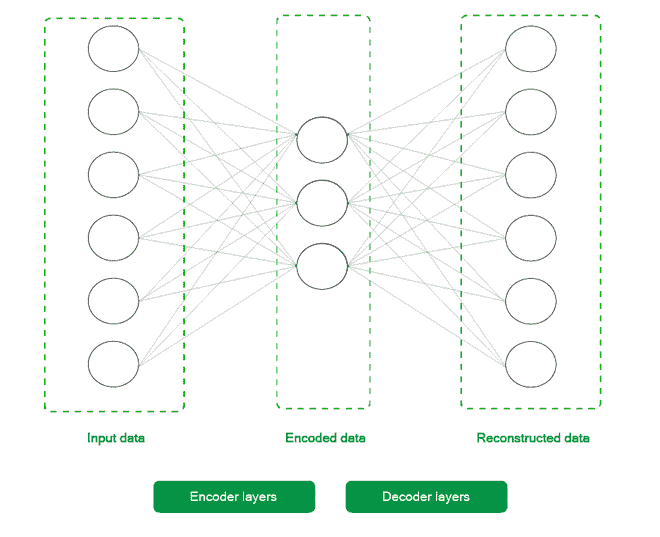
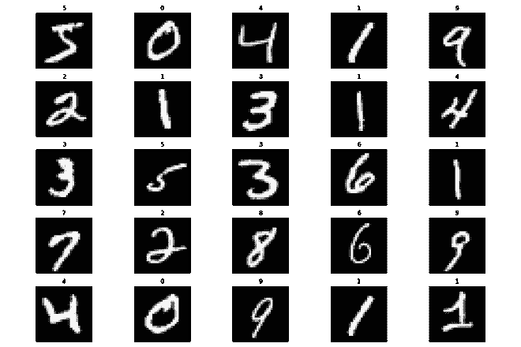
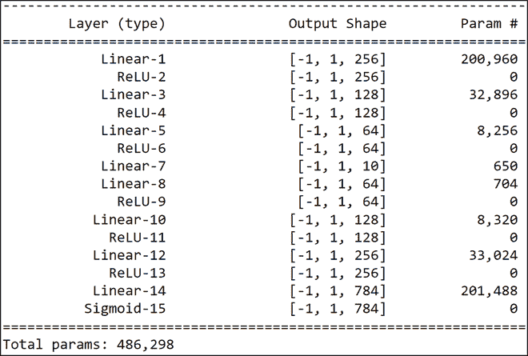

# 在 PyTorch 中实现深度自动编码器进行图像重建

> 原文:[https://www . geeksforgeeks . org/implement-deep-auto encoder-in-py torch-for-image-recovery/](https://www.geeksforgeeks.org/implement-deep-autoencoder-in-pytorch-for-image-reconstruction/)

由于互联网上有惊人数量的数据，来自工业界和学术界的研究人员和科学家一直在努力开发比当前最先进的方法更有效、更可靠的数据传输模式。自动编码器是近年来发现的用于此类任务的关键元素之一，其架构简单直观。

一般来说，一旦训练了自动编码器，就可以将编码器权重发送到发射机端，将解码器权重发送到接收机端。这样，发送端可以以编码格式发送数据(从而节省时间和金钱)，而接收端可以以少得多的大修接收数据。本文将探索自动编码器的一个有趣的应用，它可以使用 Python 中的 Pytorch 框架在著名的 MNIST 数字数据集上进行图像重建。

## 自动编码器

如下图所示，一个非常基本的自动编码器由两个主要部分组成:

1.  **编码器和**
2.  **解码器**

通过一系列层，编码器获取输入，并将较高维度的数据带到相同值的潜在低维表示。解码器采用这种潜在的表示，并输出重构的数据。

为了更深入地理解该理论，鼓励读者阅读以下文章: [ML |自动编码器](https://www.geeksforgeeks.org/ml-auto-encoders/)



基本的 2 层自动编码器

## 安装:

除了像 **Numpy** 和 **Matplotlib** 这样的常用库之外，本文只需要 **Pytorch** 工具链中的 **torch** 和 **torchvision** 库。您可以使用以下命令获取所有这些库。

> pip3 安装 torch torch torch ision torchadio num py matplot lib

现在进入最有趣的部分，代码。本文假设您基本熟悉 **PyTorch** 工作流及其各种实用程序，如**数据加载器、数据集和张量**转换。为了快速复习这些概念，鼓励读者阅读以下文章:

*   [使用 PyTorch](https://www.geeksforgeeks.org/training-neural-networks-with-validation-using-pytorch/) 通过验证来训练神经网络
*   【PyTorch 入门

该代码分为 5 个不同的步骤，以实现更好的材料流动，并按顺序执行，以确保正常工作。每个步骤在开始时都有一些要点，这可以帮助读者更好地理解该步骤的代码。

## **分步实施:**

**步骤 1:** 从训练集中加载数据并打印一些样本图像。

*   **初始化变换:**首先，我们初始化变换，该变换将应用于所获得的数据集中的每个条目。由于张量是 Pytorch 的内部函数，我们首先将每个项目转换成张量，并对它们进行归一化，以将像素值限制在 0 & 1 之间。这样做是为了使优化过程更容易和更快。
*   **下载数据集:**然后，我们使用 **torchvision.datasets** 实用程序下载数据集，并将其存储在本地机器上的文件夹**中。/MNIST/列车**和**。/MNIST/测试**用于训练和测试设备。**我们还将这些数据集转换为批处理大小等于 256 的数据加载器，以加快学习速度。**鼓励读者玩弄这些价值观，期待一致的结果。
*   **绘制数据集:**最后，我们从数据集中随机打印出 25 张图像，以便更好地查看我们正在处理的数据。

**代码:**

## 计算机编程语言

```
# Importing the necessary libraries
import numpy as np
import matplotlib.pyplot as plt
import torchvision
import torch
plt.rcParams['figure.figsize'] = 15, 10

# Initializing the transform for the dataset
transform = torchvision.transforms.Compose([
    torchvision.transforms.ToTensor(),
    torchvision.transforms.Normalize((0.5), (0.5))
])

# Downloading the MNIST dataset
train_dataset = torchvision.datasets.MNIST(
    root="./MNIST/train", train=True,
    transform=torchvision.transforms.ToTensor(),
    download=True)

test_dataset = torchvision.datasets.MNIST(
    root="./MNIST/test", train=False,
    transform=torchvision.transforms.ToTensor(),
    download=True)

# Creating Dataloaders from the
# training and testing dataset
train_loader = torch.utils.data.DataLoader(
    train_dataset, batch_size=256)
test_loader = torch.utils.data.DataLoader(
    test_dataset, batch_size=256)

# Printing 25 random images from the training dataset
random_samples = np.random.randint(
    1, len(train_dataset), (25))

for idx in range(random_samples.shape[0]):
    plt.subplot(5, 5, idx + 1)
    plt.imshow(train_dataset[idx][0][0].numpy(), cmap='gray')
    plt.title(train_dataset[idx][1])
    plt.axis('off')

plt.tight_layout()
plt.show()
```

**输出:**



训练集中的随机样本

**步骤 2:** 初始化深度自动编码器模型和其他超参数

在这一步中，我们初始化我们的 **DeepAutoencoder** 类，它是 **torch.nn.Module** 的一个子类。这为我们抽象出了很多样板代码，现在我们可以专注于构建我们的**模型架构**，如下所示:



模型架构

如上所述，**编码器层形成网络的前半部分，即从 Linear-1 到 Linear-7** ，**解码器形成从 Linear-10 到 Sigmoid-15 的另一半。**我们使用了 **torch.nn.Sequential** 实用程序来分离编码器和解码器。这样做是为了更好地理解模型的架构。之后，我们初始化一些模型超参数，以便在学习过程中使用均方误差损失和 Adam 优化器对 **100 个时期进行训练。**

## 计算机编程语言

```
# Creating a DeepAutoencoder class
class DeepAutoencoder(torch.nn.Module):
    def __init__(self):
        super().__init__()        
        self.encoder = torch.nn.Sequential(
            torch.nn.Linear(28 * 28, 256),
            torch.nn.ReLU(),
            torch.nn.Linear(256, 128),
            torch.nn.ReLU(),
            torch.nn.Linear(128, 64),
            torch.nn.ReLU(),
            torch.nn.Linear(64, 10)
        )

        self.decoder = torch.nn.Sequential(
            torch.nn.Linear(10, 64),
            torch.nn.ReLU(),
            torch.nn.Linear(64, 128),
            torch.nn.ReLU(),
            torch.nn.Linear(128, 256),
            torch.nn.ReLU(),
            torch.nn.Linear(256, 28 * 28),
            torch.nn.Sigmoid()
        )

    def forward(self, x):
        encoded = self.encoder(x)
        decoded = self.decoder(encoded)
        return decoded

# Instantiating the model and hyperparameters
model = DeepAutoencoder()
criterion = torch.nn.MSELoss()
num_epochs = 100
optimizer = torch.optim.Adam(model.parameters(), lr=1e-3)
```

**第三步:**训练循环

**训练循环迭代 100 个纪元，并执行以下操作:**

*   迭代每一批并且**计算输出图像和原始图像(其为输出)之间的损失**。
*   平均每个批次的损失，**存储每个时期的图像及其输出。**

循环结束后，我们绘制出训练损失，以便更好地理解训练过程。正如我们所看到的，每个连续时期的损失都会减少，因此可以认为训练是成功的。

## 计算机编程语言

```
# List that will store the training loss
train_loss = []

# Dictionary that will store the
# different images and outputs for 
# various epochs
outputs = {}

batch_size = len(train_loader)

# Training loop starts
for epoch in range(num_epochs):

    # Initializing variable for storing 
    # loss
    running_loss = 0

    # Iterating over the training dataset
    for batch in train_loader:

        # Loading image(s) and
        # reshaping it into a 1-d vector
        img, _ = batch  
        img = img.reshape(-1, 28*28)

        # Generating output
        out = model(img)

        # Calculating loss
        loss = criterion(out, img)

        # Updating weights according
        # to the calculated loss
        optimizer.zero_grad()
        loss.backward()
        optimizer.step()

        # Incrementing loss
        running_loss += loss.item()

    # Averaging out loss over entire batch
    running_loss /= batch_size
    train_loss.append(running_loss)

    # Storing useful images and
    # reconstructed outputs for the last batch
    outputs[epoch+1] = {'img': img, 'out': out}

# Plotting the training loss
plt.plot(range(1,num_epochs+1),train_loss)
plt.xlabel("Number of epochs")
plt.ylabel("Training Loss")
plt.show()
```