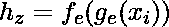
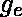
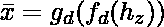
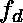
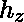
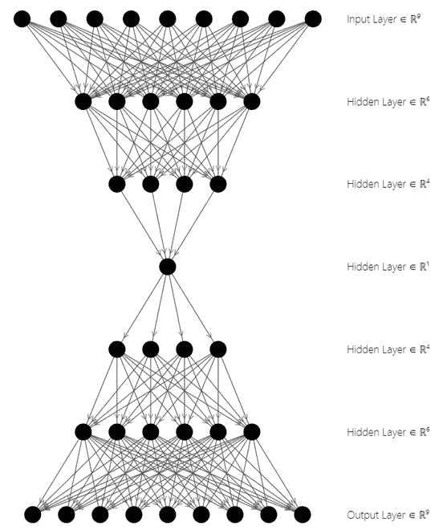
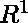

# 在 PyTorch 中实现自动编码器

> 原文:[https://www . geesforgeks . org/impering-an-auto-encoder-in-py torch/](https://www.geeksforgeeks.org/implementing-an-autoencoder-in-pytorch/)

**自动编码器**是一种神经网络，它为给定的输入生成“n 层”编码，并试图使用生成的代码重建输入。这种神经网络体系结构分为编码器结构、解码器结构和潜在空间，也称为“瓶颈”。为了学习输入的数据表示，使用无监督数据训练网络。这些压缩的数据表示经过解码过程，其中输入被重建。自动编码器是一个回归任务，它对身份函数进行建模。

## **编码器结构**

该结构包括传统的前馈神经网络，其被构造成预测输入数据的潜在视图表示。它由下式给出:



其中代表隐藏层 1，代表隐藏层 2，代表自动编码器的输入，h 代表输入的低维数据空间

## **解码器结构**

该结构包括前馈神经网络，但是数据的维数按照编码器层的顺序增加，用于预测输入。它由下式给出:



其中代表隐藏层 1，代表隐藏层 2，代表由编码器结构生成的低维数据空间，代表重建的输入。

## **潜在空间结构**

这是模型输入的数据表示或低级压缩表示。解码器结构使用这种低维形式的数据来重建输入。用表示



自解压体系结构

在上图中，顶部三层代表编码器块，而底部三层代表解码器块。潜在状态空间在架构的中间。自动编码器用于图像压缩、特征提取、降维等。现在让我们看看实现。

## **所需模块**

*   **torch:** 这个 python 包提供了基于 autograd 系统构建的高级张量计算和深度神经网络。

```py
pip install torch
```

*   **torchvision:** 该模块由大量数据库、图像架构和计算机视觉转换组成

```py
pip install torchvision
```

## **py torch 中自动编码器的实现**

**步骤 1:导入模块**

我们将使用 torch 包中的 torch.optim 和 torch.nn 模块以及 torchvision 包中的数据集和转换。在本文中，我们将使用流行的 MNIST 数据集，该数据集包含 0 到 9 之间的手写单个数字的灰度图像。

## 蟒蛇 3

```py
import torch
from torchvision import datasets
from torchvision import transforms
import matplotlib.pyplot as plt
```

**步骤 2:加载数据集**

这个片段使用数据加载器模块将 MNIST 数据集加载到加载器中。数据集被下载并转换成图像张量。使用数据加载器模块，张量被加载并准备使用。数据集加载时启用了洗牌功能，批处理大小为 64。

## 蟒蛇 3

```py
# Transforms images to a PyTorch Tensor
tensor_transform = transforms.ToTensor()

# Download the MNIST Dataset
dataset = datasets.MNIST(root = "./data",
                         train = True,
                         download = True,
                         transform = tensor_transform)

# DataLoader is used to load the dataset 
# for training
loader = torch.utils.data.DataLoader(dataset = dataset,
                                     batch_size = 32,
                                     shuffle = True)
```

**步骤 3:创建自动编码器类**

在这个编码片段中，编码器部分按顺序降低数据的维数，如下所示:

```py
28*28 = 784 ==> 128 ==> 64 ==> 36 ==> 18 ==> 9
```

其中输入节点的数量是 784，被编码成潜在空间中的 9 个节点。而在解码器部分，数据的维数线性增加到原始输入大小，以便重建输入。

```py
9 ==> 18 ==> 36 ==> 64 ==> 128 ==> 784 ==> 28*28 = 784
```

其中输入是 9 节点潜在空间表示，输出是 28*28 重构输入。

编码器从线性层中的 28*28 节点开始，然后是 ReLU 层，一直持续到维度减少到 9 个节点。解密器使用这 9 种数据表示，通过使用编码器架构的逆结构来恢复原始图像。解密器架构使用一个 Sigmoid Layer 来仅在 0 和 1 之间的范围内设置值。

## 蟒蛇 3

```py
# Creating a PyTorch class
# 28*28 ==> 9 ==> 28*28
class AE(torch.nn.Module):
    def __init__(self):
        super().__init__()

        # Building an linear encoder with Linear
        # layer followed by Relu activation function
        # 784 ==> 9
        self.encoder = torch.nn.Sequential(
            torch.nn.Linear(28 * 28, 128),
            torch.nn.ReLU(),
            torch.nn.Linear(128, 64),
            torch.nn.ReLU(),
            torch.nn.Linear(64, 36),
            torch.nn.ReLU(),
            torch.nn.Linear(36, 18),
            torch.nn.ReLU(),
            torch.nn.Linear(18, 9)
        )

        # Building an linear decoder with Linear
        # layer followed by Relu activation function
        # The Sigmoid activation function
        # outputs the value between 0 and 1
        # 9 ==> 784
        self.decoder = torch.nn.Sequential(
            torch.nn.Linear(9, 18),
            torch.nn.ReLU(),
            torch.nn.Linear(18, 36),
            torch.nn.ReLU(),
            torch.nn.Linear(36, 64),
            torch.nn.ReLU(),
            torch.nn.Linear(64, 128),
            torch.nn.ReLU(),
            torch.nn.Linear(128, 28 * 28),
            torch.nn.Sigmoid()
        )

    def forward(self, x):
        encoded = self.encoder(x)
        decoded = self.decoder(encoded)
        return decoded
```