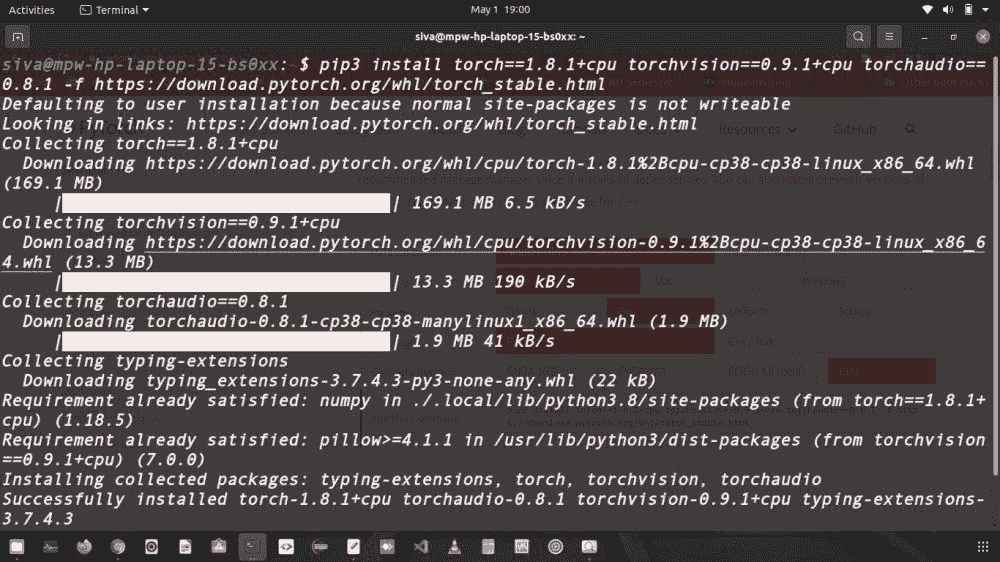

# 在 Linux 上安装 Pytorch

> 原文:[https://www.geeksforgeeks.org/install-pytorch-on-linux/](https://www.geeksforgeeks.org/install-pytorch-on-linux/)

在本文中，我们将讨论如何在 Linux 系统中安装 PyTorch。我们正在使用 Ubuntu 20 LTS，你可以使用任何其他的。要在您的 Linux 系统中成功安装 PyTorch，请遵循以下步骤:

**首先检查你用的是不是 python 的最新版本。**

因为 PyGame 只支持 python 3.7.7 或更高版本，所以请确保您使用的是最新版本的 python。键入以下命令检查文章的版本。

> *python 3–版本*

**注意:**如果没有安装 python 请参考[在 Linux 系统](https://www.geeksforgeeks.org/how-to-install-python-on-linux/)中安装 Python。

**检查你是否使用 pip 最新版本:**

pip 是一个 python 包安装程序，如果你想在你的 python 文件中使用任何外部包，你首先要在你的本地系统中安装它，所以使用 pip 工具。如果您已经在使用新的 pip 版本，请按照下面的步骤操作。如果没有，请参考关于如何在 Linux 系统中安装 pip 的文章。

> *pip 3–版本*

**如果没有使用最新的 pip 版本，则成为 root 用户并更新 Linux 包:**

打开终端，确保您是根用户。

> *sudo s*

键入您的密码，并以 root 用户身份执行以下过程，然后使用以下命令更新 Linux 软件包。

> *apt 更新*

完成该步骤后，您就可以在您的 Linux 系统中安装 PyTorch 了。

### 安装 **PyTorch**

> pip3 安装 torch = = 1 . 8 . 1+CPU torch vision = = 0 . 9 . 1+CPU torch audio = = 0 . 8 . 1-f https://download.pytorch.org/whl/torch_stable.html

上面的命令是用来在没有 GPU 的系统中安装 PyTorch 的。您只需复制命令并将其粘贴到终端并运行它。



以下命令用于在有图形处理器的系统中安装 PyTorch。确保你有 python 3.6 或 3.7 或 3.8。

```py
pip3 install torch torchvision torchaudio
```

要确保 PyTorch 安装在您的系统中，只需键入 python3 并运行它，然后键入**导入 Torch** 以使用 PyTorch 库，最后键入并运行**打印(torch。__version__)** 如果您的系统中安装了 PyTorch，它会显示您的系统中安装了哪个版本的 PyTorch。

