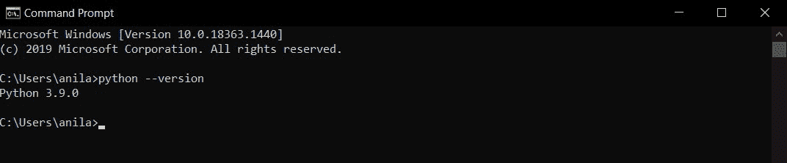
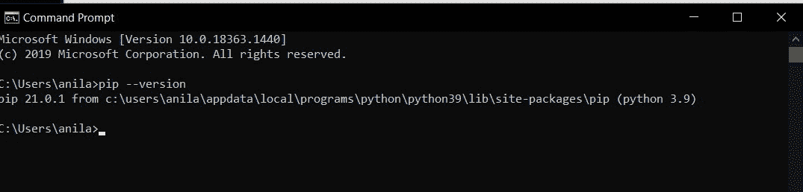
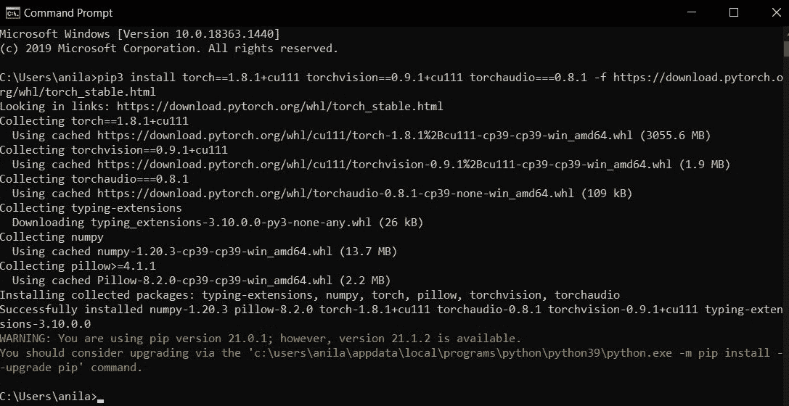
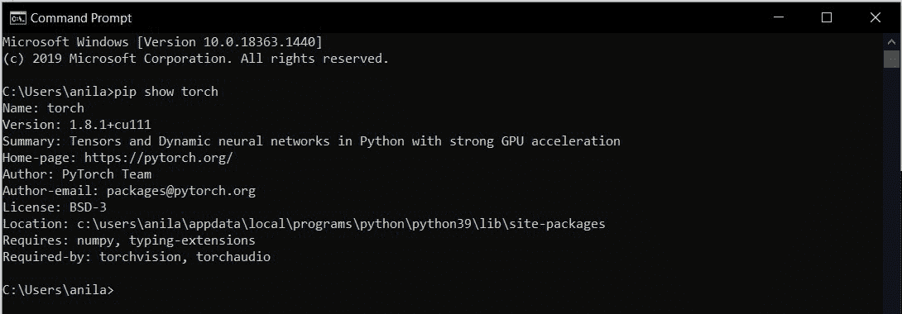
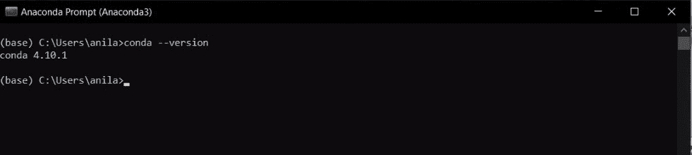
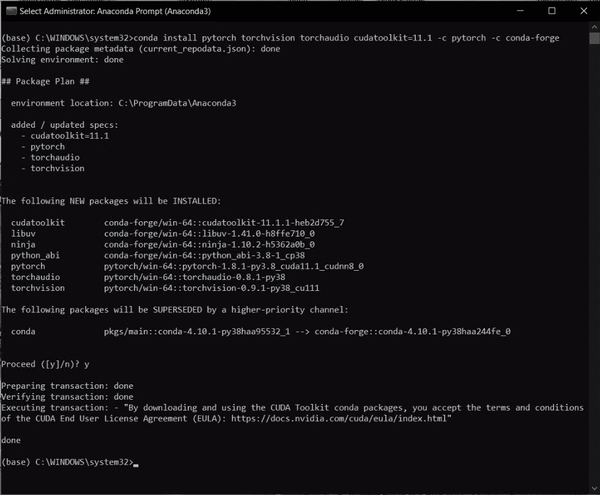
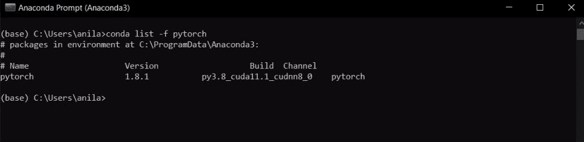

# 在 Windows 上安装 py torch

> 原文:[https://www.geeksforgeeks.org/install-pytorch-on-windows/](https://www.geeksforgeeks.org/install-pytorch-on-windows/)

在本文中，我们将学习如何在 Windows 上安装 Pytorch。PyTorch 是基于 Torch 库的开源机器学习库，用于计算机视觉和自然语言处理等应用，主要由脸书的 AI 研究实验室开发。它是在修改后的 BSD 许可下发布的免费开源软件。

### **方法 1:** **使用 pip**

**步骤 1:** 在命令提示符下输入以下命令，检查 python 是否已经安装。

> python 版本

如果这个命令运行成功，并且我们能够获得一个 python 版本，那么我们就可以开始了，或者参考[安装 Python。如何在 Windows 上安装 Python？](https://www.geeksforgeeks.org/how-to-install-python-on-windows/)

**步骤 2:** 在命令提示符下输入以下命令，检查 pip 是否已经安装。

> pip 版本

如果这个命令运行成功，并且我们能够获得一个 pip 版本，那么我们就可以开始了，或者参考本文[安装 pip 下载并安装 pip 最新版本](https://www.geeksforgeeks.org/download-and-install-pip-latest-version/)。

**第三步:**输入以下任一命令*(根据您的系统规格)*安装最新稳定版本的 Pytorch。

**1。**计算平台:CUDA 10.2，英伟达驱动版本应该是> = 441.22

> pip3 安装 torch = = 1 . 8 . 1+cu102 torch vision = = 0 . 9 . 1+cu102 torch audio = = = 0 . 8 . 1-f https://download.pytorch.org/whl/torch_stable.html

**2。**计算平台:CUDA 11.1，英伟达驱动版本应该是> = 456.38

> pip3 安装 torch = = 1 . 8 . 1+cu111 torch vision = = 0 . 9 . 1+cu111 torch audio = = = 0 . 8 . 1-f https://download.pytorch.org/whl/torch_stable.html

**3。**计算平台:中央处理器

> pip3 安装 torch = = 1 . 8 . 1+CPU torch vision = = 0 . 9 . 1+CPU torch audio = = = 0 . 8 . 1-f https://download.pytorch.org/whl/torch_stable.html

**第 4 步:**在命令提示符下输入以下命令，检查 Pytorch 是否安装成功。

> pip3 展示火炬

### **方法二:使用 conda**

**步骤 1:** 在 Anaconda 提示符下输入以下命令，检查是否安装了 conda。

> conda–版本

如果这个命令运行成功，并且我们能够获得 conda 版本，那么我们就可以开始了，或者参考本文[安装 Anaconda 如何在 windows 上安装 Anaconda？](https://www.geeksforgeeks.org/how-to-install-anaconda-on-windows/)

**第二步:**在管理员模式下打开 Anaconda 提示符，输入以下任一命令*(根据您的系统规格)*即可安装最新稳定版本的 Pytorch。

**1。**计算平台:CUDA 10.2，英伟达驱动版本应该是> = 441.22

> install pytorch torch torch ision torchadio cuda olkit = 10.2-c pytorch 伯爵

**2。**计算平台:CUDA 11.1，英伟达驱动版本应该是> = 456.38

> 安装 pytorch torch torch ision torchadio cuda olkit = 11.1-c pytorch-c conda-forge

**3。**计算平台:中央处理器

> 安装 pytorch torch torch ision torchadio CPU only-c pytorch 伯爵

**步骤 3:** 在 Anaconda 提示符下输入以下命令，检查 Pytorch 是否安装成功。

> 利斯特-f 皮托奇伯爵

