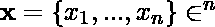
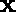

# py torch 中的雅可比矩阵

> 原文:[https://www.geeksforgeeks.org/jacobian-matrix-in-pytorch/](https://www.geeksforgeeks.org/jacobian-matrix-in-pytorch/)

**简介:**

雅可比是一个非常强大的算子，用于计算给定函数相对于其潜在变量的偏导数。出于复习的目的，给定函数相对于向量的雅可比定义为

![\mathbf{J}_f(\mathbf{x}) = \begin{bmatrix}   \frac{\partial f}{\partial x_1} &    \frac{\partial f}{\partial x_2} & \ldots &    \frac{\partial f}{\partial x_n}\end{bmatrix}=    \begin{bmatrix}  \frac{\partial f_1}{\partial x_1} & \ldots &    \frac{\partial f_1}{\partial x_n} \\[1ex] \vdots & \ddots & \vdots \\ \frac{\partial f_m}{\partial x_1} &    \ldots &    \frac{\partial f_m}{\partial x_n} \end{bmatrix}](img/7349e64c49460282eb81552e7170e7e7.png "Rendered by QuickLaTeX.com")

**示例:**

假设我们有一个向量![\mathbf{x} = \begin{bmatrix}  x_{1} \\[1ex]x_{2} \\[1ex]x_{3} \end{bmatrix}       ](img/eb80aa5e6da8932786ed14771a0ba3e5.png "Rendered by QuickLaTeX.com")和一个函数![f(\mathbf{x}) = f(x_1,x_2,x_3)= \begin{bmatrix}f_{1} \\[1ex]f_{2}\\[1ex]f_{3}\end{bmatrix} = \begin{bmatrix}x_1+x_2 \\[1ex]x_1 \times x_3 \\[1ex]x_2^{3}\end{bmatrix}      ](img/c8186811ac463cc78e15d1ef9d15f32e.png "Rendered by QuickLaTeX.com")。要计算相对于的雅可比，我们可以使用上述公式得到

![\mathbf{J}_f(\mathbf{x}) = \begin{bmatrix}   \frac{\partial f}{\partial x_1} &    \frac{\partial f}{\partial x_2} &    \frac{\partial f}{\partial x_3}\end{bmatrix}=    \begin{bmatrix}  \frac{\partial f_1}{\partial x_1} & \frac{\partial f_1}{\partial x_2} &    \frac{\partial f_1}{\partial x_3} \\[1ex]   \frac{\partial f_2}{\partial x_1} & \frac{\partial f_2}{\partial x_2} &    \frac{\partial f_2}{\partial x_3} \\[1ex]  \frac{\partial f_3}{\partial x_1} & \frac{\partial f_3}{\partial x_2} &    \frac{\partial f_3}{\partial x_3} \end{bmatrix}=\begin{bmatrix}  \frac{\partial (x_1 + x_2)}{\partial x_1} & \frac{\partial (x_1 + x_2)}{\partial x_2} &    \frac{\partial (x_1 + x_2)}{\partial x_3} \\[1ex]   \frac{\partial (x_1 \times x_3)}{\partial x_1} & \frac{\partial (x_1 \times x_3)}{\partial x_2} &    \frac{\partial (x_1 \times x_3)}{\partial x_3} \\[1ex]  \frac{\partial x_2^3}{\partial x_1} & \frac{\partial x_2^3}{\partial x_2} &    \frac{\partial x_2^3}{\partial x_3} \end{bmatrix} = \begin{bmatrix}1 & 1 & 0 \\[1ex] x_3 & 0 & x_1 \\[1ex] 0 & 3\times x_2^2&0\end{bmatrix}](img/460f9fe354f264d12894120dc74b0c95.png "Rendered by QuickLaTeX.com")

为了实现与上面相同的功能，我们可以使用 Pytorch 的**torch . autograd . functional**实用程序中的**雅可比()**函数来计算给定函数对于某些输入的雅可比矩阵。

> **语法:**torch . autograd . functional . Jacobian(func，inputs，create_graph=False，strict=False，矢量化=False)
> 
> **参数:**
> 
> *   **函数:**一个 Python 函数，接受输入并输出一个 Pytorch 张量(或张量元组)。
> *   **输入:**输入作为参数传递给“func”方法。输入可以是单个 Pytorch 张量(或张量元组)
> *   **create_graph:** 如果为真，则自动签名引擎会创建一个可反向传播的图，用于对渐变进行进一步的操作。默认为假。
> *   **严格:**如果为真，当发动机检测到存在一个输入，使得所有输出都与其无关时，将会产生一个错误。如果为假，则返回此类输入的零梯度。默认为假。
> *   **矢量化:**如果为 True，则仍处于实验阶段，该函数使用 vmap 原型功能，仅通过调用 autograd 引擎一次来计算梯度，而不是矩阵每行调用一次。默认为假。

**安装:**

对于本文，您只需要 torch 实用程序，它可以通过 pip 包管理器下载，使用:

```
pip install torch
```

**函数用法示例:**

为了便于流动，我们将使用相同的函数和向量，如上面的例子中所讨论的。由于张量是 Pytorch 包的基本构造块，我们将使用它们来表示输入向量和给定的函数。本文假设对 Pytorch 张量有一个基本的了解，可以通过浏览 [Pytorch 文章](https://www.geeksforgeeks.org/getting-started-with-pytorch/)快速查看。

**理论验证:**

假设我们有一个向量![\mathbf{x} = \begin{bmatrix}  x_{1} \\[1ex]x_{2} \\[1ex]x_{3} \end{bmatrix}  = \begin{bmatrix}  3 \\[1ex]4 \\[1ex]5 \end{bmatrix}      ](img/28f70b5de69ad5d2f09ab9b3ce7f3f42.png "Rendered by QuickLaTeX.com")作为给定的输入。通过将的值插入到上面导出的方程中，我们将得到![J_f({\mathbf{x}}) =\begin{bmatrix}1 & 1 & 0 \\[1ex] x_3 & 0 & x_1 \\[1ex] 0 & 3\times x_2^2&0\end{bmatrix}=\begin{bmatrix}1 & 1 & 0 \\[1ex] 5 & 0 & 3 \\[1ex] 0 & 3\times 4^2&0\end{bmatrix}= \begin{bmatrix}1 & 1 & 0 \\[1ex] 5 & 0 & 3 \\[1ex] 0 & 48 & 0\end{bmatrix}](img/0b68f86d6fd0e859f40ae913041cbbdd.png "Rendered by QuickLaTeX.com")

**代码:Python 实现，用 Pytorch** 展示雅可比矩阵的工作原理

## 计算机编程语言

```
from torch.autograd.functional import jacobian
from torch import tensor

#Defining the main function
def f(x1,x2,x3):
    return (x1 + x2, x3*x1, x2**3)

#Defining input tensors
x1 = tensor(3.0)
x2 = tensor(4.0)
x3 = tensor(5.0)

#Printing the Jacobian
print(jacobian(f,(x1,x2,x3)))
```

**输出:**

```
((tensor(1.), tensor(1.), tensor(0.)), 
(tensor(5.), tensor(0.), tensor(3.)), 
(tensor(0.), tensor(48.), tensor(0.)))
```

输出和我们的理论验证一模一样！使用类似的方法，我们可以使用 Pytorch API 计算任何给定函数的雅可比矩阵。

**参考文献:**

1.  [https://py torch . org/docs/stable/autograd . html # torch . autograd . functional . Jacobian](https://pytorch.org/docs/stable/autograd.html#torch.autograd.functional.jacobian)
2.  [https://pytorch.org/docs/stable/tensors.html](https://pytorch.org/docs/stable/tensors.html)