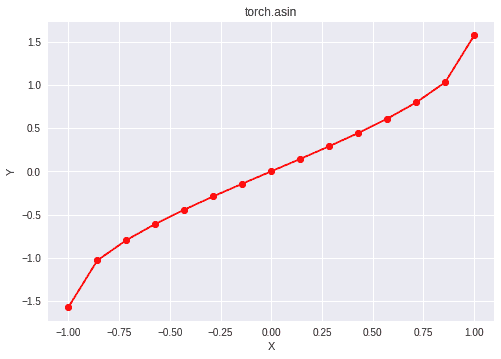

# Python | PyTorch asin()方法

> 原文:[https://www.geeksforgeeks.org/python-pytorch-asin-method/](https://www.geeksforgeeks.org/python-pytorch-asin-method/)

PyTorch 是脸书开发的开源机器学习库。它用于深度神经网络和自然语言处理。
函数 torch.asin()为 PyTorch 中的*逆正弦*函数提供支持。它期望输入在[-1，1]范围内，并以弧度形式给出输出。如果输入不在[-1，1]范围内，则返回 *nan* 。输入类型是张量，如果输入包含一个以上的元素，则计算元素反正弦。

> **语法** : torch.asin(x，out=None)
> **参数** :
> **x** :输入张量
> **名称**(可选):输出张量
> **返回类型**:与 x 类型相同的张量。

**代码#1:**

## 蟒蛇 3

```
# Importing the PyTorch library
import torch

# A constant tensor of size 6
a = torch.FloatTensor([1.0, -0.5, 3.4, 0.2, 0.0, -2])
print(a)

# Applying the inverse sin function and
# storing the result in 'b'
b = torch.asin(a)
print(b)
```

**输出:**

```
tensor([ 1.0000, -0.5000,  3.4000,  0.2000,  0.0000, -2.0000])
tensor([ 1.5708, -0.5236,     nan,  0.2014,  0.0000,     nan])
```

**代码#2:** 可视化

## 蟒蛇 3

```
# Importing the PyTorch library
import torch

# Importing the NumPy library
import numpy as np

# Importing the matplotlib.pyplot function
import matplotlib.pyplot as plt

# A vector of size 15 with values from -1 to 1
a = np.linspace(-1, 1, 15)

# Applying the inverse sine function and
# storing the result in 'b'
b = torch.asin(torch.FloatTensor(a))

print(b)

# Plotting
plt.plot(a, b.numpy(), color = 'red', marker = "o")
plt.title("torch.asin")
plt.xlabel("X")
plt.ylabel("Y")

plt.show()
```

**输出:**

```
tensor([-1.5708, -1.0297, -0.7956, -0.6082, -0.4429, -0.2898, -0.1433,  0.0000,
         0.1433,  0.2898,  0.4429,  0.6082,  0.7956,  1.0297,  1.5708])
```

