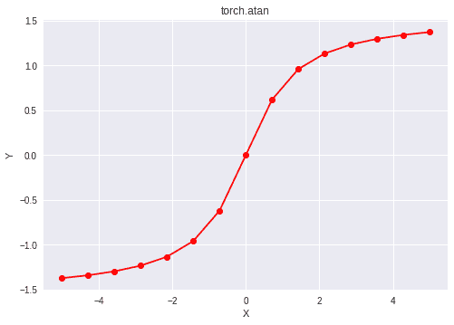

# Python | PyTorch atan()方法

> 原文:[https://www.geeksforgeeks.org/python-pytorch-atan-method/](https://www.geeksforgeeks.org/python-pytorch-atan-method/)

PyTorch 是脸书开发的开源机器学习库。它用于深度神经网络和自然语言处理。
函数 torch.atan()支持 PyTorch 中的*反正切*函数。它以弧度形式给出输出。输入类型是张量，如果输入包含多个元素，则计算元素方向的反正切。

> **语法** : torch.atan(x，out=None)
> **参数** :
> **x** :输入张量
> **名称**(可选):输出张量
> **返回类型**:与 x 类型相同的张量。

**代码#1:**

## 蟒蛇 3

```py
# Importing the PyTorch library
import torch

# A constant tensor of size 6
a = torch.FloatTensor([1.0, -0.5, 3.4, 0.2, 0.0, -2])
print(a)

# Applying the inverse tan function and
# storing the result in 'b'
b = torch.atan(a)
print(b)
```

**输出:**

```py
tensor([ 1.0000, -0.5000,  3.4000,  0.2000,  0.0000, -2.0000])
tensor([ 0.7854, -0.4636,  1.2847,  0.1974,  0.0000, -1.1071])
```

**代码#2:** 可视化

## 蟒蛇 3

```py
# Importing the PyTorch library
import torch

# Importing the NumPy library
import numpy as np

# Importing the matplotlib.pyplot function
import matplotlib.pyplot as plt

# A vector of size 15 with values from -5 to 5
a = np.linspace(-5, 5, 15)

# Applying the inverse tangent function and
# storing the result in 'b'
b = torch.atan(torch.FloatTensor(a))

print(b)

# Plotting
plt.plot(a, b.numpy(), color = 'red', marker = "o")
plt.title("torch.atan")
plt.xlabel("X")
plt.ylabel("Y")

plt.show()
```

**输出:**

```py
tensor([-1.3734, -1.3416, -1.2978, -1.2341, -1.1342, -0.9601, -0.6202,  0.0000,
         0.6202,  0.9601,  1.1342,  1.2341,  1.2978,  1.3416,  1.3734])
```

