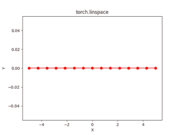

# Python Pytorch linspace()方法

> 原文:[https://www . geesforgeks . org/python-py torch-linspace-method/](https://www.geeksforgeeks.org/python-pytorch-linspace-method/)

PyTorch 是脸书开发的开源机器学习库。它用于深度神经网络和自然语言处理。
函数 torch.linspace()返回起点和终点之间等距点的一维阶梯张量。
输出张量为一维大小步长。

> **语法** : torch.linspace(开始、结束、步数=100，出=无)
> **参数** :
> **开始**:设定点的起始值。
> **结束**:该组点的结束值
> **步**:每对相邻点之间的间隙。默认值:100。
> **出(张量，可选)**:输出张量
> **返回类型**:一张张量

**代码#1:**

## 蟒蛇 3

```py
# Importing the PyTorch library
import torch

# Applying the linspace function and
# storing the resulting tensor in 't'
a = torch.linspace(3, 10, 5)
print("a = ", a)

b = torch.linspace(start =-10, end = 10, steps = 5)
print("b = ", b)
```

**输出:**

```py
a =  tensor([ 3.0000,  4.7500,  6.5000,  8.2500, 10.0000])
b =  tensor([-10.,  -5.,   0.,   5.,  10.])
```

**代码#2:** 可视化

## 蟒蛇 3

```py
# Importing the PyTorch library
import torch
# Importing the NumPy library
import numpy as np

# Importing the matplotlib.pyplot function
import matplotlib.pyplot as plt

# Applying the linspace function to get a tensor of size 15 with values from -5 to 5
a = torch.linspace(-5, 5, 15)
print(a)

# Plotting
plt.plot(a.numpy(), np.zeros(a.numpy().shape), color = 'red', marker = "o")
plt.title("torch.linspace")
plt.xlabel("X")
plt.ylabel("Y")

plt.show()
```

**输出:**

```py
tensor([-5.0000, -4.2857, -3.5714, -2.8571, -2.1429, -1.4286, -0.7143,  0.0000,
         0.7143,  1.4286,  2.1429,  2.8571,  3.5714,  4.2857,  5.0000])

[torch.FloatTensor of size 15]
```

