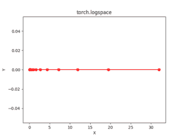

# Python Pytorch logspace()方法

> 原文:[https://www . geesforgeks . org/python-py torch-log space-method/](https://www.geeksforgeeks.org/python-pytorch-logspace-method/)

PyTorch 是脸书开发的开源机器学习库。它用于深度神经网络和自然语言处理。
函数 torch.logspace()返回步长点的一维张量，步长点以对数方式间隔开，以为底。
输出张量是一维的大小步长。

> **语法** : torch.logspace(开始、结束、步数=100，基数=10，出=无)
> **参数** :
> **开始**:设定点的起始值。
> **结束**:该组点的结束值
> **步**:开始和结束之间的采样点数。默认值:100。
> **底数**:对数函数的底数。默认:10.0
> **出(张量，可选)**:输出张量
> **返回类型** : A 张量

**代码#1:**

## 蟒蛇 3

```
# Importing the PyTorch library
import torch

# Applying the logspace function and
# storing the resulting tensor in 't'
a = torch.logspace(3, 10, 5)
print("a = ", a)

b = torch.logspace(start =-10, end = 10, steps = 5)
print("b = ", b)
```

**输出:**

```
a =  tensor([1.0000e+03, 5.6234e+04, 3.1623e+06, 1.7783e+08, 1.0000e+10])
b =  tensor([1.0000e-10, 1.0000e-05, 1.0000e+00, 1.0000e+05, 1.0000e+10])
```

**代码#2:** 可视化

## 蟒蛇 3

```
# Importing the PyTorch library
import torch
# Importing the NumPy library
import numpy as np

# Importing the matplotlib.pyplot function
import matplotlib.pyplot as plt

# Applying the logspace function to get a tensor of size 15 with values from -5 to 5 using base 2
a = torch.logspace(-5, 5, 15, 2)
print(a)

# Plotting
plt.plot(a.numpy(), np.zeros(a.numpy().shape), color = 'red', marker = "o")
plt.title("torch.linspace")
plt.xlabel("X")
plt.ylabel("Y")

plt.show()
```

**输出:**

```
tensor([3.1250e-02, 5.1271e-02, 8.4119e-02, 1.3801e-01, 2.2643e-01, 3.7150e-01,
        6.0951e-01, 1.0000e+00, 1.6407e+00, 2.6918e+00, 4.4164e+00, 7.2458e+00,
        1.1888e+01, 1.9504e+01, 3.2000e+01])
[torch.FloatTensor of size 15]
```

