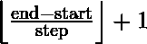

# Python Pytorch 范围()方法

> 原文:[https://www.geeksforgeeks.org/python-pytorch-range-method/](https://www.geeksforgeeks.org/python-pytorch-range-method/)

PyTorch 是脸书开发的开源机器学习库。它用于深度神经网络和自然语言处理。

函数`torch.range()`返回大小为
的一维张量，其值从开始到结束都是一步一步的。步长是张量中两个值之间的距离。


**此功能不推荐使用，支持 torch.arange()。**

> **语法** : torch.range(开始=0，结束，步骤=1，结束=无)
> 
> **参数** :
> **启动**:该组点的起始值。默认值:0。
> **结束**:该组点的结束值
> **步**:每对相邻点之间的间隙。默认值:1。
> **输出(张量，可选)**:输出张量
> 
> **返回类型**:张量

**代码#1:**

```py
# Importing the PyTorch library
import torch

# Applying the range function and
# storing the resulting tensor in 't'
a = torch.range(1, 6)
print("a = ", a)

b = torch.range(1, 5, 0.5)
print("b = ", b)
```

**输出:**

```py
a =  tensor([1., 2., 3., 4., 5., 6.])
b =  tensor([1.0000, 1.5000, 2.0000, 2.5000, 3.0000, 3.5000, 4.0000, 4.5000, 5.0000])

```