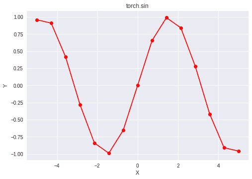

# Python | PyTorch sin()方法

> 原文:[https://www.geeksforgeeks.org/python-pytorch-sin-method/](https://www.geeksforgeeks.org/python-pytorch-sin-method/)

PyTorch 是脸书开发的开源机器学习库。它用于深度神经网络和自然语言处理。
函数 torch.sin()为 PyTorch 中的*正弦*函数提供支持。它需要弧度形式的输入，输出在[-1，1]范围内。输入类型是张量，如果输入包含一个以上的元素，则计算元素式正弦。

> **语法** : torch.sin(x，out=None)
> **参数** :
> **x** :输入张量
> **名称**(可选):输出张量
> **返回类型**:与 x 类型相同的张量。

**代码#1:**

## 蟒蛇 3

```py
# Importing the PyTorch library
import torch

# A constant tensor of size 6
a = torch.FloatTensor([1.0, -0.5, 3.4, -2.1, 0.0, -6.5])
print(a)

# Applying the sin function and
# storing the result in 'b'
b = torch.sin(a)
print(b)
```

**输出:**

```py
 1.0000
-0.5000
 3.4000
-2.1000
 0.0000
-6.5000
[torch.FloatTensor of size 6]

 0.8415
-0.4794
-0.2555
-0.8632
 0.0000
-0.2151
[torch.FloatTensor of size 6]
```

**代码#2:** 可视化

## 蟒蛇 3

```py
# Importing the PyTorch library
import torch

# Importing the NumPy library
import numpy as np

# Importing the matplotlib.pyplot function
import matplotlib.pyplot as plt

# A vector of size 15 with values from -5 to 5
a = np.linspace(-5, 5, 15)

# Applying the sine function and
# storing the result in 'b'
b = torch.sin(torch.FloatTensor(a))

print(b)

# Plotting
plt.plot(a, b.numpy(), color = 'red', marker = "o")
plt.title("torch.sin")
plt.xlabel("X")
plt.ylabel("Y")

plt.show()
```

**输出:**

```py
 0.9589
 0.9103
 0.4167
-0.2806
-0.8408
-0.9899
-0.6551
 0.0000
 0.6551
 0.9899
 0.8408
 0.2806
-0.4167
-0.9103
-0.9589
[torch.FloatTensor of size 15]
```

