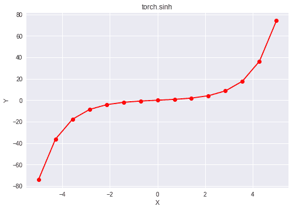

# Python | PyTorch sinh()方法

> 原文:[https://www.geeksforgeeks.org/python-pytorch-sinh-method/](https://www.geeksforgeeks.org/python-pytorch-sinh-method/)

PyTorch 是脸书开发的开源机器学习库。它用于深度神经网络和自然语言处理。
函数 torch.sinh()为 PyTorch 中的*双曲正弦*函数提供支持。它需要弧度形式的输入。输入类型是张量，如果输入包含一个以上的元素，则计算元素方式的双曲正弦。

> **语法** : torch.sinh(x，out=None)
> **参数** :
> **x** :输入张量
> **名称**(可选):输出张量
> **返回类型**:与 x 类型相同的张量。

**代码#1:**

## 蟒蛇 3

```py
# Importing the PyTorch library
import torch

# A constant tensor of size 6
a = torch.FloatTensor([1.0, -0.5, 3.4, -2.1, 0.0, -6.5])
print(a)

# Applying the sinh function and
# storing the result in 'b'
b = torch.sinh(a)
print(b)
```

**输出:**

```py
 1.0000
-0.5000
 3.4000
-2.1000
 0.0000
-6.5000
[torch.FloatTensor of size 6]

   1.1752
  -0.5211
  14.9654
  -4.0219
   0.0000
-332.5700
[torch.FloatTensor of size 6]
```

**代码#2:** 可视化

## 蟒蛇 3

```py
# Importing the PyTorch library
import torch

# Importing the NumPy library
import numpy as np

# Importing the matplotlib.pyplot function
import matplotlib.pyplot as plt

# A vector of size 15 with values from -5 to 5
a = np.linspace(-5, 5, 15)

# Applying the hyperbolic sine function and
# storing the result in 'b'
b = torch.sinh(torch.FloatTensor(a))

print(b)

# Plotting
plt.plot(a, b.numpy(), color = 'red', marker = "o")
plt.title("torch.sinh")
plt.xlabel("X")
plt.ylabel("Y")

plt.show()
```

**输出:**

```py
-74.2032
-36.3203
-17.7696
 -8.6771
 -4.2032
 -1.9665
 -0.7766
  0.0000
  0.7766
  1.9665
  4.2032
  8.6771
 17.7696
 36.3203
 74.2032
[torch.FloatTensor of size 15]
```

