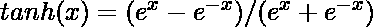
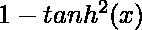
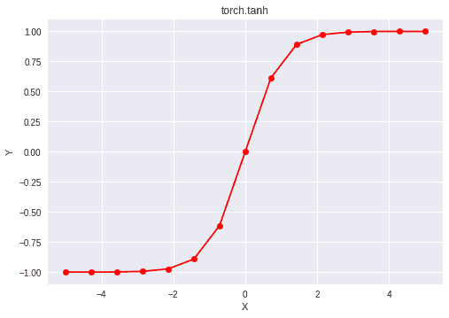

# Python | PyTorch tanh()方法

> 原文:[https://www.geeksforgeeks.org/python-pytorch-tanh-method/](https://www.geeksforgeeks.org/python-pytorch-tanh-method/)

PyTorch 是脸书开发的开源机器学习库。它用于深度神经网络和自然语言处理。
众多激活函数之一是双曲正切函数(也称为 tanh)，定义为。
双曲正切函数在(-1，1)范围内输出，因此将强负输入映射为负值。与 sigmoid 函数不同，只有接近零的值被映射到接近零的输出，这在一定程度上解决了“消失梯度”问题。双曲正切函数在每个点都是可微的，其导数为。由于表达式包含 tanh 函数，因此可以重用它的值来加快反向传播。
尽管与 sigmoid 函数相比，网络被“卡住”的几率较低，但双曲正切函数仍然存在“消失梯度”的问题。整流线性单元可以用来克服这个问题。
函数 torch.tanh()支持 PyTorch 中的*双曲正切*函数。它需要弧度形式的输入，输出在[-∞，∞]范围内。输入类型是张量，如果输入包含一个以上的元素，则计算元素方向的双曲正切。

> **语法** : torch.tanh(x，out=None)
> **参数** :
> **x** :输入张量
> **名称**(可选):输出张量
> **返回类型**:与 x 类型相同的张量。

**代码#1:**

## 蟒蛇 3

```py
# Importing the PyTorch library
import torch

# A constant tensor of size 6
a = torch.FloatTensor([1.0, -0.5, 3.4, -2.1, 0.0, -6.5])
print(a)

# Applying the tanh function and
# storing the result in 'b'
b = torch.tanh(a)
print(b)
```

**输出:**

```py
 1.0000
-0.5000
 3.4000
-2.1000
 0.0000
-6.5000
[torch.FloatTensor of size 6]

 0.7616
-0.4621
 0.9978
-0.9705
 0.0000
-1.0000
[torch.FloatTensor of size 6]
```

**代码#2:** 可视化

## 蟒蛇 3

```py
# Importing the PyTorch library
import torch

# Importing the NumPy library
import numpy as np

# Importing the matplotlib.pyplot function
import matplotlib.pyplot as plt

# A vector of size 15 with values from -5 to 5
a = np.linspace(-5, 5, 15)

# Applying the hyperbolic tangent function and
# storing the result in 'b'
b = torch.tanh(torch.FloatTensor(a))

print(b)

# Plotting
plt.plot(a, b.numpy(), color = 'red', marker = "o")
plt.title("torch.tanh")
plt.xlabel("X")
plt.ylabel("Y")

plt.show()
```

**输出:**

```py
-0.9999
-0.9996
-0.9984
-0.9934
-0.9728
-0.8914
-0.6134
 0.0000
 0.6134
 0.8914
 0.9728
 0.9934
 0.9984
 0.9996
 0.9999
[torch.FloatTensor of size 15]
```

