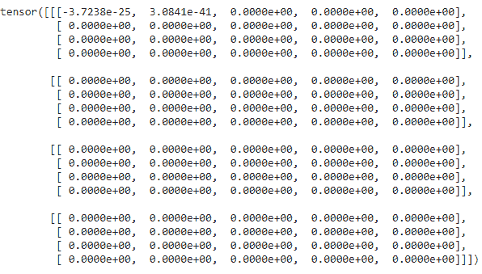
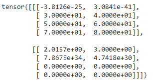

# 在 Pytorch 中重塑张量

> 原文:[https://www . geeksforgeeks . org/resforming-a-tensor-in-py torch/](https://www.geeksforgeeks.org/reshaping-a-tensor-in-pytorch/)

在本文中，我们将讨论如何在 Pytorch 中重塑张量。整形允许我们使用与 self 相同的数据和元素数量，但使用指定的形状来更改形状，这意味着它返回的数据与指定的数组相同，但指定的维度大小不同。

**创建演示张量:**

Python 代码来创建一个 1D 张量并显示它。

## 蟒蛇 3

```
# import torch module
import torch

# create an 1 D etnsor with 8 elements
a = torch.tensor([1,2,3,4,5,6,7,8])

# display tensor shape
print(a.shape)

# display tensor
a
```

**输出:**

```
torch.Size([8])
tensor([1, 2, 3, 4, 5, 6, 7, 8])
```

## **方法 1:使用重塑()方法**

此方法用于将给定的张量重塑为给定的形状(更改尺寸)

> **语法:**tensor . resform([行，列])
> 
> **在哪里，**
> 
> *   张量是输入张量
> *   row 表示重新整形的张量中的行数
> *   column 表示变形张量中的列数

**示例 1:** 将一维张量重塑为二维张量的 Python 程序。

## 蟒蛇 3

```
# import torch module
import torch

# create an 1 D etnsor with 8 elements
a = torch.tensor([1, 2, 3, 4, 5, 6, 7, 8])

# display tensor shape
print(a.shape)

# display  actual tensor
print(a)

# reshape tensor into 4 rows and 2 columns
print(a.reshape([4, 2]))

# display shape of reshaped tensor
print(a.shape)
```

**输出:**

```
torch.Size([8])
tensor([1, 2, 3, 4, 5, 6, 7, 8])
tensor([[1, 2],
        [3, 4],
        [5, 6],
        [7, 8]])
torch.Size([8])
```

**示例 2:** Python 代码将张量整形为 4 行 2 列

## 蟒蛇 3

```
# import torch module
import torch

# create an 1 D etnsor with 8 elements
a = torch.tensor([1, 2, 3, 4, 5, 6, 7, 8])

# display tensor shape
print(a.shape)

# display  actual tensor
print(a)

# reshape tensor into 4 rows and 2 columns
print(a.reshape([4, 2]))

# display shape
print(a.shape)
```

**输出:**

```
torch.Size([8])
tensor([1, 2, 3, 4, 5, 6, 7, 8])
tensor([[1, 2],
       [3, 4],
       [5, 6],
       [7, 8]])
torch.Size([8])
```

**示例 3:** 将张量重塑为 8 行 1 列的 Python 代码。

## 蟒蛇 3

```
# import torch module
import torch

# create an 1 D etnsor with 8 elements
a = torch.tensor([1, 2, 3, 4, 5, 6, 7, 8])

# display tensor shape
print(a.shape)

# display  actual tensor
print(a)

# reshape tensor into 8 rows and 1 column
print(a.reshape([8, 1]))

# display shape
print(a.shape)
```

**输出:**

```
torch.Size([8])
tensor([1, 2, 3, 4, 5, 6, 7, 8])
tensor([[1],
       [2],
       [3],
       [4],
       [5],
       [6],
       [7],
       [8]])
torch.Size([8])
```

## **方法二:使用扁平化()方法**

扁平化()用于将一个 N 维张量扁平化为一个 1D 张量。

> **语法:**火炬.展平(张量)
> 
> 其中，张量是输入张量

**示例 1:** Python 代码，创建一个包含二维元素的张量，并展平该向量

## 蟒蛇 3

```
# import torch module
import torch

# create an 2 D tensor with 8 elements each
a = torch.tensor([[1,2,3,4,5,6,7,8],
                  [1,2,3,4,5,6,7,8]])

# display actual tensor
print(a)

# flatten a tensor with flatten() function
print(torch.flatten(a))
```

**输出:**

```
tensor([[1, 2, 3, 4, 5, 6, 7, 8],
       [1, 2, 3, 4, 5, 6, 7, 8]])
tensor([1, 2, 3, 4, 5, 6, 7, 8, 1, 2, 3, 4, 5, 6, 7, 8])
```

**示例 2:** Python 代码，创建一个包含三维元素的张量，并展平该向量

## 蟒蛇 3

```
# import torch module
import torch

# create an 3 D tensor with 8 elements each
a = torch.tensor([[[1,2,3,4,5,6,7,8],
                 [1,2,3,4,5,6,7,8]],
                [[1,2,3,4,5,6,7,8],
                 [1,2,3,4,5,6,7,8]]])

# display actual tensor
print(a)

# flatten a tensor with flatten() function
print(torch.flatten(a))
```

**输出:**

> 张量([[1，2，3，4，5，6，7，8]，
> 
>         [1, 2, 3, 4, 5, 6, 7, 8]],
> 
>        [[1, 2, 3, 4, 5, 6, 7, 8],
> 
>         [1, 2, 3, 4, 5, 6, 7, 8]]])
> 
> 张量([1，2，3，4，5，6，7，8，1，2，3，4，5，6，7，8，1，2，3，4，5，6，7，8，
> 
>        1, 2, 3, 4, 5, 6, 7, 8])

## **方法三:使用 view()方法**

view()用于更改二维格式 IE 行和列中的张量。我们必须指定要查看的行数和列数。

> **语法:** tensor.view(行数，列数)
> 
> **在哪里，**
> 
> *   张量是输入一维张量
> *   行数是观察张量的行数
> *   no_of_columns 是查看张量的列总数。

**示例 1:** Python 程序创建一个包含 12 个元素的张量，视图包含 3 行 4 列，反之亦然。

## 蟒蛇 3

```
# importing torch module
import torch

# create one dimensional tensor 12 elements
a=torch.FloatTensor([24, 56, 10, 20, 30,
                     40, 50, 1, 2, 3, 4, 5]) 

# view tensor in 4 rows and 3 columns
print(a.view(4, 3))

# view tensor in 3 rows and 4 columns
print(a.view(3, 4))
```

**输出:**

```
tensor([[24., 56., 10.],
       [20., 30., 40.],
       [50.,  1.,  2.],
       [ 3.,  4.,  5.]])
tensor([[24., 56., 10., 20.],
       [30., 40., 50.,  1.],
       [ 2.,  3.,  4.,  5.]])
```

**示例 2:** Python 代码，用于将张量的视图更改为 10 行 1 列，反之亦然。

## 蟒蛇 3

```
# importing torch module
import torch

# create one dimensional tensor 10 elements
a = torch.FloatTensor([24, 56, 10, 20, 30,
                     40, 50, 1, 2, 3]) 

# view tensor in 10 rows and 1 column
print(a.view(10, 1))

# view tensor in 1 row and 10 columns
print(a.view(1, 10))
```

**输出:**

```
tensor([[24.],
       [56.],
       [10.],
       [20.],
       [30.],
       [40.],
       [50.],
       [ 1.],
       [ 2.],
       [ 3.]])
tensor([[24., 56., 10., 20., 30., 40., 50.,  1.,  2.,  3.]])
```

## **方法 4:使用 resize()方法**

这用于调整给定张量的尺寸。

> **语法:** tensor.resize_(没有 _of_tensors，没有 _ of _ rows，没有 _of_columns)
> 
> **其中:**
> 
> *   张量是输入张量
> *   no_of_tensors 表示要生成的张量总数
> *   no_of_rows 表示新调整大小的张量中的总行数
> *   no_of_columns 表示新调整大小的张量中的列总数

**示例 1:** Python 代码创建一个空的一维张量，并创建 4 行 5 列的 4 个新张量

## 蟒蛇 3

```
# importing torch module
import torch

# create one dimensional tensor
a = torch.Tensor() 

# resize the tensor to 4 tensors.
# each tensor with 4 rows and 5 columns
print(a.resize_(4, 4, 5))
```

**输出:**



**示例 2:** 创建一个包含元素的一维张量，并将其大小调整为包含 2 行 2 列的 3 个张量

## 蟒蛇 3

```
# importing torch module
import torch

# create one dimensional
a = torch.Tensor() 

# resize the tensor to 2 tensors.
# each tensor with 4 rows and 2 columns
print(a.resize_(2, 4, 2))
```

**输出:**



## **方法 5:使用 unsqueeze()方法**

这用于通过在给定位置添加新维度来重塑张量。

> **语法:** tensor.unsqueeze(位置)
> 
> **其中，**位置是从 0 开始的维度索引。

**示例 1:** 创建二维张量并在 0 维中添加一个维的 Python 代码。

## 蟒蛇 3

```
# importing torch module
import torch

# create two dimensional tensor
a = torch.Tensor([[2,3], [1,2]]) 

# display shape
print(a.shape)

# add dimension at 0 position
added = a.unsqueeze(0)

print(added.shape)
```

**输出:**

```
torch.Size([2, 2])
torch.Size([1, 2, 2])
```

**示例 2:** 创建一维张量并添加维度的 Python 代码

## 蟒蛇 3

```
# importing torch module
import torch

# create one dimensional tensor
a = torch.Tensor([1, 2, 3, 4, 5]) 

# display shape
print(a.shape)

# add dimension at 0 position
added = a.unsqueeze(0)

print(added.shape)

# add dimension at 1 position
added = a.unsqueeze(1)

print(added.shape)
```

**输出:**

```
torch.Size([5])
torch.Size([1, 5])
torch.Size([5, 1])
```