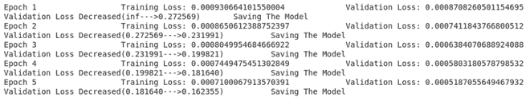

# 使用 PyTorch

通过验证来训练神经网络

> 原文:[https://www . geeksforgeeks . org/training-neural-networks-with-validation-use-py torch/](https://www.geeksforgeeks.org/training-neural-networks-with-validation-using-pytorch/)

神经网络是一个受生物学启发的编程范例，深度学习是围绕它构建的。Python 提供了各种库，您可以使用这些库在给定的数据上创建和训练神经网络。PyTorch 就是这样一个库，它为我们提供了各种工具来轻松构建和训练神经网络。说到神经网络，设置最佳架构和超参数变得至关重要。当训练神经网络时，只要学习速率是最优的，训练损失总是不断减少。但重要的是，我们的网络不仅在训练数据上表现得更好，而且在从未见过的数据上也表现得更好。衡量这一点的一种方法是引入一个验证集来跟踪神经网络的测试精度。在本文中，我们将介绍如何在每个训练步骤中跟踪验证精度，并保存具有最佳验证精度的模型权重。

#### 安装 PyTorch

安装 PyTorch 非常类似于任何其他 python 库。我们可以使用 pip 或 conda 安装 PyTorch:-

```
pip install torch torchvision
```

该命令将安装 PyTorch 和 torchvision，后者为计算机视觉提供各种数据集、模型和变换。要使用 conda 安装，您可以使用以下命令:-

```
conda install pytorch torchvision torchaudio cudatoolkit=10.2 -c pytorch
```

#### 正在加载数据

在本教程中，我们将使用 torchvision 库中提供的 MNIST 数据集。在深度学习中，我们通常以一定大小的批次训练神经网络，数据加载器是 PyTorch 中的一个数据加载实用程序，它在这些批次的数据集上创建一个可迭代的。让我们从加载数据开始

```
from torchvision import datasets, transforms
from torch.utils.data import DataLoader, random_split

transforms = transforms.Compose([
                                 transforms.ToTensor()
])
```

在上面的代码中，我们声明了一个名为 transform 的变量，它本质上帮助我们以定义的格式转换原始数据。在这里，我们的转换只是简单地获取原始数据，并将其转换为张量。张量是描述 n 维矩阵的一种奇特方式。

```
train = datasets.MNIST('', train = True, transform = transforms, download = True)
train, valid = random_split(train,[50000,10000])
```

现在，我们正在下载原始数据，并对其应用转换以将其转换为张量， **train** 告知正在加载的数据是训练数据还是测试数据。最后，我们将训练张量分成 2 个 50000 和 10000 个数据点的张量，它们成为我们的训练张量和有效张量。

```
trainloader = DataLoader(train, batch_size=32)
validloader = DataLoader(valid, batch_size=32)
```

现在我们刚刚创建了上述 32 个批量张量的*数据加载器*。现在我们有了数据，让我们开始创建我们的神经网络。

#### 构建我们的模型

在 PyTorch 中，我们有两种方法可以创建神经网络，即使用*顺序()*方法或使用类方法。我们将使用类方法来创建我们的神经网络，因为它提供了对数据流的更多控制。使用类方法创建神经网络的格式如下

```
from torch import nn

class model(nn.Module):
    def __init__(self):
        # Define Model Here

    def forward(self, x):
        # Define Forward Pass Here
```

因此，在 __init__()方法中，我们定义了我们的层和其他变量，在 forward()方法中，我们定义了我们的正向传递，即数据如何流过层。

```
import torch
from torch import nn
import torch.nn.functional as F

class Network(nn.Module):
    def __init__(self):
        super(Network,self).__init__()
        self.fc1 = nn.Linear(28*28, 256)
        self.fc2 = nn.Linear(256, 128)
        self.fc3 = nn.Linear(128, 10)

    def forward(self, x):
        x = x.view(1,-1)
        x = F.relu(self.fc1(x))
        x = F.relu(self.fc2(x))
        x = self.fc3(x)
        return x

model = Network()

if torch.cuda.is_available():
    model = model.cuda()
```

在上面的代码中，我们定义了一个具有以下架构的神经网络:-

*   **输入层:** 784 个节点，MNIST 图像的维数为 28*28，具有 784 个像素，因此当被展平时，它将成为具有 784 个输入节点的神经网络的输入。
*   **隐藏层 1:** 256 个节点
*   **隐藏层 2:** 128 个节点
*   **输出层:** 10 个节点，10 个类，即数字 0-9

*nn。线性()*或线性图层用于对输入数据应用线性变换。如果你熟悉张量流，它很像密集层。

在 *forward()* 方法中，我们首先展平图像，使其穿过每一层，并对其应用激活函数。之后，我们创建我们的神经网络实例，最后，我们只是检查机器是否有图形处理器，如果有，我们将把我们的模型转移到那里，以加快计算速度。

#### 定义标准和优化器

优化器定义了如何更新神经网络的权重，在本教程中，我们将使用 SGD 优化器或随机梯度下降优化器。优化器以模型参数和学习速率作为输入参数。有各种优化器可以尝试，比如 Adam、Adagrad 等。

标准是您希望最小化的损失，在这种情况下是 CrossEntropyLoss()，它是 log_softmax()和 NLLLoss()的组合。

```
criterion = nn.CrossEntropyLoss()
optimizer = torch.optim.SGD(model.parameters(), lr = 0.01)
```

#### 用验证训练神经网络

PyTorch 中的训练步骤几乎每次训练都是一样的。但是在实现之前，让我们了解一下模型对象的两种模式

*   **训练模式:*设定的***model . train()、**T5】告诉你的模特你在训练模特。所以像辍学这样的层次。其行为不同，而训练和测试可以相应地进行。**
*   **评估模式:**由 *model.eval()* 设置，告诉你的模型你正在测试模型。

即使你在这里不需要它，了解它们还是更好。现在我们已经清楚了，让我们了解一下培训步骤:-

*   将数据移动到图形处理器(可选)
*   使用**优化器清除梯度**
*   向前传球
*   计算损失
*   使用 **loss.backward()** 执行向后传递以计算梯度
*   使用 **optimizer.step()** 执行优化器步骤以更新权重

验证和测试步骤也是相似的，但你只需向前传递并计算损失。没有验证的简单训练循环如下所示

```
epochs = 5

for e in range(epochs):
    train_loss = 0.0
    for data, labels in tqdm(trainloader):
        # Transfer Data to GPU if available
        if torch.cuda.is_available():
            data, labels = data.cuda(), labels.cuda()

        # Clear the gradients
        optimizer.zero_grad()
        # Forward Pass
        target = model(data)
        # Find the Loss
        loss = criterion(target,labels)
        # Calculate gradients 
        loss.backward()
        # Update Weights
        optimizer.step()
        # Calculate Loss
        train_loss += loss.item()

    print(f'Epoch {e+1} \t\t Training Loss: {train_loss / len(trainloader)}')
```

如果您添加验证循环，它将是相同的，但只有向前传递和损失计算。但是可能发生的情况是，你的最后一次迭代并没有给你最少的验证损失。为了解决这个问题，我们可以设置一个最大有效损失，它可以是 ***np.inf*** ，如果当前有效损失小于，我们可以保存模型的**状态字典**，我们可以稍后加载，就像一个检查点。 **state_dict** 是一个 OrderedDict 对象，它将每个层映射到它的参数张量。

```
import numpy as np
epochs = 5
min_valid_loss = np.inf

for e in range(epochs):
    train_loss = 0.0
    model.train()     # Optional when not using Model Specific layer
    for data, labels in trainloader:
        if torch.cuda.is_available():
            data, labels = data.cuda(), labels.cuda()

        optimizer.zero_grad()
        target = model(data)
        loss = criterion(target,labels)
        loss.backward()
        optimizer.step()
        train_loss += loss.item()

    valid_loss = 0.0
    model.eval()     # Optional when not using Model Specific layer
    for data, labels in validloader:
        if torch.cuda.is_available():
            data, labels = data.cuda(), labels.cuda()

        target = model(data)
        loss = criterion(target,labels)
        valid_loss = loss.item() * data.size(0)

    print(f'Epoch {e+1} \t\t Training Loss: {train_loss / len(trainloader)} \t\t Validation Loss: {valid_loss / len(validloader)}')
    if min_valid_loss > valid_loss:
        print(f'Validation Loss Decreased({min_valid_loss:.6f}--->{valid_loss:.6f}) \t Saving The Model')
        min_valid_loss = valid_loss
        # Saving State Dict
        torch.save(model.state_dict(), 'saved_model.pth')
```

运行上述代码后，您应该会得到以下输出，尽管您的损失可能会有所不同



### 密码

## 蟒蛇 3

```
import torch
from torch import nn
import torch.nn.functional as F
from torchvision import datasets, transforms
from torch.utils.data import DataLoader, random_split
import numpy as np

#Declare transform to convert raw data to tensor
transforms = transforms.Compose([
                                 transforms.ToTensor()
])

# Loading Data and splitting it into train and validation data
train = datasets.MNIST('', train = True, transform = transforms, download = True)
train, valid = random_split(train,[50000,10000])

# Create Dataloader of the above tensor with batch size = 32
trainloader = DataLoader(train, batch_size=32)
validloader = DataLoader(valid, batch_size=32)

# Building Our Mode
class Network(nn.Module):
    # Declaring the Architecture
    def __init__(self):
        super(Network,self).__init__()
        self.fc1 = nn.Linear(28*28, 256)
        self.fc2 = nn.Linear(256, 128)
        self.fc3 = nn.Linear(128, 10)

    # Forward Pass
    def forward(self, x):
        x = x.view(x.shape[0],-1)    # Flatten the images
        x = F.relu(self.fc1(x))
        x = F.relu(self.fc2(x))
        x = self.fc3(x)
        return x

model = Network()
if torch.cuda.is_available():
    model = model.cuda()

# Declaring Criterion and Optimizer
criterion = nn.CrossEntropyLoss()
optimizer = torch.optim.SGD(model.parameters(), lr = 0.01)

# Training with Validation
epochs = 5
min_valid_loss = np.inf

for e in range(epochs):
    train_loss = 0.0
    for data, labels in trainloader:
        # Transfer Data to GPU if available
        if torch.cuda.is_available():
            data, labels = data.cuda(), labels.cuda()

        # Clear the gradients
        optimizer.zero_grad()
        # Forward Pass
        target = model(data)
        # Find the Loss
        loss = criterion(target,labels)
        # Calculate gradients
        loss.backward()
        # Update Weights
        optimizer.step()
        # Calculate Loss
        train_loss += loss.item()

    valid_loss = 0.0
    model.eval()     # Optional when not using Model Specific layer
    for data, labels in validloader:
        # Transfer Data to GPU if available
        if torch.cuda.is_available():
            data, labels = data.cuda(), labels.cuda()

        # Forward Pass
        target = model(data)
        # Find the Loss
        loss = criterion(target,labels)
        # Calculate Loss
        valid_loss += loss.item()

    print(f'Epoch {e+1} \t\t Training Loss: {\
    train_loss / len(trainloader)} \t\t Validation Loss: {\
    valid_loss / len(validloader)}')

    if min_valid_loss > valid_loss:
        print(f'Validation Loss Decreased({min_valid_loss:.6f\
        }--->{valid_loss:.6f}) \t Saving The Model')
        min_valid_loss = valid_loss

        # Saving State Dict
        torch.save(model.state_dict(), 'saved_model.pth')
```