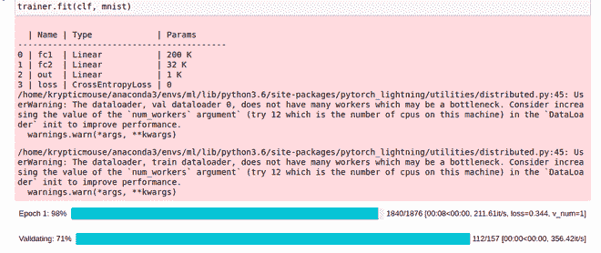

# 了解 PyTorch 闪电数据模块

> 原文:[https://www . geesforgeks . org/understance-py torch-lightning-data modules/](https://www.geeksforgeeks.org/understanding-pytorch-lightning-datamodules/)

PyTorch Lightning 旨在使 PyTorch 代码更具结构化和可读性，这不仅仅限于 PyTorch 模型，还包括数据本身。在 PyTorch 中，我们使用数据加载器来训练或测试我们的模型。虽然我们也可以在 PyTorch Lightning 中使用数据加载器来训练模型，但 PyTorch Lightning 也为我们提供了一种更好的方法，称为数据模块。数据模块是一个可重用和可共享的类，它封装了数据加载器以及处理数据所需的步骤。创建数据加载器会变得很麻烦，这就是为什么最好将数据集以数据模块的形式组合在一起。建议你知道如何使用 PyTorch Lightning 定义一个[神经网络。](https://www.geeksforgeeks.org/training-neural-networks-using-pytorch-lightning/)

**安装 PyTorch 闪电:**

安装 Lightning 与 python 中的任何其他库相同。

```py
pip install pytorch-lightning
```

或者，如果您想在 conda 环境中安装它，您可以使用以下命令:-

```py
conda install -c conda-forge pytorch-lightning
```

## Pytorch 闪电数据模块格式

要定义闪电数据模块，我们遵循以下格式:-

```py
import pytorch-lightning as pl
from torch.utils.data import random_split, DataLoader

class DataModuleClass(pl.LightningDataModule):
    def __init__(self):
        #Define required parameters here

    def prepare_data(self):
        # Define steps that should be done
    # on only one GPU, like getting data.

    def setup(self, stage=None):
        # Define steps that should be done on 
    # every GPU, like splitting data, applying
    # transform etc.

    def train_dataloader(self):
        # Return DataLoader for Training Data here

    def val_dataloader(self):
        # Return DataLoader for Validation Data here

    def test_dataloader(self):
        # Return DataLoader for Testing Data here
```

**注意:**以上功能名称应完全相同。

## 理解数据模块类

在本文中，我将以 MNIST 数据为例。如我们所见，创建闪电数据模块的第一个要求是继承 pytorch-lightning 中的 Lightning DataModule 类:

```py
import pytorch-lightning as pl
from torch.utils.data import random_split, DataLoader

class DataModuleMNIST(pl.LightningDataModule):
```

### __init__()方法:

它用于存储关于批次大小、转换等的信息。

```py
def __init__(self):
    super().__init__()
    self.download_dir = ''
    self.batch_size = 32
    self.transform = transforms.Compose([
        transforms.ToTensor()
    ])
```

### prepare_data()方法:

该方法用于定义仅由一个图形处理器执行的进程。它通常用于处理下载数据的任务。

```py
def prepare_data(self):
    datasets.MNIST(self.download_dir,
           train=True, download=True)

    datasets.MNIST(self.download_dir, train=False,        
           download=True)
```

### setup()方法:

该方法用于定义由所有可用的图形处理器执行的过程。它通常用于处理加载数据的任务。

```py
def setup(self, stage=None):
    data = datasets.MNIST(self.download_dir,
             train=True, transform=self.transform)

    self.train_data, self.valid_data = random_split(data, [55000, 5000])

    self.test_data = datasets.MNIST(self.download_dir,
                        train=False, transform=self.transform)
```

### train_dataloader()方法:

此方法用于创建训练数据数据加载器。在这个函数中，通常只返回训练数据的数据加载器。

```py
def train_dataloader(self):
    return DataLoader(self.train_data, batch_size=self.batch_size)
```

### val_dataloader()方法:

此方法用于创建验证数据数据加载器。在这个函数中，通常只返回验证数据的数据加载器。

```py
def val_dataloader(self):
   return DataLoader(self.valid_data, batch_size=self.batch_size)
```

### test_dataloader()方法:

此方法用于创建测试数据数据加载器。在这个函数中，通常只返回测试数据的数据加载器。

```py
def test_dataloader(self):
   return DataLoader(self.test_data, batch_size=self.batch_size)
```

### 使用数据模块训练 Pytorch 闪电模型:

在 Pytorch Lighting 中，我们使用 Trainer()来训练我们的模型，在这种情况下，我们可以将数据作为 DataLoader 或 DataModule 传递。让我们以我在本文[中定义的模型](https://www.geeksforgeeks.org/training-neural-networks-using-pytorch-lightning/)为例:

```py
class model(pl.LightningModule): 
    def __init__(self): 
        super(model, self).__init__() 
        self.fc1 = nn.Linear(28*28, 256) 
        self.fc2 = nn.Linear(256, 128) 
        self.out = nn.Linear(128, 10) 
        self.lr = 0.01
        self.loss = nn.CrossEntropyLoss() 

    def forward(self, x): 
        batch_size, _, _, _ = x.size() 
        x = x.view(batch_size, -1) 
        x = F.relu(self.fc1(x)) 
        x = F.relu(self.fc2(x)) 
        return self.out(x) 

    def configure_optimizers(self): 
        return torch.optim.SGD(self.parameters(), lr=self.lr) 

    def training_step(self, train_batch, batch_idx): 
        x, y = train_batch 
        logits = self.forward(x) 
        loss = self.loss(logits, y) 
        return loss 

    def validation_step(self, valid_batch, batch_idx): 
        x, y = valid_batch 
        logits = self.forward(x) 
        loss = self.loss(logits, y)
```

现在，为了训练这个模型，我们将创建一个 Trainer()对象，并通过将模型和数据模块作为参数传递来拟合它。

```py
clf = model() 
mnist = DataModuleMNIST() 
trainer = pl.Trainer(gpus=1) 
trainer.fit(clf, mnist)
```

**以下全面实施:**

## 蟒蛇 3

```py
# import module
import torch 

# To get the layers and losses for our model
from torch import nn 
import pytorch_lightning as pl 

# To get the activation function for our model
import torch.nn.functional as F 

# To get MNIST data and transforms
from torchvision import datasets, transforms

# To get the optimizer for our model
from torch.optim import SGD 

# To get random_split to split training
# data into training and validation data
# and DataLoader to create dataloaders for train, 
# valid and test data to be returned
# by our data module
from torch.utils.data import random_split, DataLoader 

class model(pl.LightningModule): 
    def __init__(self): 
        super(model, self).__init__() 

        # Defining our model architecture
        self.fc1 = nn.Linear(28*28, 256) 
        self.fc2 = nn.Linear(256, 128) 
        self.out = nn.Linear(128, 10) 

        # Defining learning rate
        self.lr = 0.01

        # Defining loss 
        self.loss = nn.CrossEntropyLoss() 

    def forward(self, x):

          # Defining the forward pass of the model
        batch_size, _, _, _ = x.size() 
        x = x.view(batch_size, -1) 
        x = F.relu(self.fc1(x)) 
        x = F.relu(self.fc2(x)) 
        return self.out(x) 

    def configure_optimizers(self):

          # Defining and returning the optimizer for our model
        # with the defines parameters
        return torch.optim.SGD(self.parameters(), lr = self.lr) 

    def training_step(self, train_batch, batch_idx): 

          # Defining training steps for our model
        x, y = train_batch 
        logits = self.forward(x) 
        loss = self.loss(logits, y) 
        return loss 

    def validation_step(self, valid_batch, batch_idx): 

        # Defining validation steps for our model
        x, y = valid_batch 
        logits = self.forward(x) 
        loss = self.loss(logits, y)

class DataModuleMNIST(pl.LightningDataModule):
    def __init__(self):
        super().__init__()

        # Directory to store MNIST Data
        self.download_dir = ''

        # Defining batch size of our data
        self.batch_size = 32

        # Defining transforms to be applied on the data
        self.transform = transforms.Compose([
            transforms.ToTensor()
        ])

    def prepare_data(self):

          # Downloading our data
        datasets.MNIST(self.download_dir, 
                       train = True, download = True)

        datasets.MNIST(self.download_dir,
                       train = False, download = True)

    def setup(self, stage=None):

          # Loading our data after applying the transforms
        data = datasets.MNIST(self.download_dir,
                              train = True, 
                              transform = self.transform)

        self.train_data, self.valid_data = random_split(data,
                                                        [55000, 5000])

        self.test_data = datasets.MNIST(self.download_dir,
                                        train = False,
                                        transform = self.transform)

    def train_dataloader(self):

          # Generating train_dataloader
        return DataLoader(self.train_data, 
                          batch_size = self.batch_size)

    def val_dataloader(self):

          # Generating val_dataloader
        return DataLoader(self.valid_data,
                          batch_size = self.batch_size)

    def test_dataloader(self):

        # Generating test_dataloader
        return DataLoader(self.test_data,
                          batch_size = self.batch_size)

clf = model() 
mnist = DataModuleMNIST() 
trainer = pl.Trainer()
trainer.fit(clf, mnist) 
```

**输出:**

