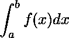
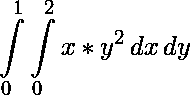

# 用 SciPy 进行数据分析

> 原文:[https://www.geeksforgeeks.org/data-analysis-with-scipy/](https://www.geeksforgeeks.org/data-analysis-with-scipy/)

[SciPy](https://docs.scipy.org/doc/scipy/reference/) 是一个 python 库，在求解很多数学方程和算法时非常有用。它是在 Numpy 库的基础上设计的，为寻找科学的数学公式如矩阵秩、逆、多项式方程、LU 分解等提供了更多的扩展。使用其高级功能将显著降低代码的复杂性，并有助于更好地分析数据。SciPy 是一个交互式 Python 会话，用作数据处理库，旨在与 MATLAB、Octave、R-Lab 等竞争对手竞争。它具有许多用户友好、高效且易于使用的功能，有助于解决数值积分、插值、优化、线性代数和统计等问题。

在 Python 中使用 SciPy 库制作 ML 模型的好处是，它还提供了一种强大的编程语言，可用于开发不太复杂的程序和应用程序。

```
# import numpy library
import numpy as np
A = np.array([[1,2,3],[4,5,6],[7,8,8]])
```

### 线性代数

1.  **矩阵的行列式**

    ```
    # importing linalg function from scipy
    from scipy import linalg

    # Compute the determinant of a matrix
    linalg.det(A)
    ```

    ```
    Output :
    2.999999999999997

    ```

2.  **矩阵的计算旋转逻辑单元分解**
    逻辑单元分解是一种将矩阵简化为组成部分的方法，有助于更容易地计算复杂的矩阵运算。分解方法也称为矩阵分解方法，是计算机中线性代数的基础，甚至用于基本运算，如求解线性方程组、计算逆矩阵和计算矩阵的行列式。
    分解为:
    A = P L U
    其中 P 为置换矩阵，L 为单位对角元素的下三角，U 为上三角。

    ```
    P, L, U = linalg.lu(A)
    print(P)
    print(L)
    print(U)
    # print LU decomposition
    print(np.dot(L,U))
    ```

    ```
    Output :
    array([[ 0.,  1.,  0.],
           [ 0.,  0.,  1.],
           [ 1.,  0.,  0.]])

    array([[ 1\.        ,  0\.        ,  0\.        ],
           [ 0.14285714,  1\.        ,  0\.        ],
           [ 0.57142857,  0.5       ,  1\.        ]])

    array([[ 7\.        ,  8\.        ,  8\.        ],
           [ 0\.        ,  0.85714286,  1.85714286],
           [ 0\.        ,  0\.        ,  0.5       ]])

    array([[ 7.,  8.,  8.],
           [ 1.,  2.,  3.],
           [ 4.,  5.,  6.]])

    ```

3.  **该矩阵的特征值和特征向量**

    ```
    eigen_values, eigen_vectors = linalg.eig(A)
    print(eigen_values)
    print(eigen_vectors)
    ```

    ```
    Output :
    array([ 15.55528261+0.j,  -1.41940876+0.j,  -0.13587385+0.j])

    array([[-0.24043423, -0.67468642,  0.51853459],
           [-0.54694322, -0.23391616, -0.78895962],
           [-0.80190056,  0.70005819,  0.32964312]])

    ```

4.  **解线性方程组也可以**

    ```
    v = np.array([[2],[3],[5]])
    print(v)
    s = linalg.solve(A,v)
    print(s)
    ```

    ```
    Output :
    array([[2],
           [3],
           [5]])

    array([[-2.33333333],
           [ 3.66666667],
           [-1\.        ]])

    ```

### 稀疏线性代数

SciPy 有一些计算稀疏矩阵和潜在的非常大的矩阵的例程。必要的工具在子模块 scipy.sparse.
**我们来看看如何构造一个大的稀疏矩阵:**

```
# import necessary modules
from scipy import sparse
# Row-based linked list sparse matrix
A = sparse.lil_matrix((1000, 1000))
print(A)

A[0,:100] = np.random.rand(100)
A[1,100:200] = A[0,:100]
A.setdiag(np.random.rand(1000))
print(A)
```

```
Output :
<1000x1000 sparse matrix of type ''
    with 0 stored elements in LInked List format>

<1000x1000 sparse matrix of type ''
    with 1199 stored elements in LInked List format>

```

1.  **稀疏矩阵线性代数**

    ```
    from scipy.sparse import linalg

    # Convert this matrix to Compressed Sparse Row format.
    A.tocsr()

    A = A.tocsr()
    b = np.random.rand(1000)
    ans = linalg.spsolve(A, b)
    # it will print ans array of 1000 size
    print(ans)
    ```

    ```
    Output :
    array([-2.53380006e+03, -1.25513773e+03,  9.14885544e-01,  2.74521543e+00,
            5.99942835e-01,  4.57778093e-01,  1.87104209e-01,  2.15228367e+00,
            8.78588432e-01,  1.85105721e+03,  1.00842538e+00,  4.33970632e+00,
            5.26601699e+00,  2.17572231e-01,  1.79869079e+00,  3.83800946e-01,
            2.57817130e-01,  5.18025462e-01,  1.68672669e+00,  3.07971950e+00,
            6.20604437e-01,  1.41365890e-01,  3.18167429e-01,  2.06457302e-01,
            8.94813817e-01,  5.06084834e+00,  5.00913942e-01,  1.37391305e+00,
            2.32081425e+00,  4.98093749e+00,  1.75492222e+00,  3.17278127e-01,
            8.50013844e-01,  1.17524493e+00,  1.70173722e+00,  .............))

    ```

### 综合

当一个函数很难解析积分时，人们只需通过数值积分方法找到一个解。SciPy 也有进行数值积分的能力。Scipy 在 **scipy.integrate** 模块中有集成方法。

1.  **Single Integrals**
    The Quad routine is the important function out of SciPy’s integration functions. If integration in over f(x) function where x ranges from a to b, then integral looks like this.
    
    The parameters of quad is scipy.integrate.quad(f, a, b), Where ‘f’ is the function to be integrated. Whereas, ‘a’ and ‘b’ are the lower and upper ranges of x limit. Let us see an example of integrating  over the **range of 0 and 1 with respect to dx**.
    We will first define the function f(x)=e^(-x^2) , this is done using a lambda expression and then use quad routine.

    ```
    import scipy.integrate
    f= lambda x:np.exp(-x**2)
    # print results
    i = scipy.integrate.quad(f, 0, 1)
    print(i)
    ```

    ```
    (0.7468241328124271, 8.291413475940725e-15)

    ```

    四元函数返回两个值，其中第一个数字是整数值，第二个值是整数值的可能误差。

2.  **二重积分**T4**dbl quad**函数的参数为 **scipy.integrate.dblquad(f，a，b，g，h)** 。其中，“f”是要积分的函数，“a”和“b”分别是 x 变量的下限和上限，而“g”和“h”是告诉 y 变量下限和上限的函数。
    作为一个例子，让我们在 x 范围从 0 到 2 和 y 范围从 0 到 1 上执行 x*y^2 的二重积分。
    
    我们使用λ表达式定义函数 f、g 和 h。请注意，即使 g 和 h 是常数，因为它们在许多情况下可能是常数，它们也必须被定义为函数，就像我们在这里对下限所做的那样。

    ```
    from scipy import integrate
    f = lambda y, x: x*y**2
    i = integrate.dblquad(f, 0, 2, lambda x: 0, lambda x: 1)
    # print the results
    print(i)
    ```

    ```
    Output :
     (0.6666666666666667, 7.401486830834377e-15)

    ```

SciPy 能做的还有很多，比如傅里叶变换、贝塞尔函数等。
更多详情可参考[文档](https://docs.scipy.org/doc/scipy/reference/)！