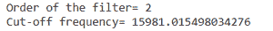
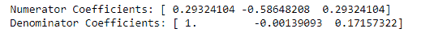
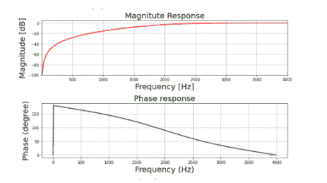
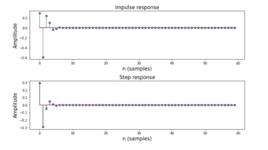

# 使用 Scipy–Python 中的双线性变换方法设计 IIR 高通巴特沃斯滤波器

> 原文:[https://www . geeksforgeeks . org/design-an-IIR-high pass-butterworth-filter-use-双线性变换-method-in-scipy-python/](https://www.geeksforgeeks.org/design-an-iir-highpass-butterworth-filter-using-bilinear-transformation-method-in-scipy-python/)

IIR 代表无限脉冲响应，它是许多线性时不变系统的显著特征之一，其特点是具有**脉冲响应 h(t)/h(n)** ，该脉冲响应在某一点后不变为零，而是无限延续。

## **什么是 IIR 高通巴特沃斯？**

它基本上就像一个普通的数字高通巴特沃兹滤波器，具有无限的脉冲响应。

**规格如下:**

*   通带频率:2-4 千赫
*   阻带频率:0-500 赫兹
*   通带纹波:3dB
*   阻带衰减:20 分贝
*   采样频率:8 千赫
*   我们将绘制滤波器的幅度、相位、脉冲和阶跃响应。

**分步方法:**

**步骤 1:** 导入所有必需的库。

## 蟒蛇 3

```py
# import required library
import numpy as np
import scipy.signal as signal
import matplotlib.pyplot as plt
```

**第二步:**定义用户自定义函数 ***mfreqz()*** 和 ***impz()*** 。mfreqz 是幅度和相位图的函数& impz 是脉冲和阶跃响应的函数。

## 蟒蛇 3

```py
def mfreqz(b, a, Fs):

    # Compute frequency response of the filter
    # using signal.freqz function
    wz, hz = signal.freqz(b, a)

    # Calculate Magnitude from hz in dB
    Mag = 20*np.log10(abs(hz))

    # Calculate phase angle in degree from hz
    Phase = np.unwrap(np.arctan2(np.imag(hz), np.real(hz)))*(180/np.pi)

    # Calculate frequency in Hz from wz
    Freq = wz*Fs/(2*np.pi)  # START CODE HERE ### (≈ 1 line of code)

    # Plot filter magnitude and phase responses using subplot.
    fig = plt.figure(figsize=(10, 6))

    # Plot Magnitude response
    sub1 = plt.subplot(2, 1, 1)
    sub1.plot(Freq, Mag, 'r', linewidth=2)
    sub1.axis([1, Fs/2, -100, 5])
    sub1.set_title('Magnitude Response', fontsize=20)
    sub1.set_xlabel('Frequency [Hz]', fontsize=20)
    sub1.set_ylabel('Magnitude [dB]', fontsize=20)
    sub1.grid()

    # Plot phase angle
    sub2 = plt.subplot(2, 1, 2)
    sub2.plot(Freq, Phase, 'g', linewidth=2)
    sub2.set_ylabel('Phase (degree)', fontsize=20)
    sub2.set_xlabel(r'Frequency (Hz)', fontsize=20)
    sub2.set_title(r'Phase response', fontsize=20)
    sub2.grid()

    plt.subplots_adjust(hspace=0.5)
    fig.tight_layout()
    plt.show()

# Define impz(b,a) to calculate impulse response
# and step response of a system input: b= an array
# containing numerator coefficients,a= an array containing
#denominator coefficients
def impz(b, a):

    # Define the impulse sequence of length 60
    impulse = np.repeat(0., 60)
    impulse[0] = 1.
    x = np.arange(0, 60)

    # Compute the impulse response
    response = signal.lfilter(b, a, impulse)

    # Plot filter impulse and step response:
    fig = plt.figure(figsize=(10, 6))
    plt.subplot(211)
    plt.stem(x, response, 'm', use_line_collection=True)
    plt.ylabel('Amplitude', fontsize=15)
    plt.xlabel(r'n (samples)', fontsize=15)
    plt.title(r'Impulse response', fontsize=15)

    plt.subplot(212)
    step = np.cumsum(response)  # Compute step response of the system
    plt.stem(x, step, 'g', use_line_collection=True)
    plt.ylabel('Amplitude', fontsize=15)
    plt.xlabel(r'n (samples)', fontsize=15)
    plt.title(r'Step response', fontsize=15)
    plt.subplots_adjust(hspace=0.5)

    fig.tight_layout()
    plt.show()
```

**步骤 3:** 用给定的过滤器规格定义变量。

## 蟒蛇 3

```py
# Given specification
Fs = 8000  # Sampling frequency in Hz
fp = 2000  # Pass band frequency in Hz
fs = 500  # Stop Band frequency in Hz
Ap = 3  # Pass band ripple in dB
As = 20  # Stop band attenuation in dB

# Compute Sampling parameter
Td = 1/Fs
```

**步骤 4:** 计算截止频率

## 蟒蛇 3

```py
# Compute cut-off frequency in radian/sec
wp = 2*np.pi*fp  # pass band frequency in radian/sec
ws = 2*np.pi*fs  # stop band frequency in radian/sec
```

**步骤 5:** 预包截止频率

## 蟒蛇 3

```py
# Prewarp the analog frequency
Omega_p = (2/Td)*np.tan(wp*Td/2)  # Prewarped analog passband frequency
Omega_s = (2/Td)*np.tan(ws*Td/2)  # Prewarped analog stopband frequency
```

**步骤 6:** 计算巴特沃斯滤波器

## 蟒蛇 3

```py
# Compute Butterworth filter order and cutoff frequency
N, wc = signal.buttord(Omega_p, Omega_s, Ap, As, analog=True)

# Print the values of order and cut-off frequency
print('Order of the filter=', N)
print('Cut-off frequency=', wc)
```

**输出:**



**第七步:**通过 ***signal.butter(*** )功能，使用 N 和 wc 设计模拟巴特沃斯滤波器。

## 蟒蛇 3

```py
# Design analog Butterworth filter using N and
# wc by signal.butter function
b, a = signal.butter(N, wc, 'high', analog=True)

# Perform bilinear Transformation
z, p = signal.bilinear(b, a, fs=Fs)

# Print numerator and denomerator coefficients
# of the filter
print('Numerator Coefficients:', z)
print('Denominator Coefficients:', p)
```

**输出:**



**第 8 步:**绘制幅度&相位响应

## 蟒蛇 3

```py
# Call mfreqz function to plot the
# magnitude and phase response
mfreqz(z, p, Fs)
```

**输出:**



**第 9 步:**绘制脉冲&阶跃响应

## 蟒蛇 3

```py
# Call impz function to plot impulse and
# step response of the filter
impz(z, p)
```

**输出:**



**下面是实现:**

## 蟒蛇 3

```py
# import required library
import numpy as np
import scipy.signal as signal
import matplotlib.pyplot as plt

# User defined functions mfreqz for
# Magnitude & Phase Response
def mfreqz(b, a, Fs):

    # Compute frequency response of the filter
    # using signal.freqz function
    wz, hz = signal.freqz(b, a)

    # Calculate Magnitude from hz in dB
    Mag = 20*np.log10(abs(hz))

    # Calculate phase angle in degree from hz
    Phase = np.unwrap(np.arctan2(np.imag(hz), np.real(hz)))*(180/np.pi)

    # Calculate frequency in Hz from wz
    Freq = wz*Fs/(2*np.pi)  # START CODE HERE ### (≈ 1 line of code)

    # Plot filter magnitude and phase responses using subplot.
    fig = plt.figure(figsize=(10, 6))

    # Plot Magnitude response
    sub1 = plt.subplot(2, 1, 1)
    sub1.plot(Freq, Mag, 'r', linewidth=2)
    sub1.axis([1, Fs/2, -100, 5])
    sub1.set_title('Magnitude Response', fontsize=20)
    sub1.set_xlabel('Frequency [Hz]', fontsize=20)
    sub1.set_ylabel('Magnitude [dB]', fontsize=20)
    sub1.grid()

    # Plot phase angle
    sub2 = plt.subplot(2, 1, 2)
    sub2.plot(Freq, Phase, 'g', linewidth=2)
    sub2.set_ylabel('Phase (degree)', fontsize=20)
    sub2.set_xlabel(r'Frequency (Hz)', fontsize=20)
    sub2.set_title(r'Phase response', fontsize=20)
    sub2.grid()

    plt.subplots_adjust(hspace=0.5)
    fig.tight_layout()
    plt.show()

# Define impz(b,a) to calculate impulse
# response and step response of a system
# input: b= an array containing numerator
# coefficients,a= an array containing
#denominator coefficients
def impz(b, a):

    # Define the impulse sequence of length 60
    impulse = np.repeat(0., 60)
    impulse[0] = 1.
    x = np.arange(0, 60)

    # Compute the impulse response
    response = signal.lfilter(b, a, impulse)

    # Plot filter impulse and step response:
    fig = plt.figure(figsize=(10, 6))
    plt.subplot(211)
    plt.stem(x, response, 'm', use_line_collection=True)
    plt.ylabel('Amplitude', fontsize=15)
    plt.xlabel(r'n (samples)', fontsize=15)
    plt.title(r'Impulse response', fontsize=15)

    plt.subplot(212)
    step = np.cumsum(response)  # Compute step response of the system
    plt.stem(x, step, 'g', use_line_collection=True)
    plt.ylabel('Amplitude', fontsize=15)
    plt.xlabel(r'n (samples)', fontsize=15)
    plt.title(r'Step response', fontsize=15)
    plt.subplots_adjust(hspace=0.5)

    fig.tight_layout()
    plt.show()

# Given specification
Fs = 8000  # Sampling frequency in Hz
fp = 2000  # Pass band frequency in Hz
fs = 500  # Stop Band frequency in Hz
Ap = 3  # Pass band ripple in dB
As = 20  # Stop band attenuation in dB

# Compute Sampling parameter
Td = 1/Fs

# Compute cut-off frequency in radian/sec
wp = 2*np.pi*fp  # pass band frequency in radian/sec
ws = 2*np.pi*fs  # stop band frequency in radian/sec

# Prewarp the analog frequency
Omega_p = (2/Td)*np.tan(wp*Td/2)  # Prewarped analog passband frequency
Omega_s = (2/Td)*np.tan(ws*Td/2)  # Prewarped analog stopband frequency

# Compute Butterworth filter order and cutoff frequency
N, wc = signal.buttord(Omega_p, Omega_s, Ap, As, analog=True)

# Print the values of order and cut-off frequency
print('Order of the filter=', N)
print('Cut-off frequency=', wc)

# Design analog Butterworth filter using N and
# wc by signal.butter function
b, a = signal.butter(N, wc, 'high', analog=True)

# Perform bilinear Transformation
z, p = signal.bilinear(b, a, fs=Fs)

# Print numerator and denomerator coefficients of the filter
print('Numerator Coefficients:', z)
print('Denominator Coefficients:', p)

# Call mfreqz function to plot the magnitude
# and phase response
mfreqz(z, p, Fs)

# Call impz function to plot impulse and step
# response of the filter
impz(z, p)
```

**输出:**

   