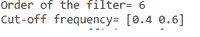
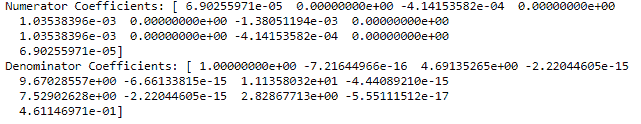
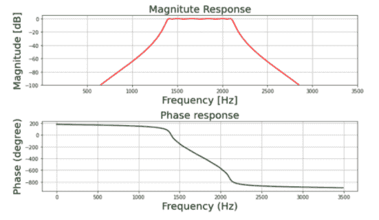
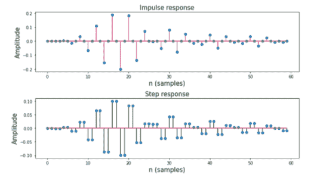

# 使用 Scipy–Python 设计 IIR 带通切比雪夫 1 型滤波器

> 原文:[https://www . geesforgeks . org/design-IIR-band-Chebyshev-type-1-filter-use-scipy-python/](https://www.geeksforgeeks.org/design-iir-bandpass-chebyshev-type-1-filter-using-scipy-python/)

IIR 代表无限脉冲响应，它是许多线性时不变系统的显著特征之一，其特点是脉冲响应 h(t)/h(n)在某一点后不为零，而是无限延续。

## **什么是 IIR 切比雪夫滤波器？**

IIR 切比雪夫滤波器是一种线性时不变滤波器，与巴特沃兹滤波器一样，但与巴特沃兹滤波器相比，它具有更陡的滚降。切比雪夫滤波器根据通带纹波和截止纹波等参数进一步分为切比雪夫ⅰ型和切比雪夫ⅱ型。

## **切比雪夫滤波器与巴特沃斯有何不同？**

与巴特沃兹滤波器相比，切比雪夫滤波器具有更陡的滚降。

## **什么是切比雪夫 I 型滤波器？**

切比雪夫ⅰ型通过在通带中加入相等的纹波，将整个通带内理想和实际频率响应之间的绝对差异降至最低。

**规格如下:**

*   通带频率:1400-2100 赫兹
*   阻带频率:1050-24500 赫兹
*   通带纹波:0.4 分贝
*   阻带衰减:50 分贝
*   采样频率:7 千赫

我们将绘制滤波器的幅度、相位、脉冲和阶跃响应。

**分步方法:**

**步骤 1:** 导入所有必需的库。

## 蟒蛇 3

```
import numpy as np
import scipy.signal as signal
import matplotlib.pyplot as plt
```

**步骤 2:** 定义用户定义的功能，如 ***mfreqz()*** 和 ***impz()。***

## 蟒蛇 3

```
def mfreqz(b, a, Fs):

    # Compute frequency response of the filter
    # using signal.freqz function
    wz, hz = signal.freqz(b, a)

    # Calculate Magnitude from hz in dB
    Mag = 20*np.log10(abs(hz))

    # Calculate phase angle in degree from hz
    Phase = np.unwrap(np.arctan2(np.imag(hz), np.real(hz)))*(180/np.pi)

    # Calculate frequency in Hz from wz
    Freq = wz*Fs/(2*np.pi)

    # Plot filter magnitude and phase responses using subplot.
    fig = plt.figure(figsize=(10, 6))

    # Plot Magnitude response
    sub1 = plt.subplot(2, 1, 1)
    sub1.plot(Freq, Mag, 'r', linewidth=2)
    sub1.axis([1, Fs/2, -100, 5])
    sub1.set_title('Magnitude Response', fontsize=20)
    sub1.set_xlabel('Frequency [Hz]', fontsize=20)
    sub1.set_ylabel('Magnitude [dB]', fontsize=20)
    sub1.grid()

    # Plot phase angle
    sub2 = plt.subplot(2, 1, 2)
    sub2.plot(Freq, Phase, 'g', linewidth=2)
    sub2.set_ylabel('Phase (degree)', fontsize=20)
    sub2.set_xlabel(r'Frequency (Hz)', fontsize=20)
    sub2.set_title(r'Phase response', fontsize=20)
    sub2.grid()

    plt.subplots_adjust(hspace=0.5)
    fig.tight_layout()
    plt.show()

# Define impz(b,a) to calculate impulse response
# and step response of a system
# input: b= an array containing numerator coefficients,
#a= an array containing denominator coefficients
def impz(b, a):

    # Define the impulse sequence of length 60
    impulse = np.repeat(0., 60)
    impulse[0] = 1.
    x = np.arange(0, 60)

    # Compute the impulse response
    response = signal.lfilter(b, a, impulse)

    # Plot filter impulse and step response:
    fig = plt.figure(figsize=(10, 6))
    plt.subplot(211)
    plt.stem(x, response, 'm', use_line_collection=True)
    plt.ylabel('Amplitude', fontsize=15)
    plt.xlabel(r'n (samples)', fontsize=15)
    plt.title(r'Impulse response', fontsize=15)

    plt.subplot(212)
    step = np.cumsum(response)

    # Compute step response of the system
    plt.stem(x, step, 'g', use_line_collection=True)
    plt.ylabel('Amplitude', fontsize=15)
    plt.xlabel(r'n (samples)', fontsize=15)
    plt.title(r'Step response', fontsize=15)
    plt.subplots_adjust(hspace=0.5)

    fig.tight_layout()
    plt.show()
```

**步骤 3:** 用给定的过滤器规格定义变量。

## 蟒蛇 3

```
# Given specification
Fs = 7000  # Sampling frequency in Hz
fp = np.array([1400, 2100])  # Pass band frequency in Hz
fs = np.array([1050, 2450])  # Stop band frequency in Hz
Ap = 0.4  # Pass band ripple in dB
As = 50  # stop band attenuation in dB
```

**步骤 4:** 计算截止频率

## 蟒蛇 3

```
# Compute pass band and stop band edge frequencies
wp = fp/(Fs/2)  # Normalized passband edge frequencies w.r.t. Nyquist rate
ws = fs/(Fs/2)  # Normalized stopband edge frequencies
```

**第五步:**计算截止频率&阶

## 蟒蛇 3

```
# Compute order of the  Chebyshev type-1 filter using signal.cheb1ord
N, wc = signal.cheb1ord(wp, ws, Ap, As)

# Print the order of the filter and cutoff frequencies
print('Order of the filter=', N)
print('Cut-off frequency=', wc)
```

**输出:**



**步骤 6:** 计算过滤器系数

## 计算机编程语言

```
# Design digital Chebyshev type-1 filter
# using signal.cheby1 function
z, p = signal.cheby1(N, Ap, wc, 'bandpass')

# Print numerator and denomerator coefficients
# of the filter
print('Numerator Coefficients:', z)
print('Denominator Coefficients:', p)
```

**输出:**



**第 7 步:**绘制幅度&相位响应

## 蟒蛇 3

```
# Call mfreqz to plot the magnitude and phase response
mfreqz(z, p, Fs)
```

**输出:**



**第 8 步:**绘制脉冲和阶跃响应

## 蟒蛇 3

```
# Call impz function to plot impulse
# and step response of the filter
impz(z,p)
```

**输出:**



**完整代码:**

## 蟒蛇 3

```
# import required library
import numpy as np
import scipy.signal as signal
import matplotlib.pyplot as plt

def mfreqz(b, a, Fs):

    # Compute frequency response of the filter
    # using signal.freqz function
    wz, hz = signal.freqz(b, a)

    # Calculate Magnitude from hz in dB
    Mag = 20*np.log10(abs(hz))

    # Calculate phase angle in degree from hz
    Phase = np.unwrap(np.arctan2(np.imag(hz), np.real(hz)))*(180/np.pi)

    # Calculate frequency in Hz from wz
    Freq = wz*Fs/(2*np.pi)

    # Plot filter magnitude and phase responses using subplot.
    fig = plt.figure(figsize=(10, 6))

    # Plot Magnitude response
    sub1 = plt.subplot(2, 1, 1)
    sub1.plot(Freq, Mag, 'r', linewidth=2)
    sub1.axis([1, Fs/2, -100, 5])
    sub1.set_title('Magnitude Response', fontsize=20)
    sub1.set_xlabel('Frequency [Hz]', fontsize=20)
    sub1.set_ylabel('Magnitude [dB]', fontsize=20)
    sub1.grid()

    # Plot phase angle
    sub2 = plt.subplot(2, 1, 2)
    sub2.plot(Freq, Phase, 'g', linewidth=2)
    sub2.set_ylabel('Phase (degree)', fontsize=20)
    sub2.set_xlabel(r'Frequency (Hz)', fontsize=20)
    sub2.set_title(r'Phase response', fontsize=20)
    sub2.grid()

    plt.subplots_adjust(hspace=0.5)
    fig.tight_layout()
    plt.show()

# Define impz(b,a) to calculate impulse response
# and step response of a system
# input: b= an array containing numerator coefficients,
# a= an array containing denominator coefficients
def impz(b, a):

    # Define the impulse sequence of length 60
    impulse = np.repeat(0., 60)
    impulse[0] = 1.
    x = np.arange(0, 60)

    # Compute the impulse response
    response = signal.lfilter(b, a, impulse)

    # Plot filter impulse and step response:
    fig = plt.figure(figsize=(10, 6))
    plt.subplot(211)
    plt.stem(x, response, 'm', use_line_collection=True)
    plt.ylabel('Amplitude', fontsize=15)
    plt.xlabel(r'n (samples)', fontsize=15)
    plt.title(r'Impulse response', fontsize=15)

    plt.subplot(212)
    step = np.cumsum(response)  # Compute step response of the system
    plt.stem(x, step, 'g', use_line_collection=True)
    plt.ylabel('Amplitude', fontsize=15)
    plt.xlabel(r'n (samples)', fontsize=15)
    plt.title(r'Step response', fontsize=15)
    plt.subplots_adjust(hspace=0.5)

    fig.tight_layout()
    plt.show()

# Given specification
Fs = 7000  # Sampling frequency in Hz
fp = np.array([1400, 2100])  # Pass band frequency in Hz
fs = np.array([1050, 2450])  # Stop band frequency in Hz
Ap = 0.4  # Pass band ripple in dB
As = 50  # stop band attenuation in dB

# Compute pass band and stop band edge frequencies
wp = fp/(Fs/2)  # Normalized passband edge frequencies w.r.t. Nyquist rate
ws = fs/(Fs/2)  # Normalized stopband edge frequencies

# Compute order of the  Chebyshev type-1
# filter using signal.cheb1ord
N, wc = signal.cheb1ord(wp, ws, Ap, As)

# Print the order of the filter and cutoff frequencies
print('Order of the filter=', N)
print('Cut-off frequency=', wc)

# Design digital Chebyshev type-1 filter using
# signal.cheby1 function
z, p = signal.cheby1(N, Ap, wc, 'bandpass')

# Print numerator and denomerator coefficients of the filter
print('Numerator Coefficients:', z)
print('Denominator Coefficients:', p)

# Call mfreqz to plot the magnitude and phase response
mfreqz(z, p, Fs)

# Call impz function to plot impulse and
# step response of the filter
impz(z, p)
```

**输出:**

   