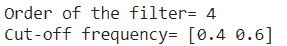
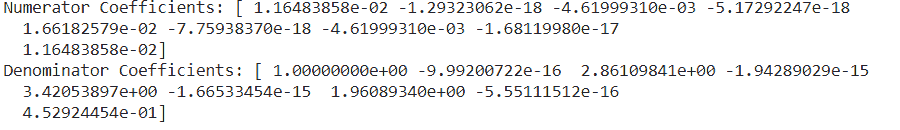
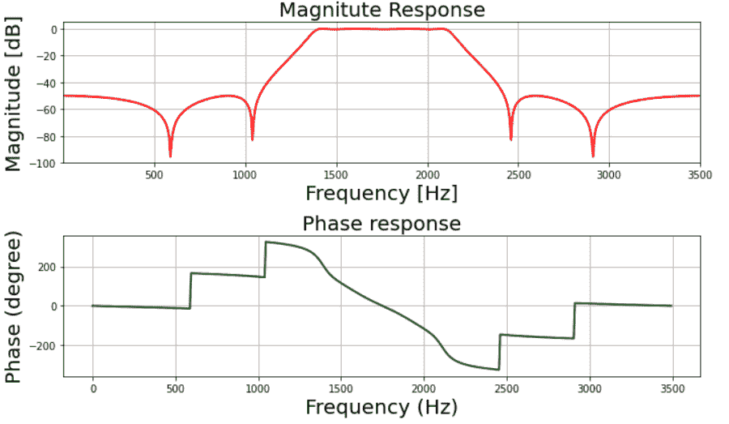
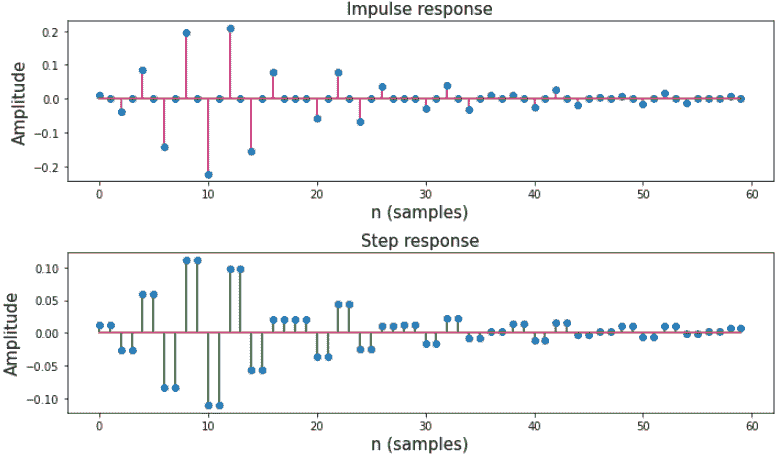

# 使用 Scipy- Python 设计 IIR 带通椭圆滤波器

> 原文:[https://www . geesforgeks . org/design-IIR-带通-椭圆滤波器-使用-scipy-python/](https://www.geeksforgeeks.org/design-iir-bandpass-elliptic-filter-using-scipy-python/)

IIR 代表无限脉冲响应，它是许多线性时不变系统的显著特征之一，其特征是脉冲响应 h(t)/h(n)在任何阶段都不会达到 0，而是无限持续。

## **什么是 IIR 带通椭圆滤波器？**

椭圆滤波器是一种特殊类型的滤波器，当需要从通带到阻带的快速转换时，用于数字信号处理。

## **规格如下:**

*   通带频率:1400-2100 赫兹
*   阻带频率:1050-24500 赫兹
*   通带纹波:0.4 分贝
*   阻带衰减:50 分贝
*   采样频率:7 千赫
*   我们将绘制滤波器的幅度和相位响应。

### **分步方法:**

**步骤 1:** 导入所有必需的库。

## 蟒蛇 3

```py
# import required library
import numpy as np
import scipy.signal as signal
import matplotlib.pyplot as plt
```

**第二步:**定义用户自定义函数 ***mfreqz()和 impz()*** 。 ***mfreqz*** 是幅度和相位图的函数， ***impz*** 是脉冲和阶跃响应的函数】。

## 蟒蛇 3

```py
# Function to depict magnitude
# and phase plot
def mfreqz(b, a, Fs):

    # Compute frequency response of the
    # filter using signal.freqz function
    wz, hz = signal.freqz(b, a)

    # Calculate Magnitude from hz in dB
    Mag = 20*np.log10(abs(hz))

    # Calculate phase angle in degree from hz
    Phase = np.unwrap(np.arctan2(np.imag(hz),
                                 np.real(hz)))*(180/np.pi)

    # Calculate frequency in Hz from wz
    Freq = wz*Fs/(2*np.pi)

    # Plot filter magnitude and phase responses using subplot.
    fig = plt.figure(figsize=(10, 6))

    # Plot Magnitude response
    sub1 = plt.subplot(2, 1, 1)
    sub1.plot(Freq, Mag, 'r', linewidth=2)
    sub1.axis([1, Fs/2, -100, 5])
    sub1.set_title('Magnitude Response', fontsize=20)
    sub1.set_xlabel('Frequency [Hz]', fontsize=20)
    sub1.set_ylabel('Magnitude [dB]', fontsize=20)
    sub1.grid()

    # Plot phase angle
    sub2 = plt.subplot(2, 1, 2)
    sub2.plot(Freq, Phase, 'g', linewidth=2)
    sub2.set_ylabel('Phase (degree)', fontsize=20)
    sub2.set_xlabel(r'Frequency (Hz)', fontsize=20)
    sub2.set_title(r'Phase response', fontsize=20)
    sub2.grid()

    plt.subplots_adjust(hspace=0.5)
    fig.tight_layout()
    plt.show()

# Define impz(b,a) to calculate impulse
# response and step response of a system
# input: b= an array containing numerator
# coefficients,a= an array containing
# denominator coefficients
def impz(b, a):

    # Define the impulse sequence of length 60
    impulse = np.repeat(0., 60)
    impulse[0] = 1.
    x = np.arange(0, 60)

    # Compute the impulse response
    response = signal.lfilter(b, a, impulse)

    # Plot filter impulse and step response:
    fig = plt.figure(figsize=(10, 6))
    plt.subplot(211)
    plt.stem(x, response, 'm', use_line_collection=True)
    plt.ylabel('Amplitude', fontsize=15)
    plt.xlabel(r'n (samples)', fontsize=15)
    plt.title(r'Impulse response', fontsize=15)

    plt.subplot(212)
    step = np.cumsum(response)

    # Compute step response of the system
    plt.stem(x, step, 'g', use_line_collection=True)
    plt.ylabel('Amplitude', fontsize=15)
    plt.xlabel(r'n (samples)', fontsize=15)
    plt.title(r'Step response', fontsize=15)
    plt.subplots_adjust(hspace=0.5)

    fig.tight_layout()
    plt.show()
```

**步骤 3:** 用给定的过滤器规格定义变量。

## 蟒蛇 3

```py
# Given specification

# Sampling frequency in Hz
Fs = 7000

# Pass band frequency in Hz
fp = np.array([1400, 2100])

# Stop band frequency in Hz
fs = np.array([1050, 2450])

# Pass band ripple in dB
Ap = 0.4

# Stop band attenuation in dB
As = 50
```

**步骤 4:** 计算截止频率

## 蟒蛇 3

```py
# Compute pass band and stop band edge frequencies

# Normalized passband edge
# frequencies w.r.t. Nyquist rate
wp = fp/(Fs/2)

# Normalized stopband
# edge frequencies
ws = fs/(Fs/2)
```

**步骤 5:** 计算椭圆带通数字滤波器的阶数。

## 蟒蛇 3

```py
# Compute order of the elliptic filter
# using signal.ellipord
N, wc = signal.ellipord(wp, ws, Ap, As)

# Print the order of the filter and
# cutoff frequencies
print('Order of the filter=', N)
print('Cut-off frequency=', wc)
```



**第六步:**设计数字椭圆带通滤波器。

## 蟒蛇 3

```py
# Design digital elliptic bandpass filter
# using signal.ellip function
z, p = signal.ellip(N, Ap, As, wc, 'bandpass')

# Print numerator and denomerator
# coefficients of the filter
print('Numerator Coefficients:', z)
print('Denominator Coefficients:', p)
```



**第 7 步:**绘制幅值和相位响应。

## 蟒蛇 3

```py
# Depicting visulalizations

# Call mfreqz to plot the magnitude and phase response
mfreqz(z, p, Fs)
```



**第 8 步:**绘制滤波器的脉冲和阶跃响应。

## 蟒蛇 3

```py
# Call impz function to plot impulse
# and step response of the filter
impz(z, p)
```



**以下是上述分步方法的完整实现:**

## 蟒蛇 3

```py
# Import required library
import numpy as np
import scipy.signal as signal
import matplotlib.pyplot as plt

# Function to depict magnitude
# and phase plot
def mfreqz(b, a, Fs):

    # Compute frequency response of the
    # filter using signal.freqz function
    wz, hz = signal.freqz(b, a)

    # Calculate Magnitude from hz in dB
    Mag = 20*np.log10(abs(hz))

    # Calculate phase angle in degree from hz
    Phase = np.unwrap(np.arctan2(np.imag(hz),
                                 np.real(hz)))*(180/np.pi)

    # Calculate frequency in Hz from wz
    Freq = wz*Fs/(2*np.pi)

    # Plot filter magnitude and phase responses using subplot.
    fig = plt.figure(figsize=(10, 6))

    # Plot Magnitude response
    sub1 = plt.subplot(2, 1, 1)
    sub1.plot(Freq, Mag, 'r', linewidth=2)
    sub1.axis([1, Fs/2, -100, 5])
    sub1.set_title('Magnitude Response', fontsize=20)
    sub1.set_xlabel('Frequency [Hz]', fontsize=20)
    sub1.set_ylabel('Magnitude [dB]', fontsize=20)
    sub1.grid()

    # Plot phase angle
    sub2 = plt.subplot(2, 1, 2)
    sub2.plot(Freq, Phase, 'g', linewidth=2)
    sub2.set_ylabel('Phase (degree)', fontsize=20)
    sub2.set_xlabel(r'Frequency (Hz)', fontsize=20)
    sub2.set_title(r'Phase response', fontsize=20)
    sub2.grid()

    plt.subplots_adjust(hspace=0.5)
    fig.tight_layout()
    plt.show()

# Define impz(b,a) to calculate impulse
# response and step response of a system
# input: b= an array containing numerator
# coefficients,a= an array containing
# denominator coefficients
def impz(b, a):

    # Define the impulse sequence of length 60
    impulse = np.repeat(0., 60)
    impulse[0] = 1.
    x = np.arange(0, 60)

    # Compute the impulse response
    response = signal.lfilter(b, a, impulse)

    # Plot filter impulse and step response:
    fig = plt.figure(figsize=(10, 6))
    plt.subplot(211)
    plt.stem(x, response, 'm', use_line_collection=True)
    plt.ylabel('Amplitude', fontsize=15)
    plt.xlabel(r'n (samples)', fontsize=15)
    plt.title(r'Impulse response', fontsize=15)

    plt.subplot(212)
    step = np.cumsum(response)

    # Compute step response of the system
    plt.stem(x, step, 'g', use_line_collection=True)
    plt.ylabel('Amplitude', fontsize=15)
    plt.xlabel(r'n (samples)', fontsize=15)
    plt.title(r'Step response', fontsize=15)
    plt.subplots_adjust(hspace=0.5)

    fig.tight_layout()
    plt.show()

# Given specification

# Sampling frequency in Hz
Fs = 7000

# Pass band frequency in Hz
fp = np.array([1400, 2100])

# Stop band frequency in Hz
fs = np.array([1050, 2450])

# Pass band ripple in dB
Ap = 0.4

# Stop band attenuation in dB
As = 50

# Compute pass band and
# stop band edge frequencies
# Normalized passband edge frequencies
# w.r.t. Nyquist rate
wp = fp/(Fs/2)

# Normalized stopband edge frequencies
ws = fs/(Fs/2)

# Compute order of the elliptic filter
# using signal.ellipord
N, wc = signal.ellipord(wp, ws, Ap, As)

# Print the order of the filter and cutoff frequencies
print('Order of the filter=', N)
print('Cut-off frequency=', wc)

# Design digital elliptic bandpass filter
# using signal.ellip() function
z, p = signal.ellip(N, Ap, As, wc, 'bandpass')

# Print numerator and denomerator coefficients of the filter
print('Numerator Coefficients:', z)
print('Denominator Coefficients:', p)

# Depicting visulalizations

# Call mfreqz to plot the magnitude and
# phase response
mfreqz(z, p, Fs)
# Call impz function to plot impulse and
# step response of the filter
impz(z, p)
```

**输出:**

   