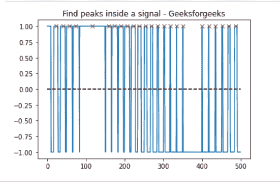

# 使用 Scipy

查找振幅高于 0 的所有峰值

> 原文:[https://www . geesforgeks . org/find-all-peaks-振幅-lies-over-0-using-scipy/](https://www.geeksforgeeks.org/find-all-peaks-amplitude-lies-above-0-using-scipy/)

**先决条件:**[**Mathplotlib**](https://www.geeksforgeeks.org/python-introduction-matplotlib/)**[**Scipy**](https://www.geeksforgeeks.org/data-analysis-with-scipy/)**

**在本文中，我们将看到如何在 find_peaks()函数的帮助下找到所有高于 0 的“x”点，该函数采用一维数组，并通过简单比较相邻值来找到所有局部最大值。**

****进场:****

*   **导入所需模块。**
*   **根据 find_peaks()属性查找信号内部的峰值。**
*   **给图表贴上标签。**
*   **显示图形。**

****步骤 1:** 导入所有库。**

## **蟒蛇 3**

```
import matplotlib.pyplot as plt
import numpy as np
from scipy.signal import find_peaks
from scipy import signal
```

****第二步:**心电图():返回的信号是 5 分钟长的心电图(ECG)，这是心脏电活动的医学记录，以 360 Hz 采样。**

> ****语法:****
> 
> **scipy.signal.find_peaks(x，高度=无)**
> 
> ****参数:****
> 
> *   ****x:** 有峰值的信号。**
> *   ****高度:**要求的山峰高度。要么是数字，要么是无，**
> 
> ****返回:****
> 
> ****峰:**x 中满足所有给定条件的峰的指数。
> **峰 _ 高:**给定高度，每个峰的高度为 x。**

## **蟒蛇 3**

```
import matplotlib.pyplot as plt
import numpy as np
from scipy.signal import find_peaks
from scipy import signal

t = np.linspace(0, 1, 500, endpoint=False)
sig = np.sin(2 * np.pi * t)
x= signal.square(2 * np.pi * 30 * t, duty=(sig + 1)/2)
peak, _ = find_peaks(x, height=0)
```

****以下是全部实现:****

## **蟒蛇 3**

```
import matplotlib.pyplot as plt
import numpy as np
from scipy.signal import find_peaks
from scipy import signal

t = np.linspace(0, 1, 500, endpoint=False)
sig = np.sin(2 * np.pi * t)
x= signal.square(2 * np.pi * 30 * t, duty=(sig + 1)/2)
peak, _ = find_peaks(x, height=0)

plt.plot(x)
plt.title("Find peaks inside a signal - Geeksforgeeks")
plt.plot(peak, x[peak], "x", color = 'r')
plt.plot(np.zeros_like(x), "--", color="black")
plt.show()
```

****输出:****

****