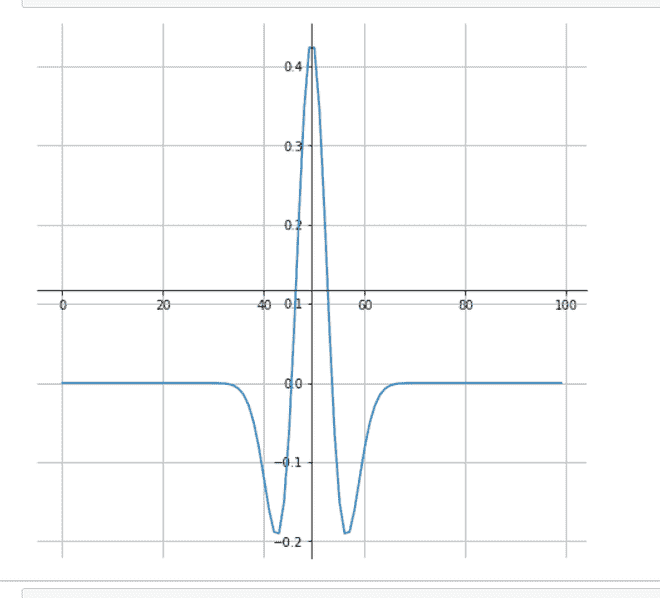

# 如何用 SciPy–Python 绘制 ricker 曲线？

> 原文:[https://www . geeksforgeeks . org/how-plot-ricker-curve-use-scipy-python/](https://www.geeksforgeeks.org/how-to-plot-ricker-curve-using-scipy-python/)

**前提条件:**[【mathplotlib】](https://www.geeksforgeeks.org/python-introduction-matplotlib/)、[【num py】](https://www.geeksforgeeks.org/numpy-in-python-set-1-introduction/)

里克小波是一种类似波浪的振荡，其振幅从 0 开始，增加，然后又减少到 0。一种里克小波，也称为“墨西哥帽小波”。
在本文中，我们将绘制里克曲线，使它们对信号处理有用。它是高斯函数的负归一化二阶导数。

> **语法:** scipy.signal.ricker(点，a)
> 
> **参数:**
> 
> *   **点:**向量中的若干点。将以 0 为中心。
> *   **a:** 小波的宽度参数。
> 
> **返回:**瑞克曲线形状的长度点数组。

**进场:**

*   导入所需模块。
*   创建一个数组来绘制里克曲线的形状。
*   在中心移动轴。
*   显示图表。

**例 1:** 绘制里克曲线。

## 蟒蛇 3

```
from scipy import signal
import matplotlib.pyplot as plt

point = 100
hat = signal.ricker(point, 4)

fig = plt.figure(figsize = (8, 8))
ax = fig.add_subplot(1, 1, 1)

# Move left y-axis and bottim x-axis to centre,
# passing through (0,0)
ax.spines['left'].set_position('center')
ax.spines['bottom'].set_position('center')

# Eliminate upper and right axes
ax.spines['right'].set_color('none')
ax.spines['top'].set_color('none')

plt.grid(True)
plt.plot(hat)

plt.show()
```

**输出:**



**例 2:** 绘制逆里克曲线。

## 蟒蛇 3

```
from scipy import signal
import matplotlib.pyplot as plt

point = 100
hat = -(signal.ricker(point, 4))

fig = plt.figure(figsize = (8, 8))
ax = fig.add_subplot(1, 1, 1)

# Move left y-axis and bottim x-axis to centre,
# passing through (0,0)
ax.spines['left'].set_position('center')
ax.spines['bottom'].set_position('center')

# Eliminate upper and right axes
ax.spines['right'].set_color('none')
ax.spines['top'].set_color('none')

plt.grid(True)
plt.plot(hat)

plt.show()
```

**输出:**

