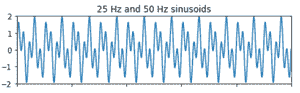
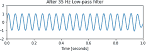

# 使用 Scipy–Python 中的低通数字巴特沃斯滤波器去除噪声

> 原文:[https://www . geeksforgeeks . org/去噪-使用-低通-数字-巴特沃斯-滤波器-in-scipy-python/](https://www.geeksforgeeks.org/noise-removal-using-lowpass-digital-butterworth-filter-in-scipy-python/)

在本文中，任务是编写一个 Python 程序，使用低通数字巴特沃斯滤波器去除噪声。

## **什么是****噪音？**

噪声基本上是电子信号中不需要的部分。它通常是由于设计故障、连接松动、开关故障等原因而产生的。

## **信号中有噪音怎么办？**

为了消除不想要的信号/噪声，我们使用不同类型和规格的滤波器。一般来说，在行业中，我们需要通过信号测试来选择最佳匹配，以确定在给定的使用情况下用于消除噪声的最佳滤波器。

## **我们现在要做什么？**

我们现在要实现一个低通[数字巴特沃兹滤波器](https://www.geeksforgeeks.org/digital-low-pass-butterworth-filter-in-python/)来去除正弦波组合中不需要的信号/噪声。

**过滤器规格:**

*   信号由 25 Hz 和 50 Hz 组成
*   采样频率 1kHz。
*   在 35Hz 下订购 N=10，以消除 50Hz 音调。

**逐步逼近:**

**步骤 1:** 导入库

## 蟒蛇 3

```
# import required library
import numpy as np
import scipy.signal as signal
import matplotlib.pyplot as plt
```

**步骤 2:** 定义规格

## 蟒蛇 3

```
# Specifications of the filter
f1 = 25  # Frequency of 1st signal
f2 = 50  # Frequency of 2nd signal
N = 10  # Order of the filter

# Generate the time vector of 1 sec duration
t = np.linspace(0, 1, 1000)  # Generate 1000 samples in 1 sec

# Generate the signal containing f1 and f2
sig = np.sin(2*np.pi*f1*t) + np.sin(2*np.pi*f2*t)
```

**步骤 3:** 用噪声绘制原始信号

## 蟒蛇 3

```
# Display the signal
fig, (ax1, ax2) = plt.subplots(2, 1, sharex=True)
ax1.plot(t, sig)
ax1.set_title('25 Hz and 50 Hz sinusoids')
ax1.axis([0, 1, -2, 2])

# Design the Butterworth filter using 
# signal.butter and output='sos'
sos = signal.butter(50, 35, 'lp', fs=1000, output='sos')
```

**输出:**



**步骤 4:** 去除噪声后的信号图

## 蟒蛇 3

```
# Filter the signal by the filter using signal.sosfilt
# Use signal.sosfiltfilt to get output inphase with input
filtered = signal.sosfiltfilt(sos, sig)

# Display the output signal
ax2.plot(t, filtered)
ax2.set_title('After 35 Hz Low-pass filter')
ax2.axis([0, 1, -2, 2])
ax2.set_xlabel('Time [seconds]')
plt.tight_layout()
plt.show()
```

**输出:**



**第五步:实施**

## 蟒蛇 3

```
# import required library
import numpy as np
import scipy.signal as signal
import matplotlib.pyplot as plt

# Given
f1 = 25  # Frequency of 1st signal
f2 = 50  # Frequency of 2nd signal
N = 10  # Order of the filter

# Generate the time vector of 1 sec duration
# START CODE HERE ### (≈ 1 line of code)
# Generate 1000 samples in 1 sec
t = np.linspace(0, 1, 1000)

# Generate the signal containing f1 and f2
# START CODE HERE ### (≈ 1 line of code)
sig = np.sin(2*np.pi*f1*t) + np.sin(2*np.pi*f2*t)

# Display the signal
fig, (ax1, ax2) = plt.subplots(2, 1, sharex=True)
ax1.plot(t, sig)
ax1.set_title('25 Hz and 50 Hz sinusoids')
ax1.axis([0, 1, -2, 2])

# Design the Butterworth filter using signal.butter and output='sos'
# START CODE HERE ### (≈ 1 line of code)
sos = signal.butter(50, 35, 'lp', fs=1000, output='sos')

# Filter the signal by the filter using signal.sosfilt
# START CODE HERE ### (≈ 1 line of code)
# Use signal.sosfiltfilt to get output inphase with input
filtered = signal.sosfiltfilt(sos, sig)

# Display the output signal
ax2.plot(t, filtered)
ax2.set_title('After 35 Hz Low-pass filter')
ax2.axis([0, 1, -2, 2])
ax2.set_xlabel('Time [seconds]')
plt.tight_layout()
plt.show()
```

**输出:**

 