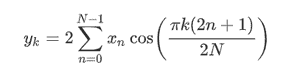

# Python–scipy . FFT . DCT()方法

> 原文:[https://www.geeksforgeeks.org/python-scipy-fft-dct-method/](https://www.geeksforgeeks.org/python-scipy-fft-dct-method/)

借助 **scipy.fft.dct()** 方法，我们可以通过选择不同类型的序列来计算离散余弦变换，并使用该方法返回变换后的数组。



**语法:**

```
scipy.fft.dct(x, type=2)

```

**返回值:**将返回变换后的数组。

**示例#1:** 在这个示例中，我们可以看到，通过使用 **scipy.fft.dct()** 方法，我们能够通过选择不同类型的序列来获得离散余弦变换，默认为 2。

## 蟒蛇 3

```
# import scipy
from scipy import fft

# Using scipy.fft.dct() method
gfg = fft.dct([1, 2, 3, 4])

print(gfg)
```

**输出:**

```
[20.00000000  -6.30864406  0.00000000  -0.44834153]

```

**例 2 :**

## 蟒蛇 3

```
# import scipy
from scipy import fft

# Using scipy.fft.dct() method
gfg = fft.dct([-6, 5, -4, 3, -2, 1], 3)

print(gfg)
```

**输出:**

```
[ -0.50866619  -0.58578644  -0.79439535  -1.34919819  -3.41421356
 -29.34774027]

```