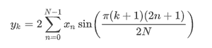

# Python–scipy . FFT . dst()方法

> 原文:[https://www.geeksforgeeks.org/python-scipy-fft-dst-method/](https://www.geeksforgeeks.org/python-scipy-fft-dst-method/)

借助 **scipy.fft.dst()** 方法，我们可以通过选择不同类型的序列来计算离散正弦变换，并使用该方法返回变换后的数组。



**语法:**

```
scipy.fft.dst(x, type=2)

```

**返回值:**将返回变换后的数组。

**示例#1:** 在这个示例中，我们可以看到，通过使用 scipy.fft.dst()方法，我们能够通过选择不同类型的序列来获得离散正弦变换，默认为 2。

## 蟒蛇 3

```
# import scipy
from scipy import fft

# Using scipy.fft.dst() method
gfg = fft.dst([1, 2, 3, 4])

print(gfg)
```

**输出:**

```
[13.06562965 -5.65685425  5.41196100 -4.00000000]

```

**例 2 :**

## 蟒蛇 3

```
# import scipy
from scipy import fft

# Using scipy.fft.dst() method
gfg = fft.dst([-6, 5, -4, 3, -2, 1], 3)

print(gfg)
```

**输出:**

```
[ -1.43023367  -2.3137085   -6.16568427  -7.77337942 -20.3137085
 -23.82253852]

```