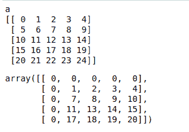
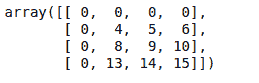

# Python Scipy–ndi image . interpolation . geometric _ transform()函数

> 原文:[https://www . geesforgeks . org/python-scipy-ndi image-interpolation-geometric _ transform-function/](https://www.geeksforgeeks.org/python-scipy-ndimage-interpolation-geometric_transform-function/)

给定的映射函数用于为输出中的每个点找到输入中相应的坐标

> **语法:**scipy . ndi image . interpolation . geometric _ transform(输入，映射，顺序=3)
> 
> **参数**
> 
> *   输入:接受一个数组。
> *   映射:接受类似于给定输出数组秩长度的元组数据结构。
> *   order : int 参数。这是样条插值，默认值为 3。
> 
> **返回:**返回一个 n 维数组。

**例 1:**

## 蟒蛇 3

```py
from scipy import ndimage

# importing numpy module for
# processing the arrays
import numpy as np

# creating an 2 dimensional array with
# 5 * 5 dimensions
a = np.arrange(25).reshape((5, 5))

print('a')
print(a)

# reducing dimensions function
def shift_func(output_coords):

    return (output_coords[0] - 0.7, output_coords[1] - 0.7)

# performing geometric transform operation
ndimage.geometric_transform(a, shift_func)
```

**输出:**



**例 2:**

## 蟒蛇 3

```py
from scipy import ndimage

# importing numpy module for
# processing the arrays
import numpy as np

# create 4 * 4 dim array.
b = np.arrange(16).reshape((4, 4))

# reducing dimensions function
def shift_func(output_coords):

    return (output_coords[0] - 0.1, output_coords[1] - 0.2)

ndimage.geometric_transform(b, shift_func)
```

**输出:**

