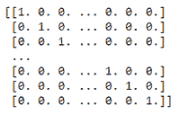
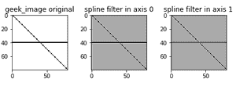

# Python Scipy–ndi image . spline _ filter 1d()函数

> 原文:[https://www . geesforgeks . org/python-scipy-ndi image-spline _ filter 1d-function/](https://www.geeksforgeeks.org/python-scipy-ndimage-spline_filter1d-function/)

该方法用于沿给定轴计算一维样条滤波器。这些由样条过滤器过滤。

> **语法:**scipy . ndi image . spline _ filter 1d(输入，顺序=3，轴=-1，输出= < class 'numpy.float64' >)
> 
> **参数**
> 
> **输入:**array _ like–输入数组
> 
> **顺序:**int–样条的顺序，默认为 3。
> 
> **轴:** int，–应用样条线过滤器的轴。默认为最后一个轴。
> 
> **输出:**n 数组–放置输出的数组，或返回数组的数据类型。默认值为 numpy.float64。

**例 1:**

## 蟒蛇 3

```
# importing spline filter with one dimension.
from scipy.ndimage import spline_filter1d

# importing matplot library for visualization
import matplotlib.pyplot as plt

# importing munpy module
import numpy as np

# creating an image
geek_image = np.eye(80)

# returns an image array format
geek_image[40, :] = 1.0
print(geek_image)
```

**输出:**



**例 2:**

## 蟒蛇 3

```
# importing spline filter with one dimension.
from scipy.ndimage import spline_filter1d

# importing matplot library for visualization
import matplotlib.pyplot as plt

# importing munpy module
import numpy as np

# creating an image
geek_image = np.eye(80)

geek_image[40, :] = 1.0

# in axis=0
axis_0 = spline_filter1d(geek_image, axis=0)

# in axis=1
axis_1 = spline_filter1d(geek_image, axis=1)

f, ax = plt.subplots(1, 3, sharex=True)

for ind, data in enumerate([[geek_image, "geek_image original"],
                            [axis_0, "spline filter in axis 0"],
                            [axis_1, "spline filter in axis 1"]]):
    ax[ind].imshow(data[0], cmap='gray_r')

    # giving title
    ax[ind].set_title(data[1])

    # orientation layout of our image
plt.tight_layout()

# to show image
plt.show()
```

**输出:**

