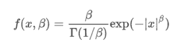

# Python | Scipy stats . half gennorm . log pdf()方法

> 原文:[https://www . geesforgeks . org/python-scipy-stats-half gennorm-log pdf-method/](https://www.geeksforgeeks.org/python-scipy-stats-halfgennorm-logpdf-method/)

借助`**stats.halfgennorm.logpdf()**`方法，利用`stats.halfgennorm.logpdf()`方法可以得到概率密度函数的对数值。

半根范数的概率密度函数是


> **语法:** `stats.halfgennorm.logpdf(x, beta)`
> **返回:**返回概率密度函数的对数。

**示例#1 :**
在这个示例中我们可以看到，通过使用`stats.halfgennorm.logpdf()`方法，我们能够使用该方法获得概率密度函数的对数。

```
# import halfgennorm
from scipy.stats import halfgennorm
beta = 2

# Using stats.halfgennorm.logpdf() method
gfg = halfgennorm.logpdf(0.1, beta)

print(gfg)
```

**输出:**

> 0.1107822376352453

**例 2 :**

```
# import halfgennorm
from scipy.stats import halfgennorm
beta = 4

# Using stats.halfgennorm.logpdf() method
gfg = halfgennorm.logpdf(0.9, beta)

print(gfg)
```

**输出:**

> -0.5578281635781869