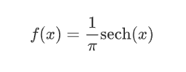

# Python | Scipy stats . hyp secant . logpdf()方法

> 原文:[https://www . geesforgeks . org/python-scipy-stats-hyp secant-log pdf-method/](https://www.geeksforgeeks.org/python-scipy-stats-hypsecant-logpdf-method/)

借助`**stats.hypsecant.logpdf()**`方法，利用`stats.hypsecant.logpdf()`方法可以得到概率密度函数的对数值。

超正割的概率密度函数为


> **语法:** `stats.hypsecant.logpdf(x, beta)`
> **返回:**返回概率密度函数的对数。

**示例#1 :**
在这个示例中我们可以看到，通过使用`stats.hypsecant.logpdf()`方法，我们能够使用该方法获得概率密度函数的对数。

```
# import hypsecant
from scipy.stats import hypsecant
beta = 2

# Using stats.hypsecant.logpdf() method
gfg = hypsecant.logpdf(0.1, beta)

print(gfg)
```

**输出:**

> -2.3737069217443336

**例 2 :**

```
# import hypsecant
from scipy.stats import hypsecant
beta = 4

# Using stats.hypsecant.logpdf() method
gfg = hypsecant.logpdf(0.9, beta)

print(gfg)
```

**输出:**

> -3.553610079413293