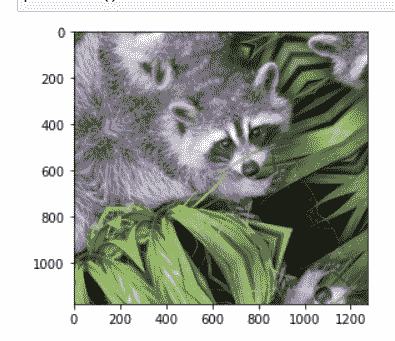
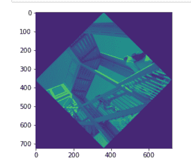

# 使用 ndimage 旋转图片。旋转 Scipy

> 原文:[https://www . geesforgeks . org/rotate-a-picture-using-ndi image-rotate-scipy/](https://www.geeksforgeeks.org/rotate-a-picture-using-ndimage-rotate-scipy/)

**前提条件:**[【mathplotlib】](https://www.geeksforgeeks.org/python-introduction-matplotlib/)、[【scipy】](https://www.geeksforgeeks.org/data-analysis-with-scipy/)

图像处理中一些最常见的任务是显示图像、基本操作、图像过滤、图像分割。
在本文中，我们将使用 SciPy 模块“ndimage.rotate()”进行旋转。SciPy ndimage 子模块专用于图像处理。这里，ndimage 指的是 n 维图像。

**进场:**

*   导入所有必需的模块。
*   SciPy 附带了一些图片，我们使用这些图片。
*   调用并传递 ndimage.rotate()中的参数。
*   显示图像。

**第一步:**导入模块。

## 蟒蛇 3

```
from scipy import ndimage, misc
from matplotlib import pyplot as plt
```

**第二步:**SciPy 中的 misc 包附带了一些图片。我们使用这些图像来学习图像处理。

## 蟒蛇 3

```
from scipy import ndimage, misc
from matplotlib import pyplot as plt

panda = misc.face()
```

**步骤 3:**SciPy“ndi image”子模块专用于图像处理。这里的“ndimage”指的是一个 n 维图像。

> **语法:**
> 
> scipy . ndi image . rotate(输入，角度)
> 
> **参数:**
> 
> *   **输入:**输入数组。
> *   **角度:**旋转角度，单位为度。
> *   **模式:** { '反射'，'恒定'，'最近'，'镜像'，'环绕' }，可选
> 
> **返回:**旋转的输入。

## 蟒蛇 3

```
from scipy import ndimage, misc
from matplotlib import pyplot as plt
panda = misc.face()

#image rotated 135 degree
panda_rotate = ndimage.rotate(panda, 135, mode = 'constant')
```

**下面是实现:**

**例 1:**

## 蟒蛇 3

```
from scipy import ndimage, misc
from matplotlib import pyplot as plt

panda = misc.face()
#image rotated 35 degree
panda_rotate = ndimage.rotate(panda, 35,
                              mode = 'mirror')
plt.imshow(panda_rotate)
plt.show()
```

**输出:**



**例 2:**

## 蟒蛇 3

```
from scipy import ndimage, misc
from matplotlib import pyplot as plt

panda = misc.ascent()

#image rotated 360 degree
panda_rotate = ndimage.rotate(panda, 45, 
                              mode = 'constant')
plt.imshow(panda_rotate)
plt.show()
```

**输出:**

