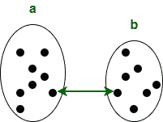
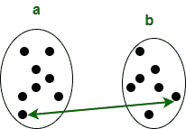
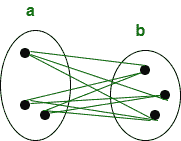
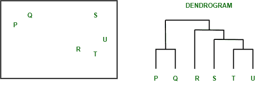
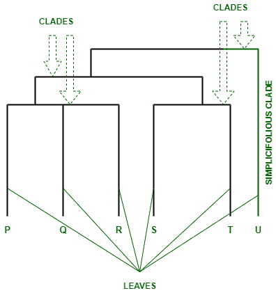
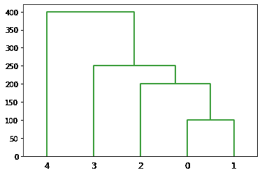
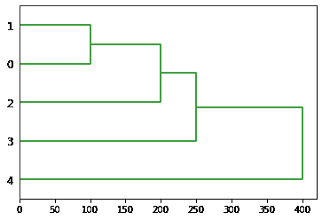

# SciPy–聚类层次树图

> 原文:[https://www . geesforgeks . org/scipy-cluster-hierarchy-tred gram/](https://www.geeksforgeeks.org/scipy-cluster-hierarchy-dendrogram/)

在本文中，我们将使用 python 中的 Scipy 模块了解集群层次树图。首先，我们将讨论以下相关概念:

## 层次聚类

[分层聚类](https://www.geeksforgeeks.org/hierarchical-clustering-in-data-mining/)需要创建从上到下具有预定顺序的聚类。这是一种用于聚类未标记数据点的[无监督机器学习](https://www.geeksforgeeks.org/supervised-unsupervised-learning/)算法。

#### 如何表演？

1.  每个数据点一开始都应该被视为一个集群。
2.  将开始时的簇数表示为 k
3.  通过组合两个最近的数据点形成一个聚类，从而产生 K-1 个聚类。
4.  通过合并两个最接近的集群形成更多的集群，从而产生 K-2 集群。
5.  重复以上四个步骤，直到创建一个大集群。
6.  一旦一个集群被创建，树图就被用来划分成多个集群。

#### 层次聚类的类型

**1。分裂聚类**

分裂聚类，也称为自上而下的聚类方法，将所有观察值分配给一个聚类，然后将该聚类划分为两个最不相似的聚类。

**2。聚集聚类**

在凝聚或自下而上的聚类方法中，每个观察值被分配到它自己的聚类中。

#### 算法

**1。单连杆**

单链聚类通常产生这样的聚类，其中个体被顺序添加到单个组中。两个群集之间的距离定义为两个最近的数据点之间的距离。

```
L(a , b) = min(D(xai , xbj)) 
```



**2。完成联动**

完全连锁聚类通常产生分离良好且紧密的聚类。两个簇之间的距离被定义为每个簇中两个数据点之间的最长距离。

```
L(a , b) = max(D(xai , xbj))
```



**3。简单平均值**

简单平均算法将集群之间的距离定义为每个成员之间的平均距离，加权后两个集群对最终输出的影响相等。

```
L(a , b) = Tab / ( Na * Nb)
T<sub>ab</sub>: The sum of all pairwise distances between the two clusters.
N<sub>a and Nb</sub>: The sizes of the clusters a and b, respectively.
```



### 系统树图

树形图是一种树形图，用于可视化集群之间的关系。树形图中垂直线的距离越大，这些簇之间的距离就越大。解释树木图的关键是集中于任何两个物体连接在一起的高度。

**树形图示例:**

假设我们有六个集群:P、Q、R、S、T 和 u。散点图上显示的这六个观测值的集群层次树图为:



给定散点图的树木图

**树形图的部分:**



树形图的一部分

*   谱系图的分支叫做分支。这些分支是根据它们有多相似或不相似来排列的。
*   树形图的每个分支都有一片或多片叶子。p、Q、R、S、T 和 U 是树图的叶子:
    *   三重(三叶):磷、钾、铬
    *   双(双光):S，T
    *   单(单叶):U

### 实现层次聚类和绘制树形图

为了实现层次聚类和绘制树图，我们将使用以下一些方法:

*   分级和聚集聚类的功能由**分级模块**提供。
*   为了执行分级聚类，使用**scipy . cluster . hierarchy . linkage**函数。该功能的参数有:

> **语法:**scipy . cluster . hierarchy . linkage(n 数组、方法、度量、最优排序)

*   为了将分级聚类绘制为树形图**使用了 scipy.cluster.hierarchy .树形图**功能。

> **语法:**scipy . cluster . hierarchy . tregram(Z，p，truncate_mode，color_threshold，get _ leaves，orientation，labels，count_sort，distance_sort，show_leaf_counts，no_plot，no_labels，leaf_font_size，leaf_rotation，leaf_label_func，show_contracted，link_color_func，ax，above _ threshold _ color)

**例 1:正常树形图**

## 计算机编程语言

```
# Python program to plot the hierarchical
# clustering dendrogram using SciPy

# Import the python libraries
import numpy as np
from scipy.cluster import hierarchy
import matplotlib.pyplot as plt

# Create an array
x = np.array([100., 200., 300., 400., 500., 250.,
              450., 280., 450., 750.])

# Plot the hierarchical clustering as a dendrogram.
temp = hierarchy.linkage(x, 'single')
plt.figure()

dn = hierarchy.dendrogram(
    temp, above_threshold_color="green", color_threshold=.7)
```

**输出:**



**示例 2:使用水平方向的树图:**

## 计算机编程语言

```
# Plot the dendrogram in horizontal orientation

# Import the python libraries
import numpy as np
from scipy.cluster import hierarchy
import matplotlib.pyplot as plt

# Create an array
x = np.array([100., 200., 300., 400., 500., 250.,
              450., 280., 450., 750.])

# Plot the hierarchical clustering as a dendrogram.
temp = hierarchy.linkage(x, 'single')
plt.figure()
dn = hierarchy.dendrogram(
    temp, above_threshold_color="green", color_threshold=.7, orientation='right')
```

**输出:**



scipy . cluster . hierarchy . tregram 的参数**方位**已设置为**【右侧】**。它在右边绘制根，在左边绘制后代链接。