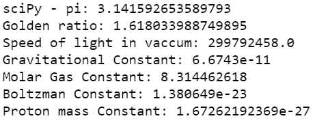
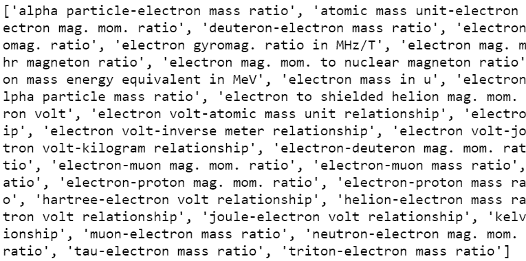
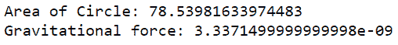

# scipy–常数

> 原文:[https://www.geeksforgeeks.org/scipy-constants/](https://www.geeksforgeeks.org/scipy-constants/)

**Scipy** 代表 Scientific Python，在任何科学/数学计算中，我们经常需要通用常数来执行任务，一个著名的例子是计算圆的面积= ' PI * r * r ’,其中 PI = 3.14……或者更复杂的例子，如找到力<sub>引力</sub>= G * M * M‖(距离) <sup>2</sup> 其中 G =引力常数。在所有这些情况下，如果我们有参考资料来查找这些常数并轻松地将它们合并到我们的计算中，将会非常方便。

Scipy-Constants 是 Scipy 库中的一个子模块，它为我们完成了这项工作。它包含了通用数学常数、物理常数和单位的详尽列表。只需 1 行代码就可以查到。

### 访问常数

只需在“ **scipy.constants.XXXX** ”格式中键入常数的名称来代替 XXXX，即可访问其值。下面列出了一些使用 scipy.constant 模块的最重要的常量。这个列表并不是详尽的，但是它给出了一个如何访问常量的好主意。

## 蟒蛇 3

```py
# import module
import scipy

# Just type the name of the constant in
# scipy.constant.XXXX format to access its value.
print("sciPy - pi:", scipy.constants.pi)
print("Golden ratio:", scipy.constants.golden_ratio)
print("Speed of light in vaccum:", scipy.constants.c)
print("Gravitational Constant:", scipy.constants.G)
print("Molar Gas Constant:", scipy.constants.R)
print("Boltzman Constant:", scipy.constants.k)
print("Proton mass Constant:", scipy.constants.proton_mass)
```

**输出:**



### 寻找常数

我们可以使用一个内置的方法来找到与我们的用例相关的常数。常量使用字典数据结构存储，我们可以使用 **scipy。常量. find()** API 从字典中找到所有相关常量，并相应地使用它们。

下面的代码演示了如何使用 scipy。常量. find() API。下面的代码打印了所有包含‘电子’的常量，我们可以过滤掉需要的那个。

## 蟒蛇 3

```py
import scipy

# find method looks up in the dictorary and
# finds out all the constants containing
# 'electron' word in it and returns a list
# of constants.
res = scipy.constants.find("electron")
print(res, end='\n')
```

**输出:**



不仅仅是常数的大小，我们还可以使用格式访问存储在 scipy.constants 模块中的与任何物理常数的大小相关的不确定性的单位和程度

> physical_constants[name] =(值、单位、不确定性)。

## 蟒蛇 3

```py
import scipy

# This returns a tuple (value, unit, uncertainty)
# associated with the physical constant
print(scipy.constants.physical_constants['alpha particle mass'])
```

**输出:**

```py
(6.6446573357e-27, 'kg', 2e-36)
```

**示例:**

## 蟒蛇 3

```py
import scipy

# Area of a circle using
# scipy.constants.pi
def Area_of_Circle(r):
    return scipy.constants.pi * r * r

# Calculates the gravational for
def force_gravity(M, m, dist):
    return (scipy.constants.G*M*m) / (dist**2)

print(f'Area of Circle: {Area_of_Circle(5)}')
print(f'Gravitational force: {force_gravity(10,5,1)}')
```

**输出:**



除了上面的变量，scipy.constants 还包含更多的物理常量，下面是 scipy.constants 模块中所有可用方法的列表，并附有说明。

**以下是 SciPy 模块中最常用的常量:**

<figure class="table">

| 常数 | 描述 |
| --- | --- |
| 圆周率 | 数学 pi 值 |
| 金色的 | 数学黄金比例 |
| c | 真空中的光速 |
| 光速 | 真空中的光速 |
| G | 标准重力加速度 |
| G | 牛顿引力常数 |
| E | 基本电荷 |
| 稀有 | 摩尔气体常数 |
| 希腊字母的第一个字母 | 精细结构常数 |
| 不适用 | 阿瓦加德罗常数 |
| K | 玻尔兹曼常数 |
| 希腊字母表中第十八个字母 | 斯特凡-玻尔兹曼常数σ |
| m_e | 电子质量 |
| m_p | 质子质量 |
| m_n | 中子质量 |
| H | 普朗克常数 |
| 普朗克常数 | 普朗克常数 h |

</figure>

**以下是 SciPy 模块中可用的单位常数:**

*   **质量:**

<figure class="table">

| 单位 | 描述 |
| --- | --- |
| 克 | 千克等于一克。 |
| 小麦 | 一公斤一粒。 |
| 镑 | 一磅等于一公斤。 |
| 盎司 | 千克一盎司。 |
| 自动质量 | 以千克为单位的原子质量常数。 |

</figure>

*   **时间:**

<figure class="table">

| 单位 | 描述 |
| --- | --- |
| 分钟 | 一分一秒。 |
| 小时 | 几秒钟一小时。 |
| 一天 | 几秒钟后的一天。 |
| 年 | 一年一秒。 |

</figure>

*   **长度:**

<figure class="table">

| 单位 | 描述 |
| --- | --- |
| 英寸 | 一英寸米。 |
| 脚 | 一英尺一米。 |
| 院子 | 一米一码。 |
| 铂 | 一米一分。 |
| 微米 | 一微米米。 |

</figure>

*   **压力:**

<figure class="table">

| 单位 | 描述 |
| --- | --- |
| 大气 （atmosphere 的缩写） | 以帕斯卡为单位的标准大气。 |
| 大气 | 以帕斯卡为单位的标准大气。 |
| 酒吧 | 一个帕斯卡酒吧。 |
| 托 | 1 托(毫米汞柱)帕斯卡。 |

</figure>

*   **面积:**

<figure class="table">

| 单位 | 描述 |
| --- | --- |
| 公顷 | 平方米一公顷。 |
| 英亩 | 平方米一英亩。 |

</figure>

*   **速度:**

<figure class="table">

| 单位 | 描述 |
| --- | --- |
| Kmh | 千米每小时，单位为米每秒。 |
| 每小时英里数 | 英里/小时，单位为米/秒。 |
| 马赫 | 每秒一米的比赛。 |

</figure>