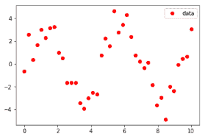
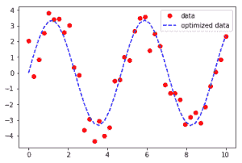
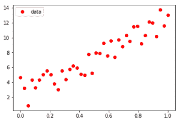
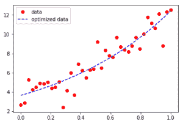

# SciPy |曲线拟合

> 原文:[https://www.geeksforgeeks.org/scipy-curve-fitting/](https://www.geeksforgeeks.org/scipy-curve-fitting/)

给定由一组点组成的数据集，找到代表数据的最佳拟合。
我们通常有一个由遵循一般路径的数据组成的数据集，但是每个数据都有一个标准偏差，这使得它们分散在最佳拟合线上。我们可以使用曲线拟合()函数得到一条直线。
**使用 SciPy :**
Scipy 是 Python 的科学计算模块，在许多著名的数学函数上提供内置函数。scipy.optimize 包为我们提供了多种优化程序。在 iPython 控制台中键入以下内容，可以找到优化的所有功能的详细列表:

```py
help(scipy.optimize)
```

最常用的有最小二乘法、曲线拟合、多元标量函数的最小化等。
**曲线拟合示例–**
**输入:**



**输出:**



**输入:**



**输出:**



如输入中所示，数据集在第一种情况下似乎分散在正弦函数和第二种情况下分散在指数函数中，曲线拟合赋予函数合法性，并确定系数以提供最佳拟合线。

显示第一个示例生成的代码–

## 蟒蛇 3

```py
import numpy as np

# curve-fit() function imported from scipy
from scipy.optimize import curve_fit

from matplotlib import pyplot as plt

# numpy.linspace with the given arguments
# produce an array of 40 numbers between 0
# and 10, both inclusive
x = np.linspace(0, 10, num = 40)

# y is another array which stores 3.45 times
# the sine of (values in x) * 1.334.
# The random.normal() draws random sample
# from normal (Gaussian) distribution to make
# them scatter across the base line
y = 3.45 * np.sin(1.334 * x) + np.random.normal(size = 40)

# Test function with coefficients as parameters
def test(x, a, b):
    return a * np.sin(b * x)

# curve_fit() function takes the test-function
# x-data and y-data as argument and returns
# the coefficients a and b in param and
# the estimated covariance of param in param_cov
param, param_cov = curve_fit(test, x, y)

print("Sine function coefficients:")
print(param)
print("Covariance of coefficients:")
print(param_cov)

# ans stores the new y-data according to
# the coefficients given by curve-fit() function
ans = (param[0]*(np.sin(param[1]*x)))

'''Below 4 lines can be un-commented for plotting results
using matplotlib as shown in the first example. '''

# plt.plot(x, y, 'o', color ='red', label ="data")
# plt.plot(x, ans, '--', color ='blue', label ="optimized data")
# plt.legend()
# plt.show()
```