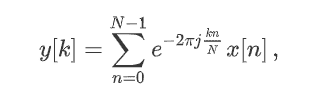

# Python 中的 scipy.fft()

> 原文:[https://www.geeksforgeeks.org/scipy-fft-in-python/](https://www.geeksforgeeks.org/scipy-fft-in-python/)

借助 **scipy.fft()** 方法，我们可以通过简单的一维 numpy 数组计算快速傅里叶变换，它将使用该方法返回变换后的数组。



快速傅里叶变换

> **语法:** scipy.fft(x)
> 
> **返回:**返回变换后的数组。

**示例#1 :**

在这个例子中，我们可以看到，通过使用 **scipy.fft()** 方法，我们能够通过传递数字序列来计算快速傅立叶变换，并返回变换后的数组。

## 蟒蛇 3

```
# import scipy and numpy
import scipy
import numpy as np

x = np.array(np.arange(10))
# Using scipy.fft() method
gfg = scipy.fft(x)

print(gfg)
```

**输出:**

> [45.+0.j -5。+15.38841769j -5。+6.8819096j -5。+3.63271264j
> 
> -5.+1.62459848j -5。+0.j -5。-1.62459848j -5。-3.63271264j
> 
> -5.-6.8819096j -5。-15.38841769j]

**例 2 :**

## 蟒蛇 3

```
# import scipy and numpy
import scipy
import numpy as np

x = np.array(np.arange(5))
# Using scipy.fft() method
gfg = scipy.fft(x)

print(gfg)
```

**输出:**

> [10.+0.j-2.5+3.4409548j-2.5+0.81229924j-2.5-0.8129924j
> 
> -2.5-3.4409548j ]