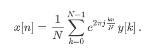

# scipy . ift()在 Python

中

> 原文:[https://www.geeksforgeeks.org/scipy-ifft-in-python/](https://www.geeksforgeeks.org/scipy-ifft-in-python/)

借助**sci . IFFT()**方法，我们可以通过简单的一维 numpy 数组计算快速傅立叶逆变换，它会用这种方法返回变换后的数组。



快速傅里叶逆变换

> **语法:**scipy . ift(y)
> 
> **返回:**返回变换后的数组。

**示例#1 :**

在这个例子中我们可以看到，通过使用 **scipy.ifft()** 方法，我们能够得到快速傅立叶逆变换并返回变换后的数组。

## 蟒蛇 3

```py
# import scipy and numpy
import scipy
import numpy as np

x = np.array(np.arange(10))
gfg_transformed = scipy.fft(x)
# Using scipy.ifft() method
gfg_inversed = scipy.ifft(gfg_transformed)

print(gfg_inversed)
```

**输出:**

> [0.-1.77635684e-16j 1。+0.00000000e+00j 2。+1.43710287e-16j
> 
> 3.+0.00000000e+00j 4。-5.48924451e-17j 5。+0.00000000e+00j
> 
> 6.-5.48924451e-17j 7。+0.00000000e+00j 8。+1.43710287e-16j
> 
> 9.+0.00000000e+00j]

**例 2 :**

## 蟒蛇 3

```py
# import scipy and numpy
import scipy
import numpy as np

x = np.array(np.arange(5))
gfg_transformed = scipy.fft(x)
# Using scipy.ifft() method
gfg_inversed = scipy.ifft(gfg_transformed)

print(gfg_inversed)
```

**输出:**

> [0.+0.j 1。+0.j 2。+0.j 3。+0.j 4。+0.j]