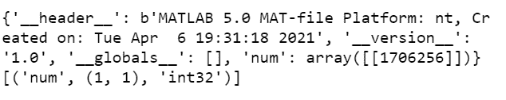
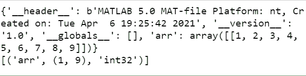
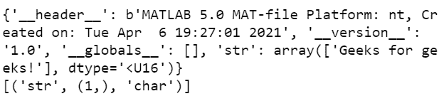

# SciPy–输入和输出

> 原文:[https://www.geeksforgeeks.org/scipy-input-and-output/](https://www.geeksforgeeks.org/scipy-input-and-output/)

在本文中，我们了解了 SciPy 输入和输出。为了处理多种格式的输入输出， **Scipy.io** 包提供了多种方法。

**scipy . io 包可以处理的一些格式有:**

*   矩阵实验室
*   netcdf
*   国际日期变更线
*   Arff
*   矩阵市场
*   波浪

其中 Matlab 是使用非常频繁的格式。

**现在让我们看看用来加载和保存. mat 文件的函数。**

*   首先我们需要使用 **loadmat()** 函数加载 Matlab 文件。
*   其次，我们将使用 **savemat()** 函数保存 Matlab 文件。
*   最后，使用 **whosmat()** 方法列出 Matlab 文件中的变量。

以下是基于上述解释的各种示例，描述了如何使用 scipy 模块进行输入和显示输出。

**例 1:** Scipy 程序取一个整数输入并显示。

## 蟒蛇 3

```py
import scipy.io as syio

# Save the mat file
n = 1706256
syio.savemat('num.mat', {'num': n})

# Load the mat File
matlab_file_contents = syio.loadmat('num.mat')
print(matlab_file_contents)

# printing the contents of mat file.
matlab_file_contents = syio.whosmat('num.mat')
print(matlab_file_contents)
```

**输出:**



**示例 2:** Scipy 程序获取数组输入并显示。

## 蟒蛇 3

```py
import scipy.io as syio

# Save the mat file
arr = [1, 2, 3, 4, 5, 6, 7, 8, 9]
syio.savemat('arr.mat', {'arr': arr})

# Load the mat File
matlab_file_contents = syio.loadmat('arr.mat')
print(matlab_file_contents)

# printing the contents of mat file.
matlab_file_contents = syio.whosmat('arr.mat')
print(matlab_file_contents)
```

**输出:**



**例 3:** Scipy 程序进行字符串输入并显示。

## 蟒蛇 3

```py
import scipy.io as syio

# Save the mat file
string = 'Geeks for geeks!'
syio.savemat('str.mat', {'str': string})

# Load the mat File
matlab_file_contents = syio.loadmat('str.mat')
print(matlab_file_contents)

# printing the contents of mat file.
matlab_file_contents = syio.whosmat('str.mat')
print(matlab_file_contents)
```

**输出:**

