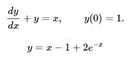
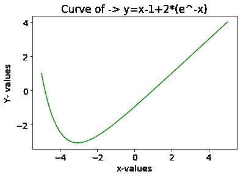

# SciPy–曲线拟合微分方程的积分

> 原文:[https://www . geesforgeks . org/scipy-曲线拟合微分方程积分/](https://www.geeksforgeeks.org/scipy-integration-of-a-differential-equation-for-curve-fit/)

在机器学习中，我们通常做的是收集数据，将其可视化，然后在图中拟合一条曲线，然后根据曲线拟合预测某些参数。如果我们有一些理论数据，我们可以使用**曲线拟合**从验证的数据集中提取方程并进行验证。因此，为了找到任意阶曲线的方程，无论它是线性的、二次的还是多项式的，我们使用**微分方程**，然后积分该方程，我们可以得到曲线拟合。

在 *Python SciPy* 中，通过使用 *odeint()对微分方程进行数学积分，可以很容易地完成这个过程来求解微分方程。*通过取三个或三个以上的参数， **odeint(model，y0，t)** 可用于求解任意阶微分方程。

> **参数:**
> **模型**–微分方程
> **y0**–Y 的初始值
> **t**–我们想要曲线的时间空间(基本上是 x 的范围)

让我们用一个例子来说明这一点:

<center></center>

**代码:解方程得到**y = x–1+2(e^-x)**作为解**

```py
import numpy as np
from scipy.integrate import odeint
import matplotlib.pyplot as plt

from scipy.integrate import odeint

# Define a function which calculates the derivative by making dy/dx as 
# the subject of formula in the given above equation
def dy_dx(y, x):
    return x - y

#Here we define the graph limits for x
xs = np.linspace(-5,5,100)

#Initially y=1 given
y0 = 1.0

# This scipy.integrate.odeint() integrates the given equation by taking
# 3 parameters odeint(model,y0,t)
# model- the differential equation function
# y0-the inital value of y
# t- the timepoints for which we need to plot the curve
ys = odeint(dy_dx, y0, xs)
ys = np.array(ys).flatten()

# By using the matplotlib.pyplot library we plot the curve after integration 
plt.rcParams.update({'font.size': 14})  # increase the font size
plt.xlabel("x-values")
plt.ylabel("Y- values")
plt.title('Curve of -> y=x-1+2*(e^-x)')
plt.plot(xs, ys,color='green')
```

**输出:**
这是使用`scipy.integrate.odeint( )`生成的图形，如下图所示，进一步用于曲线拟合–用于分析机器学习中的数据。

<center></center>