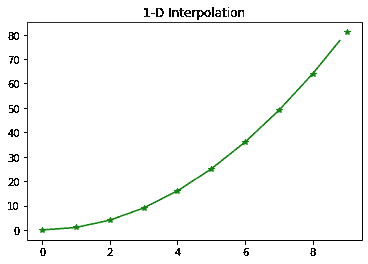
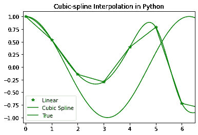
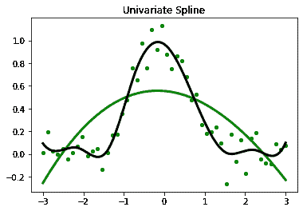

# SciPy 插值

> 原文:[https://www.geeksforgeeks.org/scipy-interpolation/](https://www.geeksforgeeks.org/scipy-interpolation/)

在本文中，我们将使用 Python 中的 SciPy 模块学习插值。首先，我们将讨论插值及其类型和实现。

### 插值及其类型

插值是一种在给定数据点之间构建数据点的技术。 **scipy.interpolate** 是 Python SciPy 中的一个模块，由类、样条函数以及一元和多元插值类组成。插值有多种方式，其中包括:

*   一维插值
*   样条插值
*   一元样条插值
*   径向基函数插值

让我们逐一讨论所有的方法，并将结果可视化。

### 一维插值

为了创建基于固定数据点的函数，使用**scipy . INTERPOL . interp 1d**。它接受数据点 x 和 y，并返回一个可以用新的 x 调用的函数，然后返回相应的 y 点。

> **语法:**scipy . interpolate . interp 1d(x，y，kind，axis，copy，bounds_error，fill_value，假定 _sorted)

## 计算机编程语言

```
# Import the required Python libraries
import matplotlib.pyplot as plt
from scipy import interpolate
import numpy as np

# Initialize input values x and y
x = np.arange(0, 10)
y = x**2

# Interpolation
temp = interpolate.interp1d(x, y)
xnew = np.arange(0, 9, 0.2)
ynew = temp(xnew)

plt.title("1-D Interpolation")
plt.plot(x, y, '*', xnew, ynew, '-', color="green")
plt.show()
```

**输出:**



### 样条插值

在样条插值中，计算曲线的样条表示，然后在所需的点计算样条。函数 **splrep** 用于在二维平面中寻找曲线的样条表示。

*   为了找到一维曲线的 B 样条表示，使用**scipy . interpolate . SPREP**。

> **语法:**scipy . interpolate . SPREP(x，y，w，xb，xe，k，task，s，t，full_output，per，quiet)

*   为了计算 B 样条或其导数，使用**scipy . INTERPOL . splev**。

> **语法:**scipy . interpret . splev(x，tck，der，ext)

## 计算机编程语言

```
# Import the required Python libraries
import numpy as np
import matplotlib.pyplot as plt
from scipy import interpolate

# Initialize the input values
x = np.arange(0, 10)
y = np.cos(x**3)

# Interpolation
# To find the spline representation of a 
# curve in a 2-D plane using the function 
# splrep
temp = interpolate.splrep(x, y, s=0)
xnew = np.arange(0, np.pi**2, np.pi/100)
ynew = interpolate.splev(xnew, temp, der=0)

plt.figure()

plt.plot(x, y, '*', xnew, ynew, xnew, np.cos(xnew),
         x, y, 'b', color="green")

plt.legend(['Linear', 'Cubic Spline', 'True'])
plt.axis([-0.1, 6.5, -1.1, 1.1])
plt.title('Cubic-spline Interpolation in Python')
plt.show()
```

**输出:**



### 单变量样条

它是一个适合一组给定数据点的一维平滑样条。**scipy . interpole . Univariaespline**用于将 k 度的样条 y = spl(x)拟合到所提供的 x，y 数据。s 通过指定平滑条件来指定结的数量。使用给定的平滑因子 s 和在最后一次调用中找到的节点进行的**样条计算。**

> **语法:**scipy . interpolate . univariaespline(x，y，w，bbox，k，s，ext)

## 计算机编程语言

```
# Import the required libraries
import matplotlib.pyplot as plt
from scipy.interpolate import UnivariateSpline

x = np.linspace(-3, 3, 50)
y = np.exp(-x**2) + 0.1 * np.random.randn(50)
plt.title("Univariate Spline")
plt.plot(x, y, 'g.', ms=8)

# Using the default values for the 
# smoothing parameter
spl = UnivariateSpline(x, y)
xs = np.linspace(-3, 3, 1000)
plt.plot(xs, spl(xs), 'green', lw=3)

# Manually change the amount of smoothing
spl.set_smoothing_factor(0.5)
plt.plot(xs, spl(xs), color='black', lw=3)
plt.show()
```

**输出:**



### 插值的径向基函数

**scipy . interpret . Rbf**用于对 n 维的散乱数据进行插值。径向基函数被定义为对应于固定的参考数据点。**scipy . interpret . Rbf**是一类径向基函数插值，用于将函数从二维散乱数据插值到三维区域。

> **语法:**scipy . INTERPOL . Rbf(* args)

## 计算机编程语言

```
# Import the required libraries
import numpy as np
from scipy.interpolate import Rbf
import matplotlib.pyplot as plt

# setup the data values
x = np.linspace(0, 10, 9)
y = np.cos(x/2)
xi = np.linspace(0, 10, 110)

# Interpolation using RBF
rbf = Rbf(x, y)
fi = rbf(xi)

plt.subplot(2, 1, 2)
plt.plot(x, y, '*', color="green")
plt.plot(xi, fi, 'green')
plt.plot(xi, np.sin(xi), 'black')
plt.title('Radial basis function Interpolation')
plt.show()
```

**输出:**

