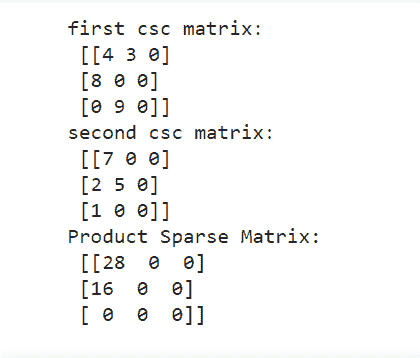
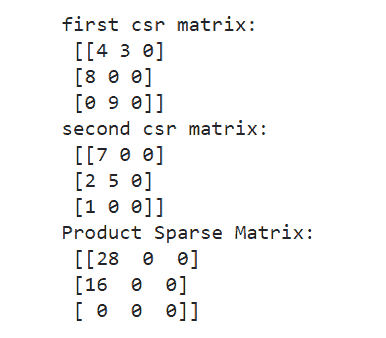
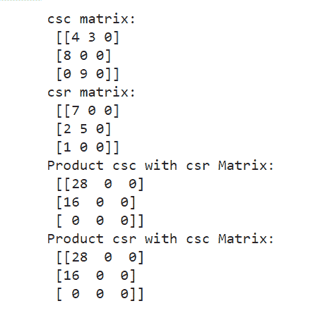

# SciPy–稀疏矩阵乘法

> 原文:[https://www . geesforgeks . org/scipy-稀疏-矩阵-乘法/](https://www.geeksforgeeks.org/scipy-sparse-matrix-multiplication/)

稀疏矩阵是那些元素大部分为零的矩阵。 **scipy.sparse** 是数值数据的 scipy 二维稀疏矩阵包。它为我们提供了不同的类来创建稀疏矩阵。 **csc_matrix** 和 **csr_matrix** 就是这两个类。 **csc_matrix()** 用于创建压缩稀疏列矩阵，而 **csr_matrix()** 用于创建压缩稀疏行矩阵。

**注意:**关于如何创建稀疏矩阵的更多信息，请访问[如何在 Python 中创建稀疏矩阵](https://www.geeksforgeeks.org/how-to-create-a-sparse-matrix-in-python/)

我们使用 **csc_matrix** 和 **csr_matrix** 类中提供的乘法()方法来乘法两个稀疏矩阵。我们可以将两个相同格式(两个矩阵都是 csc 或 csr 格式)和不同格式(一个矩阵是 csc，另一个是 csr 格式)的矩阵相乘。

### **示例 1:将两个 csc 矩阵相乘**

我们使用 csc_matrix()创建了两个压缩稀疏列格式的稀疏矩阵，并使用乘法()方法对它们进行乘法运算。

## 蟒蛇 3

```py
# Python program to multpliply two 
# csc matrices using multiply()

# Import required libraries
import numpy as np
from scipy.sparse import csc_matrix

# Create first csc matrix A
row_A = np.array([0, 0, 1, 2 ])
col_A = np.array([0, 1, 0, 1])
data_A = np.array([4, 3, 8, 9])

cscMatrix_A = csc_matrix((data_A, 
                          (row_A, col_A)),
                        shape = (3, 3))

# print first csc matrix
print("first csc matrix: \n", 
      cscMatrix_A.toarray())

# Create second csc matrix B
row_B = np.array([0, 1, 1, 2 ])
col_B = np.array([0, 0, 1, 0])
data_B = np.array([7, 2, 5, 1])

cscMatrix_B = csc_matrix((data_B, (row_B, col_B)),
                        shape = (3, 3))

# print second csc matrix
print("second csc matrix:\n", cscMatrix_B.toarray())

# Multiply these matrices
sparseMatrix_AB = cscMatrix_A.multiply(cscMatrix_B)

# print resultant matrix
print("Product Sparse Matrix:\n",
      sparseMatrix_AB.toarray())
```

**输出:**



### **例 2。将两个 csr 矩阵相乘**

我们使用 csr_matrix()创建了两个压缩稀疏行格式的稀疏矩阵，并使用 multiply()方法将它们相乘。

## 蟒蛇 3

```py
# Python program to multpliply two 
# csr matrices using multiply()

# Import required libraries
import numpy as np
from scipy.sparse import csr_matrix

# Create first csr matrix A
row_A = np.array([0, 0, 1, 2 ])
col_A = np.array([0, 1, 0, 1])
data_A = np.array([4, 3, 8, 9])

csrMatrix_A = csr_matrix((data_A, (row_A, col_A)),
                        shape = (3, 3))

# print first csr matrix
print("first csr matrix: \n", csrMatrix_A.toarray())

# Create second csr matrix B
row_B = np.array([0, 1, 1, 2 ])
col_B = np.array([0, 0, 1, 0])
data_B = np.array([7, 2, 5, 1])

csrMatrix_B = csr_matrix((data_B, (row_B, col_B)),
                        shape = (3, 3))

# print second scr matrix
print("second csr matrix:\n", csrMatrix_B.toarray())

# Multiply these matrices
sparseMatrix_AB = csrMatrix_A.multiply(csrMatrix_B)

# print resultant matrix
print("Product Sparse Matrix:\n",sparseMatrix_AB.toarray() )
```

**输出:**



### **例 3。将 csc 和 csr 矩阵相乘**

我们创建了两个稀疏矩阵，一个是压缩稀疏列格式，另一个是压缩稀疏行格式。使用乘法()方法将它们相乘。

## 蟒蛇 3

```py
# Python program to multpliply  
# csc and csr matrices using multiply()

# Import required libraries
import numpy as np
from scipy.sparse import csc_matrix

# Create csc matrix
row_A = np.array([0, 0, 1, 2 ])
col_A = np.array([0, 1, 0, 1])
data_A = np.array([4, 3, 8, 9])

cscMatrix = csc_matrix((data_A, (row_A, col_A)),
                        shape = (3, 3))

# print  csc matrix
print("csc matrix: \n", cscMatrix.toarray())

# Create csr matrix 
row_B = np.array([0, 1, 1, 2 ])
col_B = np.array([0, 0, 1, 0])
data_B = np.array([7, 2, 5, 1])

csrMatrix_B = csc_matrix((data_B, (row_B, col_B)),
                        shape = (3, 3))

# print csr matrix
print("csr matrix:\n", csrMatrix_B.toarray())

# Multiply csc matrix with csr matrix
sparseMatrix = cscMatrix_A.multiply(csrMatrix_B)

# print resultant matrix
print("Product csc with csr Matrix:\n",
      sparseMatrix.toarray() )

# Multiply csr matrix with csc matrix
sparseMatrix = csrMatrix_A.multiply(cscMatrix_B)

# print resultant matrix
print("Product csr with csc Matrix:\n",
      sparseMatrix.toarray() )
```

**输出:**

