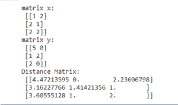
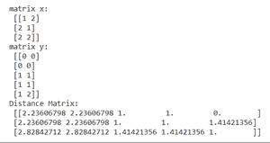
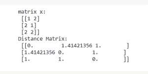
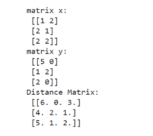
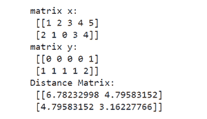

# SciPy–空间距离矩阵

> 原文:[https://www . geesforgeks . org/scipy-spatial-distance-matrix/](https://www.geeksforgeeks.org/scipy-spatial-distance-matrix/)

距离矩阵包含矩阵向量之间成对计算的距离。 **scipy.spatial** 包为我们提供了 ***距离 _ 矩阵()*** 计算距离矩阵的方法。通常矩阵是二维数组的形式，矩阵的向量是矩阵行(一维数组)。

```py
Syntax: scipy.spatial.distance_matrix(x, y, p=2)

Parameters:
    x : (M, K) Matrix of M vectors, each of dimension K. 
    y : (N, K) Matrix of N vectors, each of dimension K. 
    p : float, 1 <= p <= infinity, defines which Minkowski p-norm to use.

Returns: (M, N) ndarray
/ matrix containing the distance from every vector in x to every vector in y.
```

**注意:**两个**和 ***y*** 矩阵的列尺寸必须相同。**

**我们可以使用不同的值***【p】***来应用不同类型的距离来计算距离矩阵。**

```py
p = 1, Manhattan Distance
p = 2, Euclidean Distance
p = ∞, Chebychev Distance
```

****实施例 1。****

**我们计算两个矩阵 ***x*** 和 ***y*** 的距离矩阵。两个矩阵具有相同的维数(3，2)。所以距离矩阵有维数(3，3)。使用 p=2，距离计算为闵可夫斯基 2 范数(或欧几里德距离)。**

## **蟒蛇 3**

```py
# Python program to compute distance matrix

# import important libraries
import numpy as np
from scipy.spatial import distance_matrix

# Create the matrices
x = np.array([[1,2],[2,1],[2,2]])
y = np.array([[5,0],[1,2],[2,0]])

# Display the matrices
print("matrix x:\n", x)
print("matrix y:\n", y)

# compute the distance matrix
dist_mat = distance_matrix(x, y, p=2)

# display distance matrix
print("Distance Matrix:\n", dist_mat)
```

**输出:**

**

距离矩阵示例 1** 

****例 2。****

**我们计算两个矩阵 *x* 和 *y* 的距离矩阵。两个矩阵都有不同的维度。矩阵 *x* 有维度(3，2)，矩阵 *y* 有维度(5，2)。所以距离矩阵有维数(3，5)。**

## **蟒蛇 3**

```py
# Python program to compute distance matrix

# import important libraries
import numpy as np
from scipy.spatial import distance_matrix

# Create the matrices
x = np.array([[1,2],[2,1],[2,2]])
y = np.array([[0,0],[0,0],[1,1],[1,1],[1,2]])

# Display the matrices
print("matrix x:\n", x)
print("matrix y:\n", y)

# compute the distance matrix
dist_mat = distance_matrix(x, y, p=2)

# display distance matrix
print("Distance Matrix:\n", dist_mat)
```

**输出:**

**

距离矩阵示例 2** 

****例 3。****

**我们用单个矩阵计算距离矩阵(即 *x* )。矩阵 *x* 有维度(3，2)。相同矩阵 *x* 作为参数*y*距离矩阵有维度(3，3)。**

## **蟒蛇 3**

```py
# Python program to compute distance matrix

# import important libraries
import numpy as np
from scipy.spatial import distance_matrix

# Create the matrix
x = np.array([[1,2],[2,1],[2,2]])

# Display the matrix
print("matrix x:\n", x)

# compute the distance matrix
dist_mat = distance_matrix(x, x, p=2)

# display distance matrix
print("Distance Matrix:\n", dist_mat)
```

****输出:****

**

距离矩阵示例 3** 

****注意:**注意上面的距离矩阵是对称矩阵。当 *x* 和 *y* 矩阵相同时，距离矩阵是对称矩阵。**

****例 4。****

**我们计算两个矩阵 *x* 和 *y* 的距离矩阵。两个矩阵都有不同的维度。矩阵 *x* 有维度(3，2)，矩阵 *y* 有维度(5，2)。所以距离矩阵有维数(3，5)。使用 p=1，距离计算为闵可夫斯基 1 范数(或曼哈顿距离)。**

## **蟒蛇 3**

```py
# Python program to compute distance matrix

# import important libraries
import numpy as np
from scipy.spatial import distance_matrix

# Create the matrices
x = np.array([[1,2],[2,1],[2,2]])
y = np.array([[5,0],[1,2],[2,0]])

# Display the matrices
print("matrix x:\n", x)
print("matrix y:\n", y)

# compute the distance matrix
dist_mat = distance_matrix(x, y, p=1)

# display distance matrix
print("Distance Matrix:\n", dist_mat)
```

****输出:****

**

距离矩阵示例 4** 

****例 5。****

**我们计算两个矩阵 *x、*和 *y* 的距离矩阵。两个矩阵都有维数(2，5)。所以距离矩阵有维数(3，5)。使用 p=2，距离计算为闵可夫斯基 2 范数(或欧几里德距离)。**

## **蟒蛇 3**

```py
# Python program to compute distance matrix

# import important libraries
import numpy as np
from scipy.spatial import distance_matrix

# Create the matrices
x = np.array([[1,2,3,4,5],[2,1,0,3,4]])
y = np.array([[0,0,0,0,1],[1,1,1,1,2]])

# Display the matrices
print("matrix x:\n", x)
print("matrix y:\n", y)

# compute the distance matrix
dist_mat = distance_matrix(x, y, p=2)

# display distance matrix
print("Distance Matrix:\n", dist_mat)
```

****输出:****

**

距离矩阵示例 5**