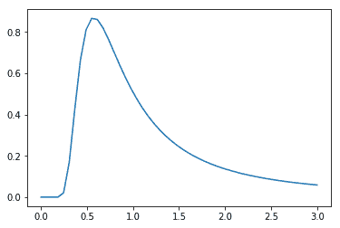

# scipy stats . alpha()| python

> 哎哎哎:# t0]https://www . geeksforgeeks . org/scipy-stats-alpha-python/

**scipy.stats.alpha()** 是一个 alpha 连续随机变量，用标准格式和一些形状参数定义，以完成其规格。

> **参数:**
> **q :** 上下尾概率
> **x :** 分位数
> **a :** 形状参数
> **loc :** 【可选】位置参数。默认= 0
> **比例:**【可选】比例参数。默认值= 1
> **大小:**【整数元组，可选】形状或随机变量。
> **矩:**【可选】由字母['mvsk']组成；m’=均值，‘v’=方差，‘s’= Fisher 偏斜度，‘k’= Fisher 峰度。(默认值= 'mv ')。
> 
> **结果:**α连续随机变量

**代码#1:创建阿尔法连续随机变量**

```py
# Python code to demonstrate scipy.alpha()
from scipy.stats import alpha

# using alpha() method
numargs = alpha.numargs
[ a ] = [0.6, ] * numargs
rv = alpha(a)
```

**代码#2 :**

```py
# Python code to demonstrate scipy.alpha()
import numpy as np
import matplotlib.pyplot as plt

# getting distribution using linspace()
distribution = np.linspace(0, np.minimum(rv.dist.b, 3))
plot = plt.plot(distribution, rv.pdf(distribution))
```

**输出:**
