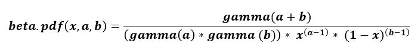
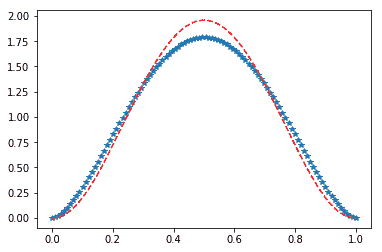

# scipy stats.beta() | Python

> 哎哎哎:# t0]https://www . geeksforgeeks . org/scipy-stats-beta python/

**scipy.stats.beta()** 是一个 beta 连续随机变量，用标准格式和一些形状参数定义，以完成其规格。



> **参数:**
> **q :** 上下尾概率
> **a、b :** 形状参数
> **x :** 分位数
> **loc :** 【可选】位置参数。默认= 0
> **比例:**【可选】比例参数。默认值= 1
> **大小:**【整数元组，可选】形状或随机变量。
> **矩:**【可选】由字母['mvsk']组成；m’=均值，‘v’=方差，‘s’= Fisher 偏斜度，‘k’= Fisher 峰度。(默认值= 'mv ')。
> 
> **结果:**β连续随机变量

**代码#1:创建 beta 连续随机变量**

```py
# importing scipy
from scipy.stats import beta

numargs = beta.numargs
[a, b] = [0.6, ] * numargs
rv = beta(a, b)

print ("RV : \n", rv)
```

**输出:**

```py
RV : 
 <scipy.stats._distn_infrastructure.rv_frozen object at 0x0000029482FCC438>

```

**代码#2:贝塔随机变量和概率分布函数。**

```py
import numpy as np
quantile = np.arange (0.01, 1, 0.1)

# Random Variates
R = beta.rvs(a, b, scale = 2,  size = 10)
print ("Random Variates : \n", R)

# PDF
R = beta.pdf(quantile, a, b, loc = 0, scale = 1)
print ("\nProbability Distribution : \n", R)
```

**输出:**

```py
Random Variates : 
 [1.47189604 1.47284574 1.84692416 1.0686604  0.32709236 1.96857076
 0.00639731 1.97093898 1.34811881 0.34269426]

Probability Distribution : 
 [2.62281037 1.04883674 0.84934164 0.76724957 0.73040985 0.72096547
 0.73529768 0.77903762 0.8752367  1.1264383 ]
```

**代码#3:图形表示。**

```py
import numpy as np
import matplotlib.pyplot as plt

distribution = np.linspace(0, np.maximum(rv.dist.b, 5))
plot = plt.plot(distribution, rv.pdf(distribution))
```

**输出:**


**代码#4:变化的位置参数**

```py
from scipy.stats import arcsine
import matplotlib.pyplot as plt
import numpy as np

x = np.linspace(0, 1.0, 100)

# Varying positional arguments
y1 = beta.pdf(x, 2.75, 2.75)
y2 = beta.pdf(x, 3.25, 3.25)
plt.plot(x, y1, "*", x, y2, "r--")
```

**输出:**
