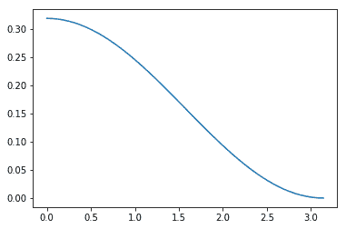
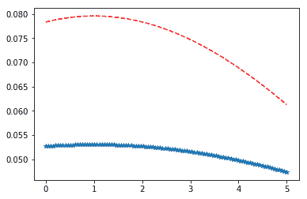

# scipy stats .余弦()| Python

> 原文:[https://www.geeksforgeeks.org/scipy-stats-cosine-python/](https://www.geeksforgeeks.org/scipy-stats-cosine-python/)

**scipy.stats.cosine()** 是一个余弦连续随机变量，用标准格式和一些形状参数定义，以完成其规格。
T3】

> **参数:**
> **q :** 上下尾概率
> **x :** 分位数
> **loc :** 【可选】位置参数。默认= 0
> **比例:**【可选】比例参数。默认值= 1
> **大小:**【整数元组，可选】形状或随机变量。
> **瞬间:**【可选】由字母['mvsk']组成；m’=均值，‘v’=方差，‘s’= Fisher 偏斜度，‘k’= Fisher 峰度。(默认值= 'mv ')。
> 
> **结果:**余弦连续随机变量

**代码#1:创建余弦连续随机变量**

```
from scipy.stats import cosine
numargs = cosine.numargs
[] = [0.6, ] * numargs
rv = cosine()

print ("RV : \n", rv)
```

**输出:**

```
RV :  
<scipy.stats._distn_infrastructure.rv_frozen object at 0x000001FDC89DEE10>
```

**代码#2:余弦随机变量和概率分布函数。**

```
import numpy as np
quantile = np.arange (0.01, 1, 0.1)

# Random Variates
R = cosine.rvs(scale = 2,  size = 10)
print ("Random Variates : \n", R)

# PDF
R = cosine.pdf(quantile, loc = 0, scale = 1)
print ("\nProbability Distribution : \n", R)
```

**输出:**

```
Random Variates : 
 [ 1.2323289   2.49938238  0.29072394 -1.10925673  0.55881836  1.70470811
  1.29090489  2.64865261  4.32789346  0.14597439]

Probability Distribution : 
 [0.31830193 0.31734797 0.3148134  0.31072354 0.30511926 0.29805655
 0.28960598 0.27985198 0.26889203 0.25683561]
```

**代码#3:图形表示。**

```
import numpy as np
import matplotlib.pyplot as plt

distribution = np.linspace(0, np.minimum(rv.dist.b, 5))
print("Distribution : \n", distribution)

plot = plt.plot(distribution, rv.pdf(distribution))
```

**输出:**

```
Distribution : 
 [0\.         0.06411414 0.12822827 0.19234241 0.25645654 0.32057068
 0.38468481 0.44879895 0.51291309 0.57702722 0.64114136 0.70525549
 0.76936963 0.83348377 0.8975979  0.96171204 1.02582617 1.08994031
 1.15405444 1.21816858 1.28228272 1.34639685 1.41051099 1.47462512
 1.53873926 1.60285339 1.66696753 1.73108167 1.7951958  1.85930994
 1.92342407 1.98753821 2.05165235 2.11576648 2.17988062 2.24399475
 2.30810889 2.37222302 2.43633716 2.5004513  2.56456543 2.62867957
 2.6927937  2.75690784 2.82102197 2.88513611 2.94925025 3.01336438
 3.07747852 3.14159265]

```



**代码#4:不同的位置和比例**

```
import matplotlib.pyplot as plt
import numpy as np

x = np.linspace(0, 5, 100)

# Varying positional arguments
y1 = cosine.pdf(x, 1, 6)
y2 = cosine.pdf(x, 1, 4)
plt.plot(x, y1, "*", x, y2, "r--")
```

