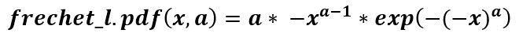
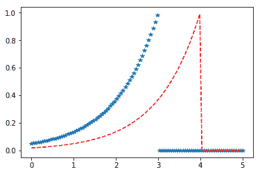

# scipy stats . freshch _ l()| python

> 哎哎哎:# t0]https://www . geeksforgeeks . org/scipy-stats-fresht _ l-python/

**scipy.stats.frechet_l()** 是一个 frechet 左(或威布尔最大值)连续随机变量，用标准格式和一些形状参数定义，以完成其规格。



> **参数:**
> **- > q :** 上下尾概率
> **- > a :** 形状参数
> **- > x :** 分位数
> **- > loc :** 【可选】位置参数。默认= 0
> **- >刻度:**【可选】刻度参数。默认值= 1
> **- >大小:**【整数元组，可选】形状或随机变量。
> **- >矩:**【可选】由字母['mvsk']组成；m' =均值，' v' =方差，
> 's' =费雪偏斜度，' k' =费雪峰度。(默认值= 'mv ')。
> 
> **结果:**弗雷切特左连续随机变量

**代码#1:创建弗雷歇左连续随机变量**

```py
from scipy.stats import frechet_l 

numargs = frechet_l .numargs
[a] = [0.7, ] * numargs
rv = frechet_l (a)

print ("RV : \n", rv) 
```

**输出:**

```py
RV : 
 <scipy.stats._distn_infrastructure.rv_frozen object at 0x0000018D578BC9E8>

```

**代码#2:弗雷歇左随机变量和概率分布。**

```py
import numpy as np
quantile = np.arange (0.01, 1, 0.1)

# Random Variates
R = frechet_l.rvs(a, scale = 2,  size = 10)
print ("Random Variates : \n", R)

# PDF
R = frechet_l.pdf(a, quantile, loc = 0, scale = 1)
print ("\nProbability Distribution : \n", R)
```

**输出:**

```py
Random Variates : 
 [-4.66775585e-02 -3.75425255e+00 -2.32248407e-01 -1.20807347e-03
 -6.26373883e+00 -1.14007755e+00 -5.09499683e+00 -4.18191271e-01
 -4.33720753e+00 -1.05442843e+00]

Probability Distribution : 
 [0\. 0\. 0\. 0\. 0\. 0\. 0\. 0\. 0\. 0.]

```

**代码#3:变化的位置参数**

```py
import matplotlib.pyplot as plt
import numpy as np

x = np.linspace(0, 5, 100)

# Varying positional arguments
y1 = frechet_l.pdf(x, 1, 3)
y2 = frechet_l.pdf(x, 1, 4)
plt.plot(x, y1, "*", x, y2, "r--")
```

**输出:**
