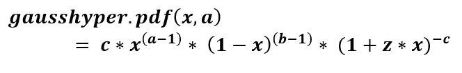
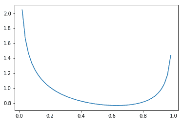
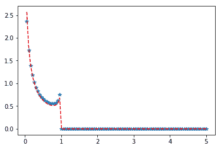

# scipy stats.gausshyper（） |蟒蛇

> 哎哎哎:# t0]https://www . geeksforgeeks . org/scipy-stats-gauss hyper-python/

**scipy.stats.gausshyper()** 是一个 Gauss 超几何连续随机变量，用标准格式和一些形状参数定义以完成其规范。



> **参数:**
> **- > q :** 上下尾概率
> **- > x :** 分位数
> **- > loc :** 【可选】位置参数。默认= 0
> **- >刻度:**【可选】刻度参数。默认值= 1
> **- >大小:**【整数元组，可选】形状或随机变量。
> **- > a、b、c、z :** 形状参数
> **- >矩:**【可选】由字母['mvsk']组成；m' =均值，' v' =方差，
> 's' =费雪偏斜度，' k' =费雪峰度。(默认值= 'mv ')。
> 
> **结果:**高斯超几何连续随机变量

**代码#1:创建高斯超几何连续随机变量**

```
from scipy.stats import gausshyper  

numargs = gausshyper  .numargs
[a, b, c, z] = [0.7, ] * numargs
rv = gausshyper  (a, b, c, z)

print ("RV : \n", rv) 
```

**输出:**

```
RV : 
 <scipy.stats._distn_infrastructure.rv_frozen object at 0x000001E399AB5A58>

```

**代码#2:高斯超几何随机变量和概率分布。**

```
import numpy as np
quantile = np.arange (0.01, 1, 0.1)

# Random Variates
R = gausshyper .rvs(a, b, c, z, scale = 2,  size = 10)
print ("Random Variates : \n", R)

# PDF
R = gausshyper .pdf(a, b, c, z, quantile, loc = 0, scale = 1)
print ("\nProbability Distribution : \n", R)
```

**输出:**

```
Random Variates : 
 [1.45915082 0.58184603 1.91448022 1.23505789 0.9253147  0.36681062
 0.19628827 0.91795248 1.95313724 1.63728124]

Probability Distribution : 
 [0.83983413 0.82838709 0.81749232 0.80714179 0.79731436 0.78798255
 0.77911641 0.77068563 0.76266077 0.75501387]
```

**代码#3:图形表示。**

```
import numpy as np
import matplotlib.pyplot as plt

distribution = np.linspace(0, np.minimum(rv.dist.b, 3))
print("Distribution : \n", distribution)

plot = plt.plot(distribution, rv.pdf(distribution))
```

**输出:**

```
Distribution : 
 [0\.         0.02040816 0.04081633 0.06122449 0.08163265 0.10204082
 0.12244898 0.14285714 0.16326531 0.18367347 0.20408163 0.2244898
 0.24489796 0.26530612 0.28571429 0.30612245 0.32653061 0.34693878
 0.36734694 0.3877551  0.40816327 0.42857143 0.44897959 0.46938776
 0.48979592 0.51020408 0.53061224 0.55102041 0.57142857 0.59183673
 0.6122449  0.63265306 0.65306122 0.67346939 0.69387755 0.71428571
 0.73469388 0.75510204 0.7755102  0.79591837 0.81632653 0.83673469
 0.85714286 0.87755102 0.89795918 0.91836735 0.93877551 0.95918367
 0.97959184 1\.        ]
```



**代码#4:变化的位置参数**

```
import matplotlib.pyplot as plt
import numpy as np

x = np.linspace(0, 5, 100)

# Varying positional arguments
y1 = gausshyper .pdf(x, a, z, 1, 3)
y2 = gausshyper .pdf(x, a, z, 1, 4)
plt.plot(x, y1, "*", x, y2, "r--")
```

**输出:**
