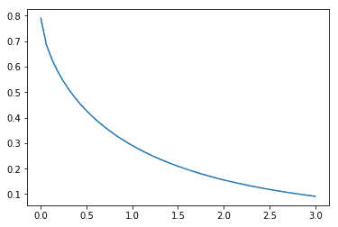

# scipy stat . halform()\ python

> [https://www.geeksforgeeks.org/scipy-stats-halfgennorm-python/](https://www.geeksforgeeks.org/scipy-stats-halfgennorm-python/)

**scipy . stats . half gennorm()**是广义正态连续随机变量的上半部分。为了完成它的规格，它是用标准格式和一些形状参数定义的。对象对象从它继承了一个泛型方法的集合，并用特定的细节来完成它们。
T3】

**参数:**

```py
-> α : scale
-> β : shape
-> μ : location

```

**Code #1 : Creating Half-generalized normal continuous random variable**

```py
from scipy.stats import halfgennorm  

numargs = halfgennorm.numargs
[a] = [0.7, ] * numargs
rv = halfgennorm (a)

print ("RV : \n", rv) 
```

**输出:**

```py
RV : 
 scipy.stats._distn_infrastructure.rv_frozen object at 0x0000021FB55D8DD8

```

**代码#2:半广义随机变量和概率分布**

```py
import numpy as np
quantile = np.arange (0.01, 1, 0.1)

# Random Variates
R = halfgennorm .rvs(.2, scale = 2,  size = 10)
print ("Random Variates : \n", R)

# PDF
R = halfgennorm .pdf(quantile, .2, loc = 0, scale = 1)
print ("\nProbability Distribution : \n", R)
```

**输出:**

```py
Random Variates : 
 [1.41299459e+03 3.51301175e+04 1.79981484e+05 2.90925518e+02
 2.70178121e+05 1.31706797e+05 3.25898913e+01 1.62607410e+04
 2.02263946e+04 1.97078668e+04]

Probability Distribution : 
 [0.00559658 0.0043805  0.00400834 0.0037776  0.00360957 0.00347731
 0.00336825 0.00327549 0.00319482 0.00312348]

```

**代码#3:图形表示。**

```py
import numpy as np
import matplotlib.pyplot as plt

distribution = np.linspace(0, np.minimum(rv.dist.b, 3))
print("Distribution : \n", distribution)

plot = plt.plot(distribution, rv.pdf(distribution))
```

**输出:**

```py
Distribution : 
 [0\.         0.06122449 0.12244898 0.18367347 0.24489796 0.30612245
 0.36734694 0.42857143 0.48979592 0.55102041 0.6122449  0.67346939
 0.73469388 0.79591837 0.85714286 0.91836735 0.97959184 1.04081633
 1.10204082 1.16326531 1.2244898  1.28571429 1.34693878 1.40816327
 1.46938776 1.53061224 1.59183673 1.65306122 1.71428571 1.7755102
 1.83673469 1.89795918 1.95918367 2.02040816 2.08163265 2.14285714
 2.20408163 2.26530612 2.32653061 2.3877551  2.44897959 2.51020408
 2.57142857 2.63265306 2.69387755 2.75510204 2.81632653 2.87755102
 2.93877551 3\.        ]

```



**代码#4:变化的位置参数**

```py
import matplotlib.pyplot as plt
import numpy as np

x = np.linspace(0, 5, 100)

# Varying positional arguments
y1 = halfgennorm .pdf(x, 1, 3)
y2 = halfgennorm .pdf(x, 1, 4)
plt.plot(x, y1, "*", x, y2, "r--")
```