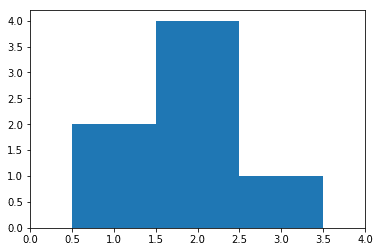

# sciPy stats .直方图()函数| Python

> 原文:[https://www . geesforgeks . org/scipy-stats-直方图-函数-python/](https://www.geeksforgeeks.org/scipy-stats-histogram-function-python/)

`**scipy.stats.histogram(a, numbins, defaultreallimits, weights, printextras)**`将范围分成几个箱，然后返回每个箱中的实例数。该函数用于构建直方图。

> **参数:**
> **arr:**【array _ like】输入数组。
> **numbins:**【int】直方图使用的箱数。[Default = 10]
> **Default limits:**(下限，上限)直方图的范围。
> **权重:**【array _ like】每个数组元素的权重。
> **print extras:**【array _ like】打印的否，如果额外指向标准输出，如果为真
> 
> **结果:**
> –累计频率箱值
> –每个箱的宽度
> –实际下限
> –加分。

**代码#1:**

```
# building the histogram 
import scipy
import numpy as np 
import matplotlib.pyplot as plt

hist, bin_edges = scipy.histogram([1, 1, 2, 2, 2, 2, 3],
                                       bins = range(5))

# Checking the results
print ("No. of points in each bin : ", hist)
print ("Size of the bins          : ", bin_edges)

# plotting the histogram
plt.bar(bin_edges[:-1], hist, width = 1)
plt.xlim(min(bin_edges), max(bin_edges))
plt.show()
```

**输出:**

```
No. of points in each bin :  [0 2 4 1]
Size of the bins          :  [0 1 2 3 4]

```

