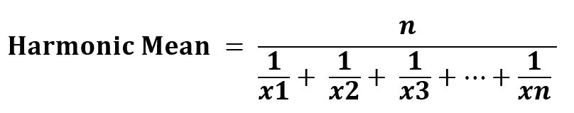

# scipy stats . hme man()| python

> 哎哎哎:# t0]https://www . geeksforgeeks . org/scipy-stats-hme man-python/

`**scipy.stats.hmean(array, axis=0, dtype=None)**`计算数组元素沿数组指定轴的调和平均值(python 中的列表)。

是公式–


> **参数:**
> **数组:**输入有计算调和平均值元素的数组或对象。
> **轴:**计算平均值的轴。默认轴= 0
> **数据类型:**可选。它设置返回元素的类型。
> 
> **根据设定的参数返回:**数组元素的调和平均值。

**代码#1:**

```py
# Harmonic Mean 

from scipy.stats.mstats import hmean 
arr1 = hmean([1, 3, 27]) 

print("Harmonic Mean is :", arr1) 
```

**Output:**

```py
Harmonic Mean is : 2.18918918919

```

**代码#2:** 多维数据

```py
# Harmonic Mean 

from scipy.stats.mstats import hmean
arr1 = [[1, 3, 27], 
        [3, 4, 6], 
        [7, 6, 3], 
        [3, 6, 8]] 

print("\nHarmonic Mean is :", hmean(arr1)) 

# using axis = 0
print("\nHarmonic Mean is with default axis = 0 : \n", 
      hmean(arr1, axis = 0))

# using axis = 1
print("\nHarmonic Mean is with default axis = 1 : \n", 
      hmean(arr1, axis = 1))  
```

**Output:**

```py
Harmonic Mean is : [ 2.21052632  4.36363636  6.04195804]

Harmonic Mean is with default axis = 0 : 
 [ 2.21052632  4.36363636  6.04195804]

Harmonic Mean is with default axis = 1 : 
 [ 2.18918919  4\.          4.66666667  4.8       ]

```