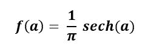
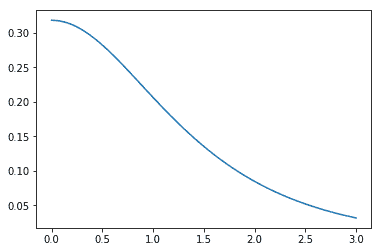
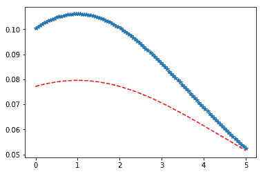

# scipy stats.hypsecant（） |蟒蛇

> 原文:[https://www.geeksforgeeks.org/scipy-stats-hypsecant-python/](https://www.geeksforgeeks.org/scipy-stats-hypsecant-python/)

**scipy.stats.hypsecant()** 是一个双曲割线连续随机变量。为了完成它的规格，它是用标准格式和一些形状参数定义的。概率密度以“标准化”形式定义。

**参数:**

```
-> α : scale
-> β : shape
-> μ : location

```

**Code #1 : Creating Hyperbolic secant continuous random variable**

```
from scipy.stats import hypsecant  

numargs = hypsecant.numargs
[] = [0.7, 0.4] * numargs
rv = hypsecant ()

print ("RV : \n", rv) 
```

**输出:**

```
RV : 
 scipy.stats._distn_infrastructure.rv_frozen object at 0x0000021FB588A160

```

**代码#2:双曲割线连续变量和概率分布**

```
import numpy as np
quantile = np.arange (0.01, 1, 0.1)

# Random Variates
R = hypsecant .rvs(scale = 2,  size = 10)
print ("Random Variates : \n", R)

# PDF
R = hypsecant .pdf(quantile, loc = 0, scale = 1)
print ("\nProbability Distribution : \n", R)
```

**输出:**

```
Random Variates : 
 [ 0.50120826  0.60225476 -0.38307417  7.15799321 -1.1929279  -2.03152053
 -0.07410646  1.79859597 -3.14724818  2.03731139]

Probability Distribution : 
 [0.31829397 0.31639377 0.31141785 0.30360449 0.2933099  0.28097073
 0.26706289 0.25206321 0.23641852 0.22052427]

```

**代码#3:图形表示。**

```
import numpy as np
import matplotlib.pyplot as plt

distribution = np.linspace(0, np.minimum(rv.dist.b, 3))
print("Distribution : \n", distribution)

plot = plt.plot(distribution, rv.pdf(distribution))
```

**输出:**

```
Distribution : 
 [0\.         0.06122449 0.12244898 0.18367347 0.24489796 0.30612245
 0.36734694 0.42857143 0.48979592 0.55102041 0.6122449  0.67346939
 0.73469388 0.79591837 0.85714286 0.91836735 0.97959184 1.04081633
 1.10204082 1.16326531 1.2244898  1.28571429 1.34693878 1.40816327
 1.46938776 1.53061224 1.59183673 1.65306122 1.71428571 1.7755102
 1.83673469 1.89795918 1.95918367 2.02040816 2.08163265 2.14285714
 2.20408163 2.26530612 2.32653061 2.3877551  2.44897959 2.51020408
 2.57142857 2.63265306 2.69387755 2.75510204 2.81632653 2.87755102
 2.93877551 3\.        ]

```



**代码#4:变化的位置参数**

```
import matplotlib.pyplot as plt
import numpy as np

x = np.linspace(0, 5, 100)

# Varying positional arguments
y1 = hypsecant .pdf(x, 1, 3)
y2 = hypsecant .pdf(x, 1, 4)
plt.plot(x, y1, "*", x, y2, "r--")
```

**输出:**
