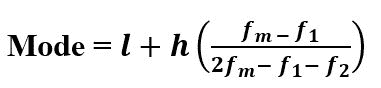

# scipy stats.mode()函数| Python

> 原文:[https://www . geesforgeks . org/scipy-stats-mode-function-python/](https://www.geeksforgeeks.org/scipy-stats-mode-function-python/)

`**scipy.stats.mode(array, axis=0)**`函数计算数组元素沿数组指定轴的模式(python 中的 list)。

 **其公式–**


```
where,
l : Lower Boundary of modal class
h : Size of modal class
f<sub>m</sub> : Frequency corresponding to modal class
f<sub>1</sub> : Frequency preceding  to modal class
f<sub>2</sub> : Frequency proceeding to modal class
```

> **参数:**
> **数组:**输入有元素的数组或对象来计算模式。
> **轴:**轴，模式将沿着该轴计算。默认情况下，轴= 0
> 
> **根据设置的参数返回:**数组元素的模态值。

**代码#1:**

```
# Arithmetic mode  
from scipy import stats
import numpy as np 

arr1 = np.array([[1, 3, 27, 13, 21, 9],
                [8, 12, 8, 4, 7, 10]]) 

print("Arithmetic mode is : \n", stats.mode(arr1)) 
```

**输出:**

```
Arithmetic mode is : 
 ModeResult(mode=array([[1, 3, 8, 4, 7, 9]]), count=array([[1, 1, 1, 1, 1, 1]]))
```

**代码#2:** 有多维数据

```
# Arithmetic mode 
from scipy import stats
import numpy as np 

arr1 = [[1, 3, 27], 
        [3, 4, 6], 
        [7, 6, 3], 
        [3, 6, 8]] 

print("Arithmetic mode is : \n", stats.mode(arr1)) 

print("\nArithmetic mode is : \n", stats.mode(arr1, axis = None)) 

print("\nArithmetic mode is : \n", stats.mode(arr1, axis = 0)) 

print("\nArithmetic mode is : \n", stats.mode(arr1, axis = 1)) 
```

**输出:**

```
Arithmetic mode is : 
 ModeResult(mode=array([[3, 6, 3]]), count=array([[2, 2, 1]]))

Arithmetic mode is : 
 ModeResult(mode=array([3]), count=array([4]))

Arithmetic mode is : 
 ModeResult(mode=array([[3, 6, 3]]), count=array([[2, 2, 1]]))

Arithmetic mode is : 
 ModeResult(mode=array([[1],
       [3],
       [3],
       [3]]), count=array([[1],
       [1],
       [1],
       [1]]))
```